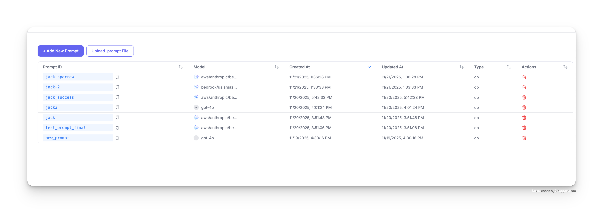
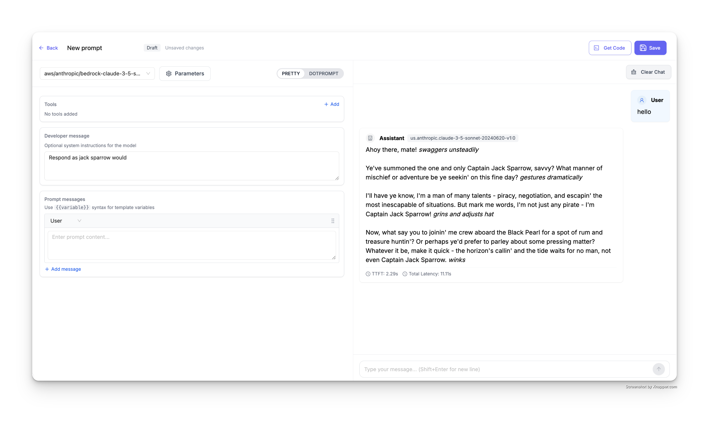
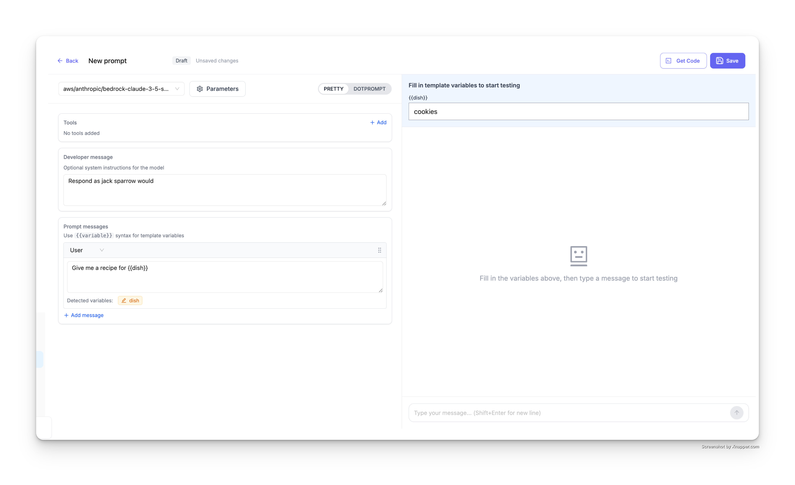
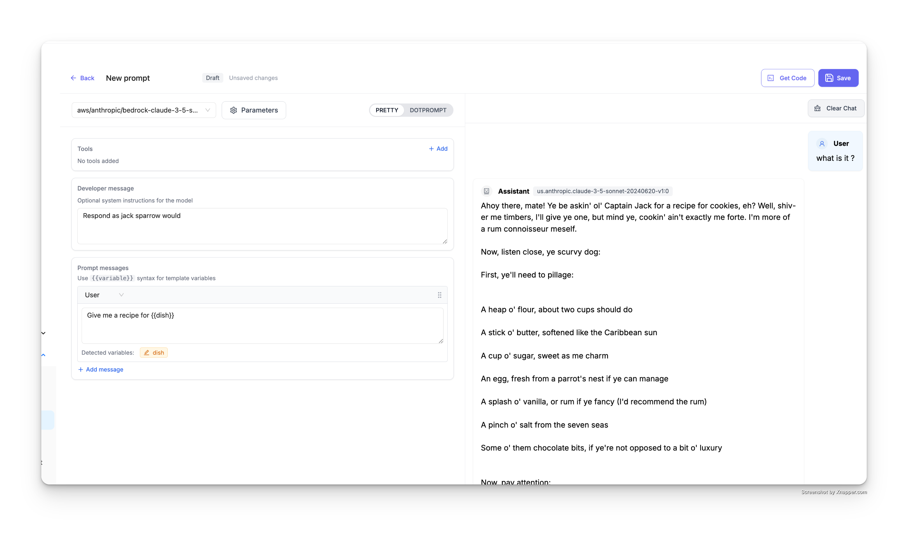
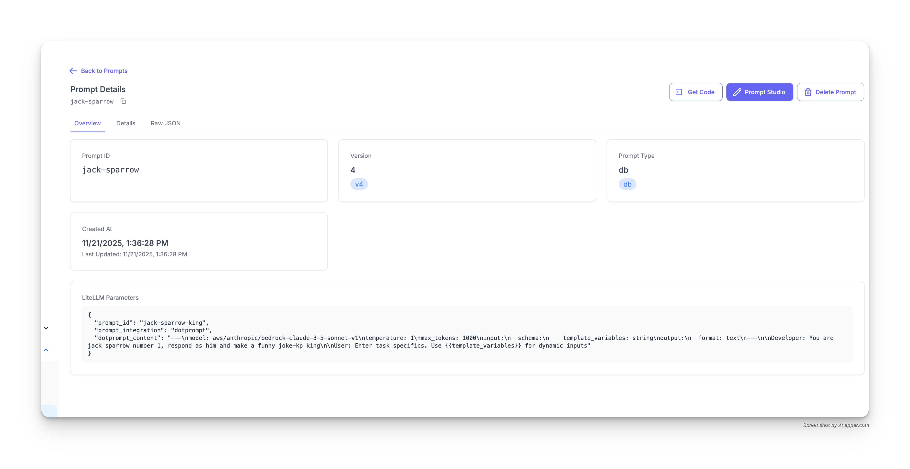
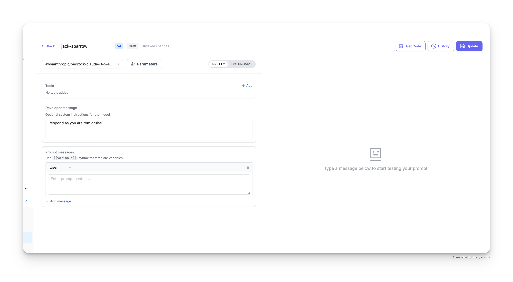
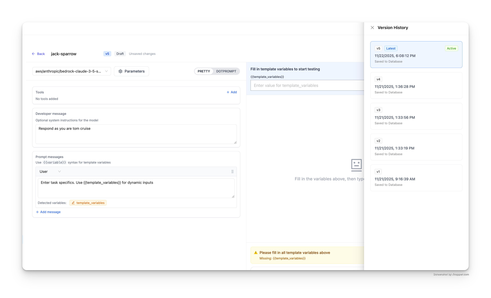
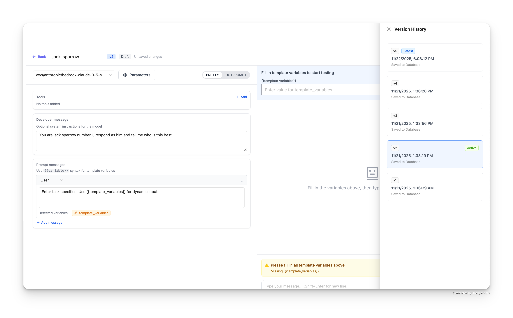

import Tabs from '@theme/Tabs';
import TabItem from '@theme/TabItem';

# LiteLLM AI Gateway Prompt Management

Use the LiteLLM AI Gateway to create, manage and version your prompts.

## Quick Start

### Accessing the Prompts Interface

1. Navigate to **Experimental > Prompts** in your LiteLLM dashboard
2. You'll see a table displaying all your existing prompts with the following columns:
   - **Prompt ID**: Unique identifier for each prompt
   - **Model**: The LLM model configured for the prompt
   - **Created At**: Timestamp when the prompt was created
   - **Updated At**: Timestamp of the last update
   - **Type**: Prompt type (e.g., db)
   - **Actions**: Delete and manage prompt options (admin only)



## Create a Prompt

Click the **+ Add New Prompt** button to create a new prompt.

### Step 1: Select Your Model

Choose the LLM model you want to use from the dropdown menu at the top. You can select from any of your configured models (e.g., `aws/anthropic/bedrock-claude-3-5-sonnet`, `gpt-4o`, etc.).

### Step 2: Set the Developer Message 

The **Developer message** section allows you to set optional system instructions for the model. This acts as the system prompt that guides the model's behavior.

For example:

```
Respond as jack sparrow would
```

This will instruct the model to respond in the style of Captain Jack Sparrow from Pirates of the Caribbean.



### Step 3: Add Prompt Messages

In the **Prompt messages** section, you can add the actual prompt content. Click **+ Add message** to add additional messages to your prompt template.

### Step 4: Use Variables in Your Prompts

Variables allow you to create dynamic prompts that can be customized at runtime. Use the `{{variable_name}}` syntax to insert variables into your prompts.

For example:

```
Give me a recipe for {{dish}}
```

The UI will automatically detect variables in your prompt and display them in the **Detected variables** section.



### Step 5: Test Your Prompt

Before saving, you can test your prompt directly in the UI:

1. Fill in the template variables in the right panel (e.g., set `dish` to `cookies`)
2. Type a message in the chat interface to test the prompt
3. The assistant will respond using your configured model, developer message, and substituted variables


The result will show the model's response with your variables substituted:



### Step 6: Save Your Prompt

Once you're satisfied with your prompt, click the **Save** button in the top right corner to save it to your prompt library.

## Using Your Prompts

Now that your prompt is published, you can use it in your application via the LiteLLM proxy API. Click the **Get Code** button in the UI to view code snippets customized for your prompt.

### Basic Usage

Call a prompt using just the prompt ID and model:

<Tabs>
<TabItem value="curl" label="cURL">

```bash showLineNumbers title="Basic Prompt Call"
curl -X POST 'http://localhost:4000/chat/completions' \
  -H 'Content-Type: application/json' \
  -H 'Authorization: Bearer sk-1234' \
  -d '{
    "model": "gpt-4",
    "prompt_id": "your-prompt-id"
  }' | jq
```

</TabItem>
<TabItem value="python" label="Python">

```python showLineNumbers title="basic_prompt.py"
import openai

client = openai.OpenAI(
    api_key="sk-1234",
    base_url="http://localhost:4000"
)

response = client.chat.completions.create(
    model="gpt-4",
    extra_body={
        "prompt_id": "your-prompt-id"
    }
)

print(response)
```

</TabItem>
<TabItem value="javascript" label="JavaScript">

```javascript showLineNumbers title="basicPrompt.js"
import OpenAI from 'openai';

const client = new OpenAI({
    apiKey: "sk-1234",
    baseURL: "http://localhost:4000"
});

async function main() {
    const response = await client.chat.completions.create({
        model: "gpt-4",
        prompt_id: "your-prompt-id"
    });
    
    console.log(response);
}

main();
```

</TabItem>
</Tabs>

### With Custom Messages

Add custom messages to your prompt:

<Tabs>
<TabItem value="curl" label="cURL">

```bash showLineNumbers title="Prompt with Custom Messages"
curl -X POST 'http://localhost:4000/chat/completions' \
  -H 'Content-Type: application/json' \
  -H 'Authorization: Bearer sk-1234' \
  -d '{
    "model": "gpt-4",
    "prompt_id": "your-prompt-id",
    "messages": [
      {
        "role": "user",
        "content": "hi"
      }
    ]
  }' | jq
```

</TabItem>
<TabItem value="python" label="Python">

```python showLineNumbers title="prompt_with_messages.py"
import openai

client = openai.OpenAI(
    api_key="sk-1234",
    base_url="http://localhost:4000"
)

response = client.chat.completions.create(
    model="gpt-4",
    messages=[
        {"role": "user", "content": "hi"}
    ],
    extra_body={
        "prompt_id": "your-prompt-id"
    }
)

print(response)
```

</TabItem>
<TabItem value="javascript" label="JavaScript">

```javascript showLineNumbers title="promptWithMessages.js"
import OpenAI from 'openai';

const client = new OpenAI({
    apiKey: "sk-1234",
    baseURL: "http://localhost:4000"
});

async function main() {
    const response = await client.chat.completions.create({
        model: "gpt-4",
        messages: [
            { role: "user", content: "hi" }
        ],
        prompt_id: "your-prompt-id"
    });
    
    console.log(response);
}

main();
```

</TabItem>
</Tabs>

### With Prompt Variables

Pass variables to your prompt template using `prompt_variables`:

<Tabs>
<TabItem value="curl" label="cURL">

```bash showLineNumbers title="Prompt with Variables"
curl -X POST 'http://localhost:4000/chat/completions' \
  -H 'Content-Type: application/json' \
  -H 'Authorization: Bearer sk-1234' \
  -d '{
    "model": "gpt-4",
    "prompt_id": "your-prompt-id",
    "prompt_variables": {
      "dish": "cookies"
    }
  }' | jq
```

</TabItem>
<TabItem value="python" label="Python">

```python showLineNumbers title="prompt_with_variables.py"
import openai

client = openai.OpenAI(
    api_key="sk-1234",
    base_url="http://localhost:4000"
)

response = client.chat.completions.create(
    model="gpt-4",
    extra_body={
        "prompt_id": "your-prompt-id",
        "prompt_variables": {
            "dish": "cookies"
        }
    }
)

print(response)
```

</TabItem>
<TabItem value="javascript" label="JavaScript">

```javascript showLineNumbers title="promptWithVariables.js"
import OpenAI from 'openai';

const client = new OpenAI({
    apiKey: "sk-1234",
    baseURL: "http://localhost:4000"
});

async function main() {
    const response = await client.chat.completions.create({
        model: "gpt-4",
        prompt_id: "your-prompt-id",
        prompt_variables: {
            "dish": "cookies"
        }
    });
    
    console.log(response);
}

main();
```

</TabItem>
</Tabs>

## Prompt Versioning

LiteLLM automatically versions your prompts each time you update them. This allows you to maintain a complete history of changes and roll back to previous versions if needed.

### View Prompt Details

Click on any prompt ID in the prompts table to view its details page. This page shows:
- **Prompt ID**: The unique identifier for your prompt
- **Version**: The current version number (e.g., v4)
- **Prompt Type**: The storage type (e.g., db)
- **Created At**: When the prompt was first created
- **Last Updated**: Timestamp of the most recent update
- **LiteLLM Parameters**: The raw JSON configuration



### Update a Prompt

To update an existing prompt:

1. Click on the prompt you want to update from the prompts table
2. Click the **Prompt Studio** button in the top right
3. Make your changes to:
   - Model selection
   - Developer message (system instructions)
   - Prompt messages
   - Variables
4. Test your changes in the chat interface on the right
5. Click the **Update** button to save the new version



Each time you click **Update**, a new version is created (v1 → v2 → v3, etc.) while maintaining the same prompt ID.

### View Version History

To view all versions of a prompt:

1. Open the prompt in **Prompt Studio**
2. Click the **History** button in the top right
3. A **Version History** panel will open on the right side



The version history panel displays:
- **Latest version** (marked with a "Latest" badge and "Active" status)
- All previous versions (v4, v3, v2, v1, etc.)
- Timestamps for each version
- Database save status ("Saved to Database")

### View and Restore Older Versions

To view or restore an older version:

1. In the **Version History** panel, click on any previous version (e.g., v2)
2. The prompt studio will load that version's configuration
3. You can see:
   - The developer message from that version
   - The prompt messages from that version
   - The model and parameters used
   - All variables defined at that time



The selected version will be highlighted with an "Active" badge in the version history panel.

To restore an older version:
1. View the older version you want to restore
2. Click the **Update** button
3. This will create a new version with the content from the older version

### Use Specific Versions in API Calls

By default, API calls use the latest version of a prompt. To use a specific version, pass the `prompt_version` parameter:

<Tabs>
<TabItem value="curl" label="cURL">

```bash showLineNumbers title="Use Specific Prompt Version"
curl -X POST 'http://localhost:4000/chat/completions' \
  -H 'Content-Type: application/json' \
  -H 'Authorization: Bearer sk-1234' \
  -d '{
    "model": "gpt-4",
    "prompt_id": "jack-sparrow",
    "prompt_version": 2,
    "messages": [
      {
        "role": "user",
        "content": "Who are u"
      }
    ]
  }' | jq
```

</TabItem>
<TabItem value="python" label="Python">

```python showLineNumbers title="prompt_version.py"
import openai

client = openai.OpenAI(
    api_key="sk-1234",
    base_url="http://localhost:4000"
)

response = client.chat.completions.create(
    model="gpt-4",
    messages=[
        {"role": "user", "content": "Who are u"}
    ],
    extra_body={
        "prompt_id": "jack-sparrow",
        "prompt_version": 2
    }
)

print(response)
```

</TabItem>
<TabItem value="javascript" label="JavaScript">

```javascript showLineNumbers title="promptVersion.js"
import OpenAI from 'openai';

const client = new OpenAI({
    apiKey: "sk-1234",
    baseURL: "http://localhost:4000"
});

async function main() {
    const response = await client.chat.completions.create({
        model: "gpt-4",
        messages: [
            { role: "user", content: "Who are u" }
        ],
        prompt_id: "jack-sparrow",
        prompt_version: 2
    });
    
    console.log(response);
}

main();
```

</TabItem>
</Tabs>


