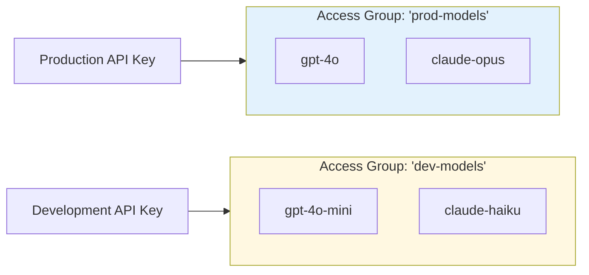
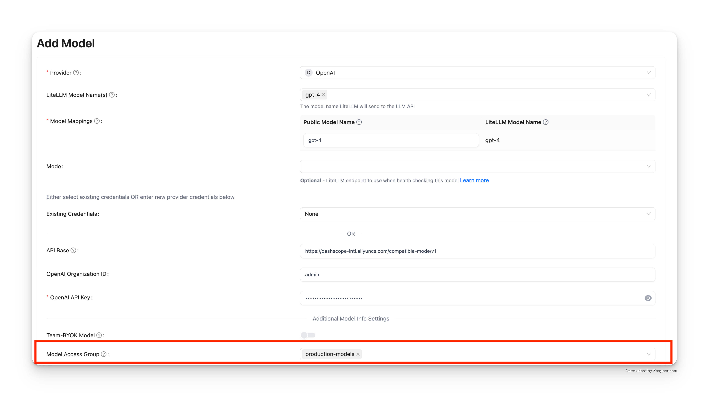
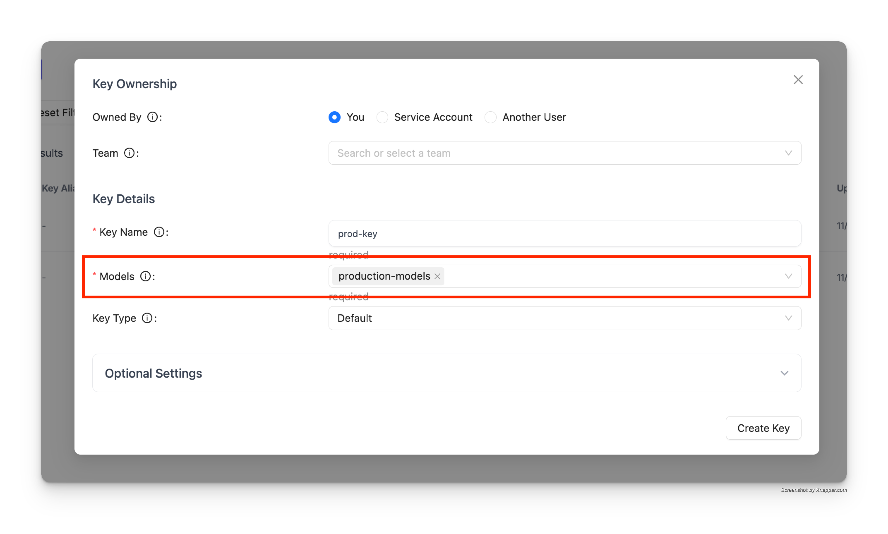

import Tabs from '@theme/Tabs';
import TabItem from '@theme/TabItem';

# Model Access Groups

### Overview

Group multiple models under a single name, then grant keys or teams access to the entire group. Add or remove models from a group without updating individual keys.

Use cases:
- Separate production and development models
- Restrict expensive models to specific teams
- Organize models by provider or capability
- Control access to model families with wildcards (e.g., `openai/*`)

### How It Works



**Key Concept:** Group models together → Attach group to key → Key gets access to all models in group

**Step 1. Assign model, access group in config.yaml**

```yaml showLineNumbers title="config.yaml"
model_list:
  - model_name: gpt-4
    litellm_params:
      model: openai/fake
      api_key: fake-key
      api_base: https://exampleopenaiendpoint-production.up.railway.app/
    model_info:
      access_groups: ["beta-models"] # 👈 Model Access Group
  - model_name: fireworks-llama-v3-70b-instruct
    litellm_params:
      model: fireworks_ai/accounts/fireworks/models/llama-v3-70b-instruct
      api_key: "os.environ/FIREWORKS"
    model_info:
      access_groups: ["beta-models"] # 👈 Model Access Group
```

<Tabs>

<TabItem value="key" label="Key Access Groups">

**Create key with access group**

```bash showLineNumbers title="Create Key with Access Group"
curl --location 'http://localhost:4000/key/generate' \
-H 'Authorization: Bearer <your-master-key>' \
-H 'Content-Type: application/json' \
-d '{"models": ["beta-models"], # 👈 Model Access Group
			"max_budget": 0,}'
```

Test Key 

<Tabs>
<TabItem label="Allowed Access" value = "allowed">

```bash showLineNumbers title="Test Key - Allowed Access"
curl -i http://localhost:4000/v1/chat/completions \
  -H "Content-Type: application/json" \
  -H "Authorization: Bearer sk-<key-from-previous-step>" \
  -d '{
    "model": "gpt-4",
    "messages": [
      {"role": "user", "content": "Hello"}
    ]
  }'
```

</TabItem>

<TabItem label="Disallowed Access" value = "not-allowed">

:::info

Expect this to fail since gpt-4o is not in the `beta-models` access group

:::

```bash showLineNumbers title="Test Key - Disallowed Access"
curl -i http://localhost:4000/v1/chat/completions \
  -H "Content-Type: application/json" \
  -H "Authorization: Bearer sk-<key-from-previous-step>" \
  -d '{
    "model": "gpt-4o",
    "messages": [
      {"role": "user", "content": "Hello"}
    ]
  }'
```

</TabItem>

</Tabs>

</TabItem>

<TabItem value="team" label="Team Access Groups">

Create Team

```bash showLineNumbers title="Create Team"
curl --location 'http://localhost:4000/team/new' \
-H 'Authorization: Bearer sk-<key-from-previous-step>' \
-H 'Content-Type: application/json' \
-d '{"models": ["beta-models"]}'
```

Create Key for Team 

```bash showLineNumbers title="Create Key for Team"
curl --location 'http://0.0.0.0:4000/key/generate' \
--header 'Authorization: Bearer sk-<key-from-previous-step>' \
--header 'Content-Type: application/json' \
--data '{"team_id": "0ac97648-c194-4c90-8cd6-40af7b0d2d2a"}
```


Test Key

<Tabs>
<TabItem label="Allowed Access" value = "allowed">

```bash showLineNumbers title="Test Team Key - Allowed Access"
curl -i http://localhost:4000/v1/chat/completions \
  -H "Content-Type: application/json" \
  -H "Authorization: Bearer sk-<key-from-previous-step>" \
  -d '{
    "model": "gpt-4",
    "messages": [
      {"role": "user", "content": "Hello"}
    ]
  }'
```

</TabItem>

<TabItem label="Disallowed Access" value = "not-allowed">

:::info

Expect this to fail since gpt-4o is not in the `beta-models` access group

:::

```bash showLineNumbers title="Test Team Key - Disallowed Access"
curl -i http://localhost:4000/v1/chat/completions \
  -H "Content-Type: application/json" \
  -H "Authorization: Bearer sk-<key-from-previous-step>" \
  -d '{
    "model": "gpt-4o",
    "messages": [
      {"role": "user", "content": "Hello"}
    ]
  }'
```

</TabItem>

</Tabs>

</TabItem>

</Tabs>


### ✨ Control Access on Wildcard Models

Control access to all models with a specific prefix (e.g. `openai/*`). 

Use this to also give users access to all models, except for a few that you don't want them to use (e.g. `openai/o1-*`). 

:::info

Setting model access groups on wildcard models is an Enterprise feature. 

See pricing [here](https://litellm.ai/#pricing)

Get a trial key [here](https://litellm.ai/#trial)
:::


1. Setup config.yaml


```yaml showLineNumbers title="config.yaml - Wildcard Models"
model_list:
  - model_name: openai/*
    litellm_params:
      model: openai/*
      api_key: os.environ/OPENAI_API_KEY
    model_info:
      access_groups: ["default-models"]
  - model_name: openai/o1-*
    litellm_params:
      model: openai/o1-*
      api_key: os.environ/OPENAI_API_KEY
    model_info:
      access_groups: ["restricted-models"]
```

2. Generate a key with access to `default-models`

```bash showLineNumbers title="Generate Key for Wildcard Access Group"
curl -L -X POST 'http://0.0.0.0:4000/key/generate' \
-H 'Authorization: Bearer sk-1234' \
-H 'Content-Type: application/json' \
-d '{
    "models": ["default-models"],
}'
``` 

3. Test the key

<Tabs>
<TabItem label="Successful Request" value = "success">

```bash showLineNumbers title="Test Wildcard Access - Allowed"
curl -i http://localhost:4000/v1/chat/completions \
  -H "Content-Type: application/json" \
  -H "Authorization: Bearer sk-<key-from-previous-step>" \
  -d '{
    "model": "openai/gpt-4",
    "messages": [
      {"role": "user", "content": "Hello"}
    ]
  }'
```
</TabItem>
<TabItem value="bad-request" label="Rejected Request">

```bash showLineNumbers title="Test Wildcard Access - Rejected"
curl -i http://localhost:4000/v1/chat/completions \
  -H "Content-Type: application/json" \
  -H "Authorization: Bearer sk-<key-from-previous-step>" \
  -d '{
    "model": "openai/o1-mini",
    "messages": [
      {"role": "user", "content": "Hello"}
    ]
  }'
```

</TabItem>
</Tabs>

## Managing Access Groups via API

:::warning Database Models Only
Access group management APIs only work with models stored in the database (added via `/model/new`). 

Models defined in `config.yaml` cannot be managed through these APIs and must be configured directly in the config file.
:::

Use the access group management endpoints to dynamically create, update, and delete access groups without restarting the proxy.

### Tutorial: Complete Access Group Workflow

This tutorial shows how to create an access group, view its details, attach it to a key, and update the models in the group.

**Prerequisites:**
- Models must be added to the database first (not just in config.yaml)
- You need your master key for authorization

#### Step 1: Add Models to Database

First, add some models to the database:

```bash showLineNumbers title="Add Models to Database"
# Add GPT-4 to database
curl -X POST 'http://localhost:4000/model/new' \
  -H 'Authorization: Bearer sk-1234' \
  -H 'Content-Type: application/json' \
  -d '{
    "model_name": "gpt-4",
    "litellm_params": {
      "model": "gpt-4",
      "api_key": "os.environ/OPENAI_API_KEY"
    }
  }'

# Add Claude to database
curl -X POST 'http://localhost:4000/model/new' \
  -H 'Authorization: Bearer sk-1234' \
  -H 'Content-Type: application/json' \
  -d '{
    "model_name": "claude-3-opus",
    "litellm_params": {
      "model": "claude-3-opus-20240229",
      "api_key": "os.environ/ANTHROPIC_API_KEY"
    }
  }'
```

#### Step 2: Create Access Group

Create an access group containing multiple models:

```bash showLineNumbers title="Create Access Group"
curl -X POST 'http://localhost:4000/access_group/new' \
  -H 'Authorization: Bearer sk-1234' \
  -H 'Content-Type: application/json' \
  -d '{
    "access_group": "production-models",
    "model_names": ["gpt-4", "claude-3-opus"]
  }'
```

**Response:**
```json showLineNumbers title="Response"
{
  "access_group": "production-models",
  "model_names": ["gpt-4", "claude-3-opus"],
  "models_updated": 2
}
```

#### Step 3: View Access Group Info

Check the access group details:

```bash showLineNumbers title="Get Access Group Info"
curl -X GET 'http://localhost:4000/access_group/production-models/info' \
  -H 'Authorization: Bearer sk-1234'
```

**Response:**
```json showLineNumbers title="Response"
{
  "access_group": "production-models",
  "model_names": ["gpt-4", "claude-3-opus"],
  "deployment_count": 2
}
```

#### Step 4: Create Key with Access Group

Create an API key that can access all models in the group:

```bash showLineNumbers title="Create Key with Access Group"
curl -X POST 'http://localhost:4000/key/generate' \
  -H 'Authorization: Bearer sk-1234' \
  -H 'Content-Type: application/json' \
  -d '{
    "models": ["production-models"],
    "max_budget": 100
  }'
```

**Response:**
```json showLineNumbers title="Response"
{
  "key": "sk-...",
  "models": ["production-models"]
}
```

**Test the key:**
```bash showLineNumbers title="Test Key Access"
# This succeeds - gpt-4 is in production-models
curl -X POST 'http://localhost:4000/v1/chat/completions' \
  -H 'Authorization: Bearer sk-...' \
  -H 'Content-Type: application/json' \
  -d '{
    "model": "gpt-4",
    "messages": [{"role": "user", "content": "Hello"}]
  }'

# This succeeds - claude-3-opus is in production-models
curl -X POST 'http://localhost:4000/v1/chat/completions' \
  -H 'Authorization: Bearer sk-...' \
  -H 'Content-Type: application/json' \
  -d '{
    "model": "claude-3-opus",
    "messages": [{"role": "user", "content": "Hello"}]
  }'
```

#### Step 5: Update Access Group

Add or remove models from the access group:

```bash showLineNumbers title="Update Access Group"
curl -X PUT 'http://localhost:4000/access_group/production-models/update' \
  -H 'Authorization: Bearer sk-1234' \
  -H 'Content-Type: application/json' \
  -d '{
    "model_names": ["gpt-4", "claude-3-opus", "gemini-pro"]
  }'
```

**Response:**
```json showLineNumbers title="Response"
{
  "access_group": "production-models",
  "model_names": ["gpt-4", "claude-3-opus", "gemini-pro"],
  "models_updated": 3
}
```

The API key from Step 4 now automatically has access to `gemini-pro` without any changes to the key itself.
### API Reference - Access Group Management

For complete API documentation including all endpoints, parameters, and response schemas, see the [Access Group Management API Reference](https://litellm-api.up.railway.app/#/model%20management/create_model_group_access_group_new_post).

## Managing Access Groups via UI

You can also manage access groups through the LiteLLM Admin UI.

### Step 1: Add Model to Access Group

When adding a model to the database, assign it to an access group using the "Model Access Group" field:



In this example, `gpt-4` is added to the `production-models` access group.

### Step 2: Create Key with Access Group

When creating an API key, specify the access group in the "Models" field:



The key will have access to all models in the `production-models` group.

### Step 3: Test the Key

Use the generated key to make requests:

```bash showLineNumbers title="Test Key with Access Group"
# This succeeds - gpt-4 is in production-models
curl -X POST 'http://localhost:4000/v1/chat/completions' \
  -H 'Authorization: Bearer sk-...' \
  -H 'Content-Type: application/json' \
  -d '{
    "model": "gpt-4",
    "messages": [{"role": "user", "content": "Hello"}]
  }'
```

**Response:**
```json showLineNumbers title="Success Response"
{
  "id": "chatcmpl-...",
  "object": "chat.completion",
  "created": 1234567890,
  "model": "gpt-4",
  "choices": [
    {
      "index": 0,
      "message": {
        "role": "assistant",
        "content": "Hello! How can I help you today?"
      },
      "finish_reason": "stop"
    }
  ]
}
```

If you try to access a model not in the access group, the request will be rejected:

```bash showLineNumbers title="Test Rejected Request"
# This fails - gpt-4o is not in production-models
curl -X POST 'http://localhost:4000/v1/chat/completions' \
  -H 'Authorization: Bearer sk-...' \
  -H 'Content-Type: application/json' \
  -d '{
    "model": "gpt-4o",
    "messages": [{"role": "user", "content": "Hello"}]
  }'
```

**Response:**
```json showLineNumbers title="Error Response"
{
  "error": {
    "message": "Invalid model for key",
    "type": "invalid_request_error"
  }
}
```

