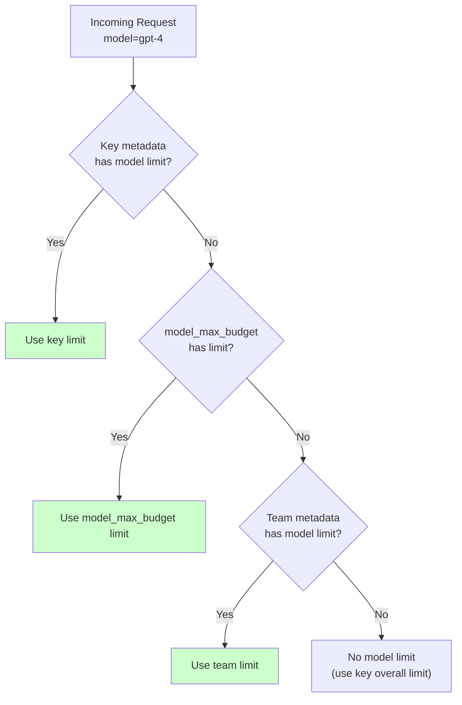

import Tabs from '@theme/Tabs';
import TabItem from '@theme/TabItem';

# Model-Specific Max Parallel Requests

Set different concurrent request limits for each model on a virtual key.

Use this to:
- Protect expensive models (GPT-4) while allowing more throughput on cheaper models
- Prevent capacity exhaustion on rate-limited model deployments
- Implement tiered access controls per model

## Quick Start

### Step 1. Create a key with model-specific limits

Use `metadata.model_max_parallel_requests` to set per-model concurrent request limits:

```shell
curl --location 'http://0.0.0.0:4000/key/generate' \
--header 'Authorization: Bearer sk-1234' \
--header 'Content-Type: application/json' \
--data '{
  "max_parallel_requests": 20,
  "metadata": {
    "model_max_parallel_requests": {
      "gpt-4": 2,
      "gpt-3.5-turbo": 5
    }
  }
}'
```

[**See Swagger**](https://litellm-api.up.railway.app/#/key%20management/generate_key_fn_key_generate_post)

This creates a key where:
- Overall key limit: 20 concurrent requests
- `gpt-4`: max 2 concurrent requests
- `gpt-3.5-turbo`: max 5 concurrent requests

**Expected Response**

```json
{
  "key": "sk-abc123...",
  "max_parallel_requests": 20,
  "metadata": {
    "model_max_parallel_requests": {
      "gpt-4": 2,
      "gpt-3.5-turbo": 5
    }
  }
}
```

### Step 2. Test the limits

**Request within limit (succeeds):**

```shell
curl --location 'http://0.0.0.0:4000/chat/completions' \
--header 'Authorization: Bearer sk-abc123...' \
--header 'Content-Type: application/json' \
--data '{
  "model": "gpt-4",
  "messages": [{"role": "user", "content": "Hello"}]
}'
```

**Request exceeding model limit (returns 429):**

When you exceed the model's concurrent limit:

```json
{
  "error": {
    "message": "Max parallel request limit reached for model gpt-4. Limit: 2, current: 2",
    "type": "rate_limit_error",
    "code": 429
  }
}
```

## Setting Limits at Different Levels

Model-specific parallel request limits can be set at the key level, team level, or via `model_max_budget`.

**Priority order:**

1. Key metadata (highest priority)
2. model_max_budget configuration
3. Team metadata (lowest priority)



<Tabs>
<TabItem value="key" label="Per Key">

Set limits directly on a virtual key:

```shell
curl --location 'http://0.0.0.0:4000/key/generate' \
--header 'Authorization: Bearer sk-1234' \
--header 'Content-Type: application/json' \
--data '{
  "metadata": {
    "model_max_parallel_requests": {
      "gpt-4": 2,
      "claude-3-opus": 1
    }
  }
}'
```

</TabItem>
<TabItem value="team" label="Per Team">

Set limits at the team level. All keys in the team inherit these limits.

```shell
curl --location 'http://0.0.0.0:4000/team/new' \
--header 'Authorization: Bearer sk-1234' \
--header 'Content-Type: application/json' \
--data '{
  "team_alias": "production-team",
  "max_parallel_requests": 50,
  "metadata": {
    "model_max_parallel_requests": {
      "gpt-4": 10,
      "gpt-3.5-turbo": 30
    }
  }
}'
```

[**See Swagger**](https://litellm-api.up.railway.app/#/team%20management/new_team_team_new_post)

Then create keys for the team:

```shell
curl --location 'http://0.0.0.0:4000/key/generate' \
--header 'Authorization: Bearer sk-1234' \
--header 'Content-Type: application/json' \
--data '{"team_id": "<team-id-from-above>"}'
```

</TabItem>
<TabItem value="priority" label="Priority Override">

Key metadata overrides team metadata. Useful for giving specific users different limits.

```shell
# Team has gpt-4 limit of 3
# But this key overrides to limit of 1
curl --location 'http://0.0.0.0:4000/key/generate' \
--header 'Authorization: Bearer sk-1234' \
--header 'Content-Type: application/json' \
--data '{
  "team_id": "<team-id>",
  "metadata": {
    "model_max_parallel_requests": {
      "gpt-4": 1
    }
  }
}'
```

The key-level limit of 1 takes precedence over the team-level limit of 3.

</TabItem>
</Tabs>

## How It Works

Model limits are enforced **independently** from the overall key limit:

| Check | Behavior |
|-------|----------|
| Overall key `max_parallel_requests` | Limits total concurrent requests across all models |
| Per-model `model_max_parallel_requests` | Limits concurrent requests for that specific model |

**Example:** A key with `max_parallel_requests: 20` and `model_max_parallel_requests: {"gpt-4": 2}` can have:
- Up to 2 concurrent GPT-4 requests
- Up to 20 total concurrent requests (including GPT-4)
- Hitting the GPT-4 limit doesn't block requests to other models

## Combining with RPM/TPM Limits

Combine `model_max_parallel_requests` with `model_rpm_limit` and `model_tpm_limit`:

```shell
curl --location 'http://0.0.0.0:4000/key/generate' \
--header 'Authorization: Bearer sk-1234' \
--header 'Content-Type: application/json' \
--data '{
  "model_rpm_limit": {"gpt-4": 10},
  "model_tpm_limit": {"gpt-4": 10000},
  "metadata": {
    "model_max_parallel_requests": {
      "gpt-4": 2
    }
  }
}'
```

This key has:
- Max 2 concurrent GPT-4 requests
- Max 10 GPT-4 requests per minute
- Max 10,000 GPT-4 tokens per minute

## Demo Video

<!-- TODO: Add Loom embed after recording -->
<!-- <iframe width="840" height="500" src="https://www.loom.com/embed/VIDEO_ID" frameborder="0" webkitallowfullscreen mozallowfullscreen allowfullscreen></iframe> -->

## Related

- [Set Rate Limits (RPM/TPM)](/docs/proxy/users#set-rate-limits)
- [Dynamic Rate Limiting](/docs/proxy/dynamic_rate_limit)
- [Virtual Keys](/docs/proxy/virtual_keys)
