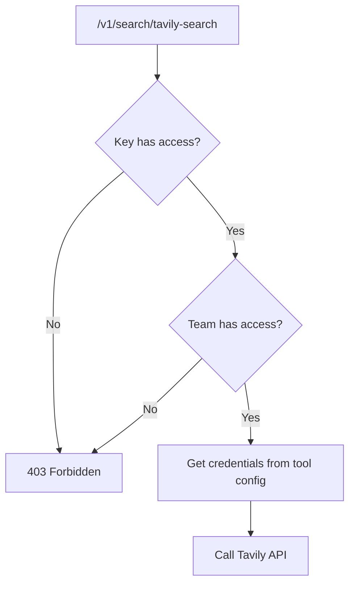

# Search Tools Access Control

Control which teams and keys can access specific search tools using model-like allowlists.

## Overview

Search tools in LiteLLM Proxy use the same access control pattern as models:

- **Team-level allowlist**: `allowed_search_tools` on teams
- **Key-level allowlist**: `allowed_search_tools` on keys
- **Tool-only credentials**: API keys stored ONLY in search tool configuration
- **Secure by default**: Credentials never exposed in team/key metadata

## Quick Start

### Step 1: Configure Search Tools

Define search tools in your `proxy_server_config.yaml`:

```yaml
search_tools:
  - search_tool_name: perplexity-search
    litellm_params:
      search_provider: perplexity
      api_key: os.environ/PERPLEXITYAI_API_KEY
  
  - search_tool_name: tavily-search
    litellm_params:
      search_provider: tavily
      api_key: os.environ/TAVILY_API_KEY

  - search_tool_name: tavily-marketing
    litellm_params:
      search_provider: tavily
      api_key: os.environ/TAVILY_MARKETING_API_KEY
      
  - search_tool_name: brave-search
    litellm_params:
      search_provider: brave
      api_key: os.environ/BRAVE_API_KEY
```

### Step 2: Create Teams with Search Tool Access

```bash
curl -X POST 'http://localhost:4000/team/new' \
  -H 'Authorization: Bearer <master-key>' \
  -H 'Content-Type: application/json' \
  -d '{
    "team_alias": "marketing-team",
    "models": ["gpt-4"],
    "allowed_search_tools": ["tavily-marketing", "perplexity-search"]
  }'
```

### Step 3: Generate Keys for Teams

```bash
curl -X POST 'http://localhost:4000/key/generate' \
  -H 'Authorization: Bearer <master-key>' \
  -H 'Content-Type: application/json' \
  -d '{
    "team_id": "<team-id>",
    "models": ["gpt-4"],
    "allowed_search_tools": ["tavily-marketing"]
  }'
```

### Step 4: Use Search Tools

```bash
curl -X POST 'http://localhost:4000/v1/search/tavily-marketing' \
  -H 'Authorization: Bearer sk-...' \
  -d '{"query": "latest marketing trends"}'
```

## Access Control Rules

### Authorization Flow



### Allowlist Behavior

| Allowlist Value | Behavior |
|----------------|----------|
| `[]` (empty) | Access to **all** search tools |
| `["tool-a", "tool-b"]` | Access only to `tool-a` and `tool-b` |
| Not set / `null` | Access to **all** search tools |

### Examples

**Example 1: Team restricts tools, key further restricts**

```yaml
# Team allows 3 tools
team.allowed_search_tools = ["tavily", "perplexity", "brave"]

# Key only allows 1 tool
key.allowed_search_tools = ["tavily"]

# Result: Key can ONLY access "tavily"
```

**Example 2: Empty allowlists grant full access**

```yaml
# Team allows all
team.allowed_search_tools = []

# Key allows all
key.allowed_search_tools = []

# Result: Key can access ANY search tool
```

**Example 3: Team blocks access even if key allows**

```yaml
# Team restricts to perplexity
team.allowed_search_tools = ["perplexity"]

# Key allows tavily
key.allowed_search_tools = ["tavily"]

# Result: Access DENIED - team doesn't allow tavily
```

## Configuration Patterns

### Pattern 1: Per-Team Search Tool Isolation

Each team gets their own search tool with dedicated credentials:

```yaml
search_tools:
  - search_tool_name: tavily-team-a
    litellm_params:
      search_provider: tavily
      api_key: os.environ/TAVILY_TEAM_A_KEY
      
  - search_tool_name: tavily-team-b
    litellm_params:
      search_provider: tavily
      api_key: os.environ/TAVILY_TEAM_B_KEY
```

```bash
# Create teams with isolated tools
curl -X POST 'http://localhost:4000/team/new' \
  -H 'Authorization: Bearer <master-key>' \
  -d '{
    "team_alias": "team-a",
    "allowed_search_tools": ["tavily-team-a"]
  }'
```

**Benefits**:
- Complete cost isolation (different Tavily accounts)
- Separate rate limits per team
- Independent billing

### Pattern 2: Shared Tools with Access Control

Share search tools across teams with allowlist restrictions:

```yaml
search_tools:
  - search_tool_name: tavily-premium
    litellm_params:
      search_provider: tavily
      api_key: os.environ/TAVILY_PREMIUM_KEY
      
  - search_tool_name: perplexity-standard
    litellm_params:
      search_provider: perplexity
      api_key: os.environ/PERPLEXITY_KEY
```

```bash
# Enterprise team gets premium tools
curl -X POST 'http://localhost:4000/team/new' \
  -d '{
    "team_alias": "enterprise",
    "allowed_search_tools": ["tavily-premium", "perplexity-standard"]
  }'

# Regular team gets standard tools only
curl -X POST 'http://localhost:4000/team/new' \
  -d '{
    "team_alias": "standard",
    "allowed_search_tools": ["perplexity-standard"]
  }'
```

### Pattern 3: Open Access with Cost Tracking

Allow all teams to access tools, track costs via `team_id`:

```yaml
search_tools:
  - search_tool_name: tavily-shared
    litellm_params:
      search_provider: tavily
      api_key: os.environ/TAVILY_SHARED_KEY
```

```bash
# Teams with empty allowlists can access all tools
curl -X POST 'http://localhost:4000/team/new' \
  -d '{
    "team_alias": "team-a",
    "allowed_search_tools": []
  }'
```

Query spend by team:

```sql
SELECT 
    team_id,
    SUM(spend) as total_spend,
    COUNT(*) as request_count
FROM "LiteLLM_SpendLogs"
WHERE call_type = 'search'
  AND model LIKE 'tavily%'
GROUP BY team_id;
```

## Security Model

### Credentials Storage

**Secure**: Credentials stored ONLY in search tool configuration

```yaml
# ✅ CORRECT - Credentials in tool config
search_tools:
  - search_tool_name: tavily-search
    litellm_params:
      api_key: os.environ/TAVILY_API_KEY  # Stored here
```

**Never in team/key metadata**:

```json
{
  "team_id": "team-123",
  "allowed_search_tools": ["tavily-search"],
  "metadata": {}  // ✅ No credentials here
}
```

### Access Control Only

Teams and keys only specify **which tools** they can access, not credentials:

```json
{
  "team": {
    "allowed_search_tools": ["tool-a", "tool-b"]  // Access control
  },
  "key": {
    "allowed_search_tools": ["tool-a"]  // Access control
  }
}
```

## API Reference

### Create Team with Search Tools

```bash
POST /team/new

{
  "team_alias": "marketing",
  "models": ["gpt-4"],
  "allowed_search_tools": ["tavily-search", "perplexity-search"]
}
```

### Update Team Search Tools

```bash
POST /team/update

{
  "team_id": "team-123",
  "allowed_search_tools": ["brave-search"]
}
```

### Generate Key with Search Tools

```bash
POST /key/generate

{
  "team_id": "team-123",
  "models": ["gpt-4"],
  "allowed_search_tools": ["tavily-search"]
}
```

### List Available Search Tools

```bash
GET /v1/search/tools

# Response:
{
  "object": "list",
  "data": [
    {
      "search_tool_name": "tavily-search",
      "search_provider": "tavily"
    }
  ]
}
```

## Cost Attribution

Search requests are automatically attributed to the team via `team_id` in spend logs:

```sql
SELECT 
    team_id,
    model as search_tool,
    SUM(spend) as cost,
    COUNT(*) as requests
FROM "LiteLLM_SpendLogs"
WHERE call_type = 'search'
  AND created_at >= NOW() - INTERVAL '30 days'
GROUP BY team_id, model
ORDER BY cost DESC;
```

**Example output**:

| team_id | search_tool | cost | requests |
|---------|-------------|------|----------|
| team-marketing | tavily-search | $45.20 | 904 |
| team-engineering | perplexity-search | $32.15 | 643 |
| team-research | brave-search | $8.50 | 170 |

## Migration from Legacy Approach

If you previously stored credentials in team metadata, migrate to the new approach:

### Before (Insecure)

```json
{
  "team": {
    "metadata": {
      "search_provider_config": {
        "tavily": {"api_key": "tvly-..."}  // ❌ Exposed
      }
    }
  }
}
```

### After (Secure)

```yaml
# 1. Move credentials to search tool config
search_tools:
  - search_tool_name: tavily-marketing
    litellm_params:
      search_provider: tavily
      api_key: os.environ/TAVILY_MARKETING_KEY  # ✅ Secure

# 2. Update team with allowlist
team:
  allowed_search_tools: ["tavily-marketing"]  # ✅ Access control only
```

## Troubleshooting

### 403 Forbidden Error

```json
{
  "error": "Key not allowed to access search tool: tavily-search. 
           Allowed search tools: [perplexity-search]"
}
```

**Solution**: Add the search tool to key's `allowed_search_tools`:

```bash
curl -X POST 'http://localhost:4000/key/update' \
  -d '{
    "key": "sk-...",
    "allowed_search_tools": ["tavily-search", "perplexity-search"]
  }'
```

### Search Tool Not Found

```json
{"error": "Search tool not found: tavily-search"}
```

**Solution**: Add the search tool to your `proxy_server_config.yaml`:

```yaml
search_tools:
  - search_tool_name: tavily-search
    litellm_params:
      search_provider: tavily
      api_key: os.environ/TAVILY_API_KEY
```

## Best Practices

1. **Use descriptive tool names**: `tavily-marketing` vs `tavily-1`
2. **Empty allowlists for admins**: Grant full access to admin teams
3. **Restrict by role**: Marketing gets marketing tools, engineering gets code search
4. **Monitor costs per team**: Query spend logs regularly
5. **Rotate credentials in tools**: Update environment variables, not team metadata
6. **Start restrictive**: Add tools to allowlists as needed

## Related

- [Search API Reference](./search.md)
- [Team Management](./team_budgets.md)
- [Cost Tracking](./cost_tracking.md)
