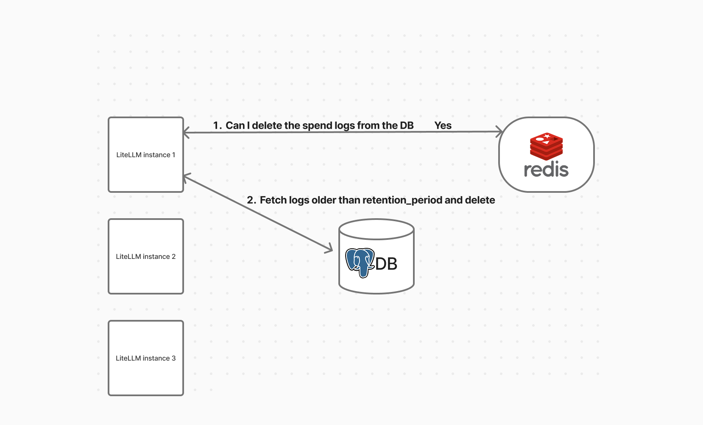

# ✨ Maximum Retention Period for Spend Logs

This walks through how to set the maximum retention period for spend logs. This helps manage database size by deleting old logs automatically.

:::info

✨ This is on LiteLLM Enterprise

[Enterprise Pricing](https://www.litellm.ai/#pricing)

[Get free 7-day trial key](https://www.litellm.ai/enterprise#trial)

:::

### Requirements

- **Postgres** (for log storage)
- **Redis** *(optional)* — required only if you're running multiple proxy instances and want to enable distributed locking

## Usage

### Setup

Add this to your `proxy_config.yaml` under `general_settings`:

```yaml title="proxy_config.yaml"
general_settings:
  maximum_spend_logs_retention_period: "7d"  # Keep logs for 7 days

  # Optional: set how frequently cleanup should run - default is daily
  maximum_spend_logs_retention_interval: "1d"  # Run cleanup daily

  # Optional: set exact time for cleanup (Cron syntax)
  maximum_spend_logs_cleanup_cron: "0 4 * * *" # Run at 04:00 AM daily

litellm_settings:
  cache: true
  cache_params:
    type: redis
```

### Configuration Options

#### `maximum_spend_logs_retention_period` (required)

How long logs should be kept before deletion. Supported formats:

- `"7d"` – 7 days
- `"24h"` – 24 hours
- `"60m"` – 60 minutes
- `"3600s"` – 3600 seconds

#### `maximum_spend_logs_retention_interval` (optional)

How often the cleanup job should run. Uses the same format as above. If not set, cleanup will run every 24 hours if and only if `maximum_spend_logs_retention_period` is set.

#### `maximum_spend_logs_cleanup_cron` (optional)

Schedule the cleanup using standard cron syntax. This takes precedence over `maximum_spend_logs_retention_interval`.

Examples:
- `"0 4 * * *"` – Run at 04:00 AM daily
- `"0 0 * * 0"` – Run at midnight every Sunday
- `"*/30 * * * *"` – Run every 30 minutes

## How it works

### Step 1. Lock Acquisition (Optional with Redis)

If Redis is enabled, LiteLLM uses it to make sure only one instance runs the cleanup at a time.

- If the lock is acquired:
  - This instance proceeds with cleanup
  - Others skip it
- If no lock is present:
  - Cleanup still runs (useful for single-node setups)

  
*Working of spend log deletions*

### Step 2. Batch Deletion

Once cleanup starts:

- It calculates the cutoff date using the configured retention period
- Deletes logs older than the cutoff in batches (default size `1000`)
- Adds a short delay between batches to avoid overloading the database

### Default settings:
- **Batch size**: 1000 logs (configurable via `SPEND_LOG_CLEANUP_BATCH_SIZE`)
- **Max batches per run**: 500
- **Max deletions per run**: 500,000 logs

You can change the cleanup parameters using environment variables:

```bash
SPEND_LOG_RUN_LOOPS=200
# optional: change batch size from the default 1000
SPEND_LOG_CLEANUP_BATCH_SIZE=2000
```

This would allow up to 200,000 logs to be deleted in one run.

  
*Batch deletion of old logs*
