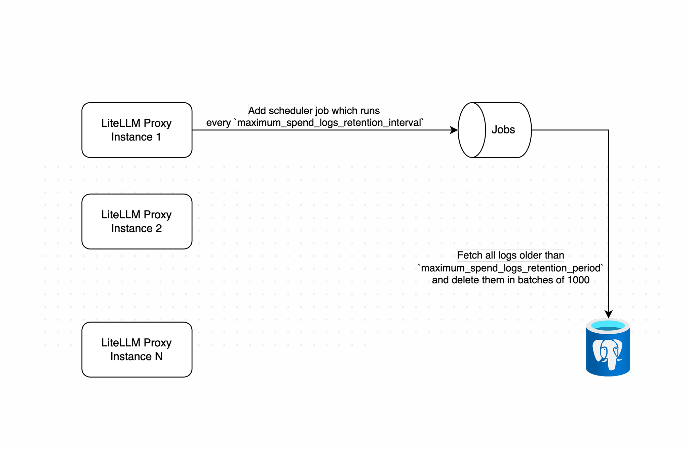

# Spend Log Cleanup

Automatically clean up old spend logs to manage database size and performance.

## What causes the problem?

LiteLLM accumulates spend logs for every request. Over time, these logs can grow to a large size, potentially impacting database performance and storage costs.

## How the spend log cleanup feature works

The spend log cleanup feature:

- Runs periodically to delete old spend logs
- Uses distributed locking to ensure only one instance runs cleanup at a time
- Deletes logs in batches to prevent database overload
- Configurable retention period and cleanup interval

## How it works

### Stage 1. Instance acquires cleanup lock

When cleanup is triggered, an instance will attempt to acquire a distributed lock:

- Only one instance can acquire the lock at a time
- The lock status is stored in Redis
- If an instance acquires the lock:
  - It proceeds with cleanup
  - Other instances skip cleanup
- If no instance has the lock:
  - Cleanup runs without distributed locking



<p style="text-align: left; color: #666">
Working of spend log deletions
</p>

### Stage 2. Batch deletion of old logs

The instance with the lock:

- Calculates cutoff date based on retention period
- Finds logs older than cutoff date
- Deletes logs in batches of 1000
- Adds small delays between batches to prevent database overload
- Releases lock when complete


<p style="text-align: left; color: #666">
Batch deletion of old logs
</p>

## Usage

### Required components

- Redis (optional, for distributed locking)
- Postgres

### Setup on LiteLLM config

You can configure spend log cleanup by setting the retention period and cleanup interval in the `general_settings` section of your `proxy_config.yaml` file:

```yaml title="litellm proxy_config.yaml" showLineNumbers
general_settings:
  maximum_spend_logs_retention_period: "7d" # Keep logs for 7 days, i.e the cutoff date, logs older than x should be deleted
  maximum_spend_logs_retention_interval: "1d" # Run cleanup every 1 day, i.e. the interval in which the job should run

litellm_settings:
  cache: True
  cache_params:
    type: redis
```

### Configuration Settings

#### Retention Period

The `maximum_spend_logs_retention_period` determines how long to keep logs before deletion. Supports the following formats:

- `"7d"` - 7 days
- `"24h"` - 24 hours
- `"60m"` - 60 minutes
- `"3600s"` - 3600 seconds

#### Cleanup Interval

The `maximum_spend_logs_retention_interval` controls how often the cleanup job runs. Uses the same time format as retention period:

- `"1d"` - Run cleanup daily
- `"12h"` - Run cleanup every 12 hours
- `"6h"` - Run cleanup every 6 hours
