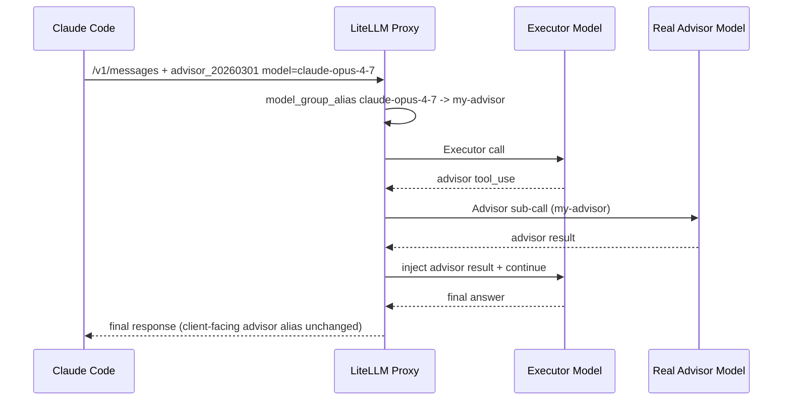

# Claude Code: Any Advisor Model via LiteLLM

This tutorial shows how to use **Claude Code's advisor tool** with **any model/provider** (OpenAI, Gemini, Bedrock, etc.) by routing through LiteLLM.

Claude Code sends advisor tools with a fixed Anthropic model name (for example `claude-opus-4-7`). LiteLLM can remap that to your real advisor model using `model_group_alias`.

<br />

<iframe width="840" height="500" src="https://www.loom.com/embed/db5bc6156c584e0998c7624821bd5272" frameborder="0" webkitallowfullscreen mozallowfullscreen allowfullscreen></iframe>

## Prerequisites

- [Claude Code](https://docs.anthropic.com/en/docs/claude-code/overview) installed
- LiteLLM proxy installed (`uv tool install 'litellm[proxy]'`)
- API keys for:
  - your **executor** model (for example Anthropic Sonnet)
  - your **advisor** model (for example OpenAI `o3`)

## Step 1: Create `config.yaml`

Create a LiteLLM config where:

1. your executor model is configured in `model_list`
2. your real advisor model is configured in `model_list`
3. `router_settings.model_group_alias` remaps Claude Code's advisor model name to your real advisor deployment

```yaml showLineNumbers title="config.yaml"
model_list:
  # Executor model (the main model Claude Code runs on)
  - model_name: claude-sonnet
    litellm_params:
      model: anthropic/claude-sonnet-4-6
      api_key: os.environ/ANTHROPIC_API_KEY

  # Real advisor model (can be any provider)
  - model_name: my-advisor
    litellm_params:
      model: openai/o3
      api_key: os.environ/OPENAI_API_KEY

router_settings:
  model_group_alias:
    # Claude Code sends this in advisor_20260301 tool model
    claude-opus-4-7: my-advisor

litellm_settings:
  drop_params: true
```

Set env vars:

```bash
export ANTHROPIC_API_KEY="your-anthropic-key"
export OPENAI_API_KEY="your-openai-key"
export LITELLM_MASTER_KEY="sk-1234"
```

## Step 2: Start LiteLLM Proxy

```bash showLineNumbers title="Run LiteLLM Proxy"
litellm --config /path/to/config.yaml
```

Expected startup endpoint:

```bash
# RUNNING on http://0.0.0.0:4000
```

## Step 3: Point Claude Code to LiteLLM

Configure Claude Code to call your LiteLLM proxy:

```bash showLineNumbers title="Claude Code environment variables"
export ANTHROPIC_BASE_URL="http://0.0.0.0:4000"
export ANTHROPIC_AUTH_TOKEN="$LITELLM_MASTER_KEY"
export ANTHROPIC_MODEL="claude-sonnet"
```

Then launch Claude Code:

```bash
claude
```

## Step 4: Call advisor from Claude Code

In Claude Code, ask for an advisor run (for example):

```text
Can you call advisor as integration test and confirm it works?
```

Claude Code will send an advisor tool like:

```json
{
  "type": "advisor_20260301",
  "name": "advisor",
  "model": "claude-opus-4-7"
}
```

LiteLLM will remap `claude-opus-4-7` -> `my-advisor` -> `openai/o3` and run the advisor loop.

## Step 5: Verify it is using your advisor model

Check proxy logs for advisor sub-calls:

```bash
rg "advisor_sub_call|litellm.acompletion\\(|openai/o3|my-advisor" proxy_server.log
```

You should see:

- the outer `/v1/messages` call on your executor (`claude-sonnet`)
- advisor sub-call routed to your mapped model (`openai/o3`)

## Internal flow



## Troubleshooting

### Why is my advisor model not found?

- Ensure alias target (`my-advisor`) exists as a `model_name` in `model_list`
- Confirm with:

```bash
curl http://0.0.0.0:4000/v1/models -H "Authorization: Bearer $LITELLM_MASTER_KEY"
```

### Why do I get `Invalid value: 'thinking'` with a non-Anthropic advisor?

- Upgrade LiteLLM to a version that includes advisor sub-call message translation for non-Anthropic providers

### Why is advisor output blank in streamed UI?

- Upgrade LiteLLM to a version where `advisor_tool_result` includes text in `content_block_start` for fake-stream iterator responses

### Why are spend/log rows missing for streamed advisor calls?

- Upgrade LiteLLM to a version that adds deferred logging support for non-`CustomStreamWrapper` anthropic streams

## Related docs

- [Advisor Tool Reference](/docs/completion/anthropic_advisor_tool)
- [Use Claude Code with Non-Anthropic Models](/docs/tutorials/claude_non_anthropic_models)
- [Forward Client Headers](/docs/proxy/forward_client_headers)
