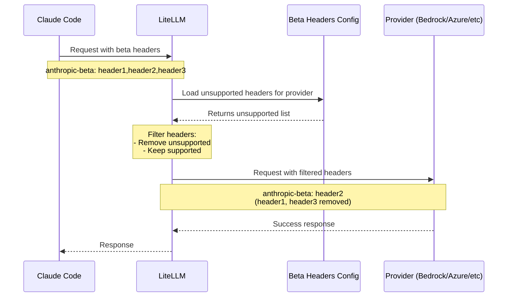

import Image from '@theme/IdealImage';

# Claude Code - Fixing Invalid Beta Header Errors

When using Claude Code with LiteLLM and non-Anthropic providers (Bedrock, Azure AI, Vertex AI), you may encounter "invalid beta header" errors. This guide explains how to fix these errors locally or contribute a fix to LiteLLM.

## What Are Beta Headers?

Anthropic uses beta headers to enable experimental features in Claude. When you use Claude Code, it may send beta headers like:

```
anthropic-beta: prompt-caching-scope-2026-01-05,advanced-tool-use-2025-11-20
```

However, not all providers support all Anthropic beta features. When an unsupported beta header is sent to a provider, you'll see an error.

## Common Error Message

```bash
Error: The model returned the following errors: invalid beta flag
```

## How LiteLLM Handles Beta Headers

LiteLLM automatically filters out unsupported beta headers using a configuration file:

```
litellm/litellm/anthropic_beta_headers_config.json
```

This JSON file lists which beta headers are **unsupported** for each provider. Headers not in the unsupported list are passed through to the provider.

## Quick Fix: Update Config Locally

If you encounter an invalid beta header error, you can fix it immediately by updating the config file locally.

### Step 1: Locate the Config File

Find the file in your LiteLLM installation:

```bash
# If installed via pip
cd $(python -c "import litellm; import os; print(os.path.dirname(litellm.__file__))")

# The config file is at:
# litellm/anthropic_beta_headers_config.json
```

### Step 2: Add the Unsupported Header

Open `anthropic_beta_headers_config.json` and add the problematic header to the appropriate provider's list:

```json title="anthropic_beta_headers_config.json"
{
  "description": "Unsupported Anthropic beta headers for each provider. Headers listed here will be dropped. Headers not listed are passed through as-is.",
  "anthropic": [],
  "azure_ai": [],
  "bedrock_converse": [
    "prompt-caching-scope-2026-01-05",
    "bash_20250124",
    "bash_20241022",
    "text_editor_20250124",
    "text_editor_20241022",
    "compact-2026-01-12",
    "advanced-tool-use-2025-11-20",
    "web-fetch-2025-09-10",
    "code-execution-2025-08-25",
    "skills-2025-10-02",
    "files-api-2025-04-14"
  ],
  "bedrock": [
    "advanced-tool-use-2025-11-20",
    "prompt-caching-scope-2026-01-05",
    "structured-outputs-2025-11-13",
    "web-fetch-2025-09-10",
    "code-execution-2025-08-25",
    "skills-2025-10-02",
    "files-api-2025-04-14"
  ],
  "vertex_ai": [
    "prompt-caching-scope-2026-01-05"
  ]
}
```

### Step 3: Restart Your Application

After updating the config file, restart your LiteLLM proxy or application:

```bash
# If using LiteLLM proxy
litellm --config config.yaml

# If using Python SDK
# Just restart your Python application
```

The updated configuration will be loaded automatically.

## Contributing a Fix to LiteLLM

Help the community by contributing your fix! If your local changes work, please raise a PR with the addition of the header and we will merge it.


## How Beta Header Filtering Works

When you make a request through LiteLLM:

