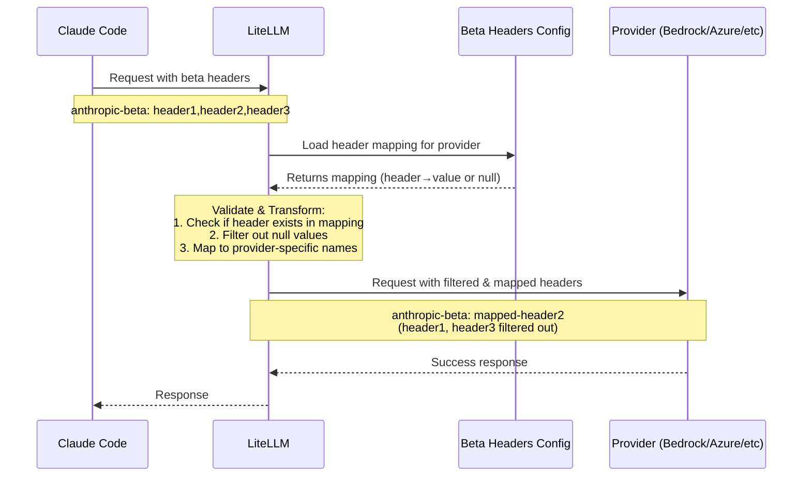

import Image from '@theme/IdealImage';

# Claude Code - Managing Anthropic Beta Headers

When using Claude Code with LiteLLM and non-Anthropic providers (Bedrock, Azure AI, Vertex AI), you need to ensure that only supported beta headers are sent to each provider. This guide explains how to add support for new beta headers or fix invalid beta header errors.

## What Are Beta Headers?

Anthropic uses beta headers to enable experimental features in Claude. When you use Claude Code, it may send beta headers like:

```
anthropic-beta: prompt-caching-scope-2026-01-05,advanced-tool-use-2025-11-20
```

However, not all providers support all Anthropic beta features. LiteLLM uses `anthropic_beta_headers_config.json` to manage which beta headers are supported by each provider.

## Common Error Message

```bash
Error: The model returned the following errors: invalid beta flag
```

## How LiteLLM Handles Beta Headers

LiteLLM uses a strict validation approach with a configuration file:

```
litellm/litellm/anthropic_beta_headers_config.json
```

This JSON file contains a **mapping** of beta headers for each provider:
- **Keys**: Input beta header names (from Anthropic)
- **Values**: Provider-specific header names (or `null` if unsupported)
- **Validation**: Only headers present in the mapping with non-null values are forwarded

This enforces stricter validation than just filtering unsupported headers - headers must be explicitly defined to be allowed.

## Adding Support for a New Beta Header

When Anthropic releases a new beta feature, you need to add it to the configuration file for each provider.

### Step 1: Locate the Config File

Find the file in your LiteLLM installation:

```bash
# If installed via pip
cd $(python -c "import litellm; import os; print(os.path.dirname(litellm.__file__))")

# The config file is at:
# litellm/anthropic_beta_headers_config.json
```

### Step 2: Add the New Beta Header

Open `anthropic_beta_headers_config.json` and add the new header to each provider's mapping:

```json title="anthropic_beta_headers_config.json"
{
  "description": "Mapping of Anthropic beta headers for each provider. Keys are input header names, values are provider-specific header names (or null if unsupported). Only headers present in mapping keys with non-null values can be forwarded.",
  "anthropic": {
    "advanced-tool-use-2025-11-20": "advanced-tool-use-2025-11-20",
    "new-feature-2026-03-01": "new-feature-2026-03-01",
    ...
  },
  "azure_ai": {
    "advanced-tool-use-2025-11-20": "advanced-tool-use-2025-11-20",
    "new-feature-2026-03-01": "new-feature-2026-03-01",
    ...
  },
  "bedrock_converse": {
    "advanced-tool-use-2025-11-20": "tool-search-tool-2025-10-19",
    "new-feature-2026-03-01": null,
    ...
  },
  "bedrock": {
    "advanced-tool-use-2025-11-20": "tool-search-tool-2025-10-19",
    "new-feature-2026-03-01": null,
    ...
  },
  "vertex_ai": {
    "advanced-tool-use-2025-11-20": "tool-search-tool-2025-10-19",
    "new-feature-2026-03-01": null,
    ...
  }
}
```

**Key Points:**
- **Supported headers**: Set the value to the provider-specific header name (often the same as the key)
- **Unsupported headers**: Set the value to `null`
- **Header transformations**: Some providers use different header names (e.g., Bedrock maps `advanced-tool-use-2025-11-20` to `tool-search-tool-2025-10-19`)
- **Alphabetical order**: Keep headers sorted alphabetically for maintainability

### Step 3: Reload Configuration (No Restart Required!)

**Option 1: Dynamic Reload Without Restart** 

Instead of restarting your application, you can dynamically reload the beta headers configuration using environment variables and API endpoints:

```bash
# Set environment variable to fetch from remote URL (Do this if you want to point it to some other URL)
export LITELLM_ANTHROPIC_BETA_HEADERS_URL="https://raw.githubusercontent.com/BerriAI/litellm/main/litellm/anthropic_beta_headers_config.json"

# Manually trigger reload via API (no restart needed!)
curl -X POST "https://your-proxy-url/reload/anthropic_beta_headers" \
  -H "Authorization: Bearer YOUR_ADMIN_TOKEN"
```

**Option 2: Schedule Automatic Reloads** 

Set up automatic reloading to always stay up-to-date with the latest beta headers:

```bash
# Reload configuration every 24 hours
curl -X POST "https://your-proxy-url/schedule/anthropic_beta_headers_reload?hours=24" \
  -H "Authorization: Bearer YOUR_ADMIN_TOKEN"
```

**Option 3: Traditional Restart**

If you prefer the traditional approach, restart your LiteLLM proxy or application:

```bash
# If using LiteLLM proxy
litellm --config config.yaml

# If using Python SDK
# Just restart your Python application
```

:::tip Zero-Downtime Updates
With dynamic reloading, you can fix invalid beta header errors **without restarting your service**! This is especially useful in production environments where downtime is costly.

See [Auto Sync Anthropic Beta Headers](../proxy/sync_anthropic_beta_headers.md) for complete documentation.
:::

## Fixing Invalid Beta Header Errors

If you encounter an "invalid beta flag" error, it means a beta header is being sent that the provider doesn't support.

### Step 1: Identify the Problematic Header

Check your logs to see which header is causing the issue:

```bash
Error: The model returned the following errors: invalid beta flag: new-feature-2026-03-01
```

### Step 2: Update the Config

Set the header value to `null` for that provider:

```json title="anthropic_beta_headers_config.json"
{
  "bedrock_converse": {
    "new-feature-2026-03-01": null
  }
}
```

### Step 3: Restart and Test

Restart your application and verify the header is now filtered out.

## Contributing a Fix to LiteLLM

Help the community by contributing your fix!

### What to Include in Your PR

1. **Update the config file**: Add the new beta header to `litellm/anthropic_beta_headers_config.json`
2. **Test your changes**: Verify the header is correctly filtered/mapped for each provider
3. **Documentation**: Include provider documentation links showing which headers are supported

### Example PR Description

```markdown
## Add support for new-feature-2026-03-01 beta header

### Changes
- Added `new-feature-2026-03-01` to anthropic_beta_headers_config.json
- Set to `null` for bedrock_converse (unsupported)
- Set to header name for anthropic, azure_ai (supported)

### Testing
Tested with:
- ✅ Anthropic: Header passed through correctly
- ✅ Azure AI: Header passed through correctly  
- ✅ Bedrock Converse: Header filtered out (returns error without fix)

### References
- Anthropic docs: [link]
- AWS Bedrock docs: [link]
```


## How Beta Header Filtering Works

When you make a request through LiteLLM:



### Filtering Rules

1. **Header must exist in mapping**: Unknown headers are filtered out
2. **Header must have non-null value**: Headers with `null` values are filtered out
3. **Header transformation**: Headers are mapped to provider-specific names (e.g., `advanced-tool-use-2025-11-20` → `tool-search-tool-2025-10-19` for Bedrock)

### Example

Request with headers:
```
anthropic-beta: advanced-tool-use-2025-11-20,computer-use-2025-01-24,unknown-header
```

For Bedrock Converse:
- ✅ `computer-use-2025-01-24` → `computer-use-2025-01-24` (supported, passed through)
- ❌ `advanced-tool-use-2025-11-20` → filtered out (null value in config)
- ❌ `unknown-header` → filtered out (not in config)

Result sent to Bedrock:
```
anthropic-beta: computer-use-2025-01-24
```

## Dynamic Configuration Management (No Restart Required!)

### Environment Variables

Control how LiteLLM loads the beta headers configuration:

| Variable | Description | Default |
|----------|-------------|---------|
| `LITELLM_ANTHROPIC_BETA_HEADERS_URL` | URL to fetch config from | GitHub main branch |
| `LITELLM_LOCAL_ANTHROPIC_BETA_HEADERS` | Set to `True` to use local config only | `False` |

**Example: Use Custom Config URL**
```bash
export LITELLM_ANTHROPIC_BETA_HEADERS_URL="https://your-company.com/custom-beta-headers.json"
```

**Example: Use Local Config Only (No Remote Fetching)**
```bash
export LITELLM_LOCAL_ANTHROPIC_BETA_HEADERS=True
```
## Provider-Specific Notes

### Bedrock
- Beta headers appear in both HTTP headers AND request body (`additionalModelRequestFields.anthropic_beta`)
- Some headers are transformed (e.g., `advanced-tool-use` → `tool-search-tool`)

### Azure AI
- Uses same header names as Anthropic
- Some features not yet supported (check config for null values)

### Vertex AI
- Some headers are transformed to match Vertex AI's implementation
- Limited beta feature support compared to Anthropic