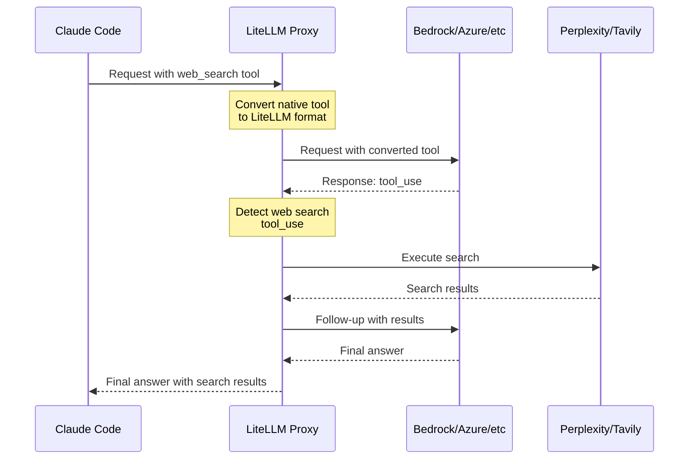

import Image from '@theme/IdealImage';

# Claude Code - WebSearch Across All Providers

Enable Claude Code's web search tool to work with any provider (Bedrock, Azure, Vertex, etc.). LiteLLM automatically intercepts web search requests and executes them server-side.

<Image img={require('../../img/claude_code_websearch.png')} />

## Proxy Configuration

Add WebSearch interception to your `litellm_config.yaml`:

```yaml showLineNumbers title="litellm_config.yaml"
model_list:
  - model_name: bedrock-sonnet
    litellm_params:
      model: bedrock/us.anthropic.claude-sonnet-4-5-20250929-v1:0
      aws_region_name: us-east-1

# Enable WebSearch interception for providers
litellm_settings:
  callbacks:
    - websearch_interception:
        enabled_providers:
          - bedrock
          - azure
          - vertex_ai
        search_tool_name: perplexity-search  # Optional: specific search tool

# Configure search provider
search_tools:
  - search_tool_name: perplexity-search
    litellm_params:
      search_provider: perplexity
      api_key: os.environ/PERPLEXITY_API_KEY
```

## Quick Start

### 1. Configure LiteLLM Proxy

Create `config.yaml`:

```yaml showLineNumbers title="config.yaml"
model_list:
  - model_name: bedrock-sonnet
    litellm_params:
      model: bedrock/us.anthropic.claude-sonnet-4-5-20250929-v1:0
      aws_region_name: us-east-1

litellm_settings:
  callbacks:
    - websearch_interception:
        enabled_providers: [bedrock]

search_tools:
  - search_tool_name: perplexity-search
    litellm_params:
      search_provider: perplexity
      api_key: os.environ/PERPLEXITY_API_KEY
```

### 2. Start Proxy

```bash showLineNumbers title="Start LiteLLM Proxy"
export PERPLEXITY_API_KEY=your-key
litellm --config config.yaml
```

### 3. Use with Claude Code

```bash showLineNumbers title="Configure Claude Code"
export ANTHROPIC_BASE_URL=http://localhost:4000
export ANTHROPIC_API_KEY=sk-1234
claude
```

Now use web search in Claude Code - it works with any provider!

## How It Works

When Claude Code sends a web search request, LiteLLM:
1. Intercepts the native `web_search` tool
2. Converts it to LiteLLM's standard format
3. Executes the search via Perplexity/Tavily
4. Returns the final answer to Claude Code



**Result**: One API call from Claude Code → Complete answer with search results

## Supported Providers

| Provider | Native Web Search | With LiteLLM |
|----------|-------------------|--------------|
| **Anthropic** | ✅ Yes | ✅ Yes |
| **Bedrock** | ❌ No | ✅ Yes |
| **Azure** | ❌ No | ✅ Yes |
| **Vertex AI** | ❌ No | ✅ Yes |
| **Other Providers** | ❌ No | ✅ Yes |

## Search Providers

Configure which search provider to use. LiteLLM supports multiple search providers:

| Provider | `search_provider` Value | Environment Variable |
|----------|------------------------|----------------------|
| **Perplexity AI** | `perplexity` | `PERPLEXITYAI_API_KEY` |
| **Tavily** | `tavily` | `TAVILY_API_KEY` |
| **Exa AI** | `exa_ai` | `EXA_API_KEY` |
| **Parallel AI** | `parallel_ai` | `PARALLEL_AI_API_KEY` |
| **Google PSE** | `google_pse` | `GOOGLE_PSE_API_KEY`, `GOOGLE_PSE_ENGINE_ID` |
| **DataForSEO** | `dataforseo` | `DATAFORSEO_LOGIN`, `DATAFORSEO_PASSWORD` |
| **Firecrawl** | `firecrawl` | `FIRECRAWL_API_KEY` |
| **SearXNG** | `searxng` | `SEARXNG_API_BASE` (required) |
| **Linkup** | `linkup` | `LINKUP_API_KEY` |

See [all supported search providers](../search/index.md) for detailed setup instructions and provider-specific parameters.

## Configuration Options

### WebSearch Interception Parameters

| Parameter | Type | Required | Description | Example |
|-----------|------|----------|-------------|---------|
| `enabled_providers` | List[String] | Yes | List of providers to enable web search interception for | `[bedrock, azure, vertex_ai]` |
| `search_tool_name` | String | No | Specific search tool from `search_tools` config. If not set, uses first available search tool. | `perplexity-search` |

### Supported Provider Values

Use these values in `enabled_providers`:

| Provider | Value | Description |
|----------|-------|-------------|
| AWS Bedrock | `bedrock` | Amazon Bedrock Claude models |
| Azure OpenAI | `azure` | Azure-hosted models |
| Google Vertex AI | `vertex_ai` | Google Cloud Vertex AI |
| Any Other | Provider name | Any LiteLLM-supported provider |

### Complete Configuration Example

```yaml showLineNumbers title="Complete config.yaml"
model_list:
  - model_name: bedrock-sonnet
    litellm_params:
      model: bedrock/us.anthropic.claude-sonnet-4-5-20250929-v1:0
      aws_region_name: us-east-1

  - model_name: azure-gpt4
    litellm_params:
      model: azure/gpt-4
      api_base: https://my-azure.openai.azure.com
      api_key: os.environ/AZURE_API_KEY

litellm_settings:
  callbacks:
    - websearch_interception:
        enabled_providers:
          - bedrock        # Enable for AWS Bedrock
          - azure          # Enable for Azure OpenAI
          - vertex_ai      # Enable for Google Vertex
        search_tool_name: perplexity-search  # Optional: use specific search tool

# Configure search tools
search_tools:
  - search_tool_name: perplexity-search
    litellm_params:
      search_provider: perplexity
      api_key: os.environ/PERPLEXITY_API_KEY

  - search_tool_name: tavily-search
    litellm_params:
      search_provider: tavily
      api_key: os.environ/TAVILY_API_KEY
```

**How search tool selection works:**
- If `search_tool_name` is specified → Uses that specific search tool
- If `search_tool_name` is not specified → Uses first search tool in `search_tools` list
- In example above: Without `search_tool_name`, would use `perplexity-search` (first in list)

## Related

- [Claude Code Quickstart](./claude_responses_api.md)
- [Claude Code Cost Tracking](./claude_code_customer_tracking.md)
- [Using Non-Anthropic Models](./claude_non_anthropic_models.md)
