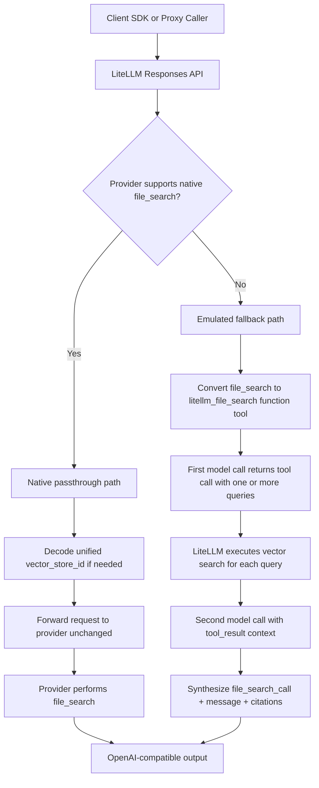

import Tabs from '@theme/Tabs';
import TabItem from '@theme/TabItem';

# File Search in the Responses API — E2E Testing Guide

LiteLLM now supports `file_search` in the Responses API across both:
- providers that support it natively (like OpenAI / Azure), and
- providers that do not (like Anthropic, Bedrock, and other non-native providers) via emulation.

This page is both a quick blog-style overview and an end-to-end implementation guide.

## What this is

`file_search` lets models retrieve grounded context from your vector stores and answer with citations.
LiteLLM keeps one OpenAI-compatible output shape while routing requests through either native passthrough or an emulated fallback.

Two paths are covered:

| Path | When it runs | What LiteLLM does |
|---|---|---|
| **Native passthrough** | Provider natively supports `file_search` (OpenAI, Azure) | Decodes unified vector store ID → forwards to provider as-is |
| **Emulated fallback** | Provider doesn't support `file_search` (Anthropic, Bedrock, etc.) | Converts to a function tool → intercepts tool call → runs vector search → synthesizes OpenAI-format output |

---

## Usage

<Tabs>
<TabItem value="proxy" label="LiteLLM Proxy" default>

### 1. Setup `config.yaml`

```yaml title="config.yaml"
model_list:
  - model_name: gpt-4.1
    litellm_params:
      model: openai/gpt-4.1
      api_key: os.environ/OPENAI_API_KEY

  - model_name: claude-sonnet
    litellm_params:
      model: anthropic/claude-sonnet-4-5
      api_key: os.environ/ANTHROPIC_API_KEY
```

### 2. Start the proxy

```bash
litellm --config config.yaml
```

### 3. Call Responses API with `file_search`

```python title="Proxy call"
from openai import OpenAI

client = OpenAI(base_url="http://localhost:4000", api_key="sk-your-proxy-key")

response = client.responses.create(
    model="claude-sonnet",  # swap to "gpt-4.1" for native path
    input="What does LiteLLM support?",
    tools=[{
        "type": "file_search",
        "vector_store_ids": ["vs_abc123"]
    }],
    include=["file_search_call.results"],
)

print(response.output)
```

</TabItem>
<TabItem value="sdk" label="LiteLLM SDK">

### 1. Install + set keys

```bash
pip install litellm
export OPENAI_API_KEY="sk-..."
export ANTHROPIC_API_KEY="sk-ant-..."
```

### 2. Call Responses API with `file_search`

```python title="SDK call"
import litellm

response = litellm.responses(
    model="anthropic/claude-sonnet-4-5",  # swap to openai/gpt-4.1 for native path
    input="What does LiteLLM support?",
    tools=[{
        "type": "file_search",
        "vector_store_ids": ["vs_abc123"]
    }],
    include=["file_search_call.results"],
)

print(response.output)
```

</TabItem>
</Tabs>

### Behavior Matrix

| Path | SDK model | Proxy model | Behavior |
|---|---|---|---|
| Native passthrough | `openai/gpt-4.1` | `gpt-4.1` | Provider executes native `file_search` |
| Emulated fallback | `anthropic/claude-sonnet-4-5` | `claude-sonnet` | LiteLLM converts to function tool and synthesizes OpenAI-format output |

---

## Architecture Diagram



---

## Prerequisites

```bash
pip install 'litellm[proxy]'
export OPENAI_API_KEY="sk-..."          # for native path
export ANTHROPIC_API_KEY="sk-ant-..."  # for emulated path
```

---

## Example response shape

## Validating the Output Format

Regardless of which path ran, the response always follows the OpenAI Responses API format:

```json
{
  "output": [
    {
      "type": "file_search_call",
      "id": "fs_abc123",
      "status": "completed",
      "queries": ["What does LiteLLM support?"],
      "search_results": null
    },
    {
      "type": "message",
      "role": "assistant",
      "content": [
        {
          "type": "output_text",
          "text": "LiteLLM is a unified interface...",
          "annotations": [
            {
              "type": "file_citation",
              "index": 150,
              "file_id": "file-xxxx",
              "filename": "knowledge.txt"
            }
          ]
        }
      ]
    }
  ]
}
```

**Validation script:**

```python showLineNumbers title="Validate response structure"
def validate_file_search_response(response):
    """Assert that response follows OpenAI file_search output format."""
    output = response.output
    assert len(output) >= 2, "Expected at least 2 output items"

    # First item: file_search_call
    fs_call = output[0]
    fs_type = fs_call["type"] if isinstance(fs_call, dict) else fs_call.type
    assert fs_type == "file_search_call", f"Expected file_search_call, got {fs_type}"

    fs_status = fs_call["status"] if isinstance(fs_call, dict) else fs_call.status
    assert fs_status == "completed"

    # Second item: message
    msg = output[1]
    msg_type = msg["type"] if isinstance(msg, dict) else msg.type
    assert msg_type == "message"

    content = msg["content"] if isinstance(msg, dict) else msg.content
    assert len(content) > 0
    text_block = content[0]
    text = text_block["text"] if isinstance(text_block, dict) else text_block.text
    assert isinstance(text, str) and len(text) > 0

    print("✅ Response structure valid")
    print(f"   Queries: {fs_call['queries'] if isinstance(fs_call, dict) else fs_call.queries}")
    print(f"   Answer length: {len(text)} chars")
    annotations = text_block["annotations"] if isinstance(text_block, dict) else text_block.annotations
    print(f"   Citations: {len(annotations)}")

validate_file_search_response(response)
```

---

## Q&A

### Q: Why do I see `UnsupportedParamsError`?

A: This usually means `file_search` was passed to a provider that does not support it natively and emulation could not route correctly.
Check:
- The model string is valid (for example, `anthropic/claude-sonnet-4-5`).
- `custom_llm_provider` resolves correctly so LiteLLM can load the provider config.

### Q: Why does vector search return no results?

A: Common causes:
- The vector store ID is wrong or has no files attached.
- In LiteLLM-managed stores, file ingestion is not complete (`status != completed`).
- The query is too narrow; try a broader query.

### Q: Why am I getting `403 Access denied` on vector store calls?

A: The caller does not have access to that vector store.
- The store may belong to another team.
- Use an admin/proxy key if your setup requires cross-team access.

### Q: Why are `annotations` empty in emulated mode?

A: `file_citation` annotations require `file_id` metadata in search results.
If your vector backend does not return file-level metadata, the answer text is still generated but citations can be empty.

---

## What to check next

- [File Search reference in Responses API docs](/docs/response_api#file-search-vector-stores) — full API reference
- [Vector Store management](/docs/vector_store_files) — create and manage vector stores
- [Managed vector stores](/docs/providers/bedrock_vector_store) — provider-specific setup
