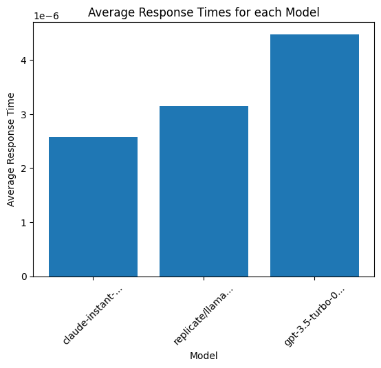
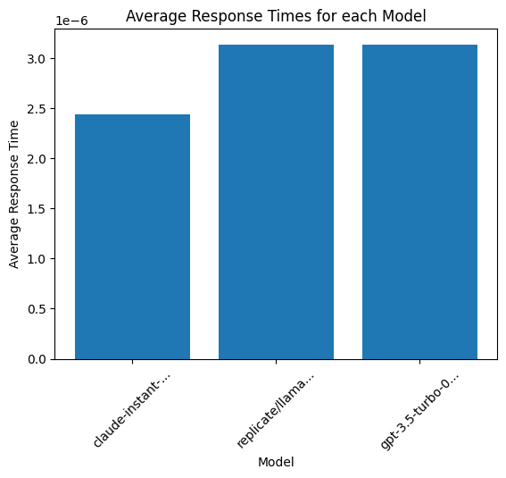

# Reliability test Multiple LLM Providers with LiteLLM


*   Quality Testing
*   Load Testing
*   Duration Testing


```python
!pip install litellm python-dotenv
```


```python
import litellm
from litellm import load_test_model, testing_batch_completion
import time
```


```python
from dotenv import load_dotenv
load_dotenv()
```

# Quality Test endpoint

## Test the same prompt across multiple LLM providers

In this example, let's ask some questions about Paul Graham


```python
models = ["gpt-3.5-turbo", "gpt-3.5-turbo-16k", "gpt-4", "claude-instant-1", "replicate/llama-2-70b-chat:58d078176e02c219e11eb4da5a02a7830a283b14cf8f94537af893ccff5ee781"]
context = """Paul Graham (/ɡræm/; born 1964)[3] is an English computer scientist, essayist, entrepreneur, venture capitalist, and author. He is best known for his work on the programming language Lisp, his former startup Viaweb (later renamed Yahoo! Store), cofounding the influential startup accelerator and seed capital firm Y Combinator, his essays, and Hacker News. He is the author of several computer programming books, including: On Lisp,[4] ANSI Common Lisp,[5] and Hackers & Painters.[6] Technology journalist Steven Levy has described Graham as a "hacker philosopher".[7] Graham was born in England, where he and his family maintain permanent residence. However he is also a citizen of the United States, where he was educated, lived, and worked until 2016."""
prompts = ["Who is Paul Graham?", "What is Paul Graham known for?" , "Is paul graham a writer?" , "Where does Paul Graham live?", "What has Paul Graham done?"]
messages =  [[{"role": "user", "content": context + "\n" + prompt}] for prompt in prompts] # pass in a list of messages we want to test
result = testing_batch_completion(models=models, messages=messages)
```


# Load Test endpoint

Run 100+ simultaneous queries across multiple providers to see when they fail + impact on latency


```python
models=["gpt-3.5-turbo", "replicate/llama-2-70b-chat:58d078176e02c219e11eb4da5a02a7830a283b14cf8f94537af893ccff5ee781", "claude-instant-1"]
context = """Paul Graham (/ɡræm/; born 1964)[3] is an English computer scientist, essayist, entrepreneur, venture capitalist, and author. He is best known for his work on the programming language Lisp, his former startup Viaweb (later renamed Yahoo! Store), cofounding the influential startup accelerator and seed capital firm Y Combinator, his essays, and Hacker News. He is the author of several computer programming books, including: On Lisp,[4] ANSI Common Lisp,[5] and Hackers & Painters.[6] Technology journalist Steven Levy has described Graham as a "hacker philosopher".[7] Graham was born in England, where he and his family maintain permanent residence. However he is also a citizen of the United States, where he was educated, lived, and worked until 2016."""
prompt = "Where does Paul Graham live?"
final_prompt = context + prompt
result = load_test_model(models=models, prompt=final_prompt, num_calls=5)
```

## Visualize the data


```python
import matplotlib.pyplot as plt

## calculate avg response time
unique_models = set(result["response"]['model'] for result in result["results"])
model_dict = {model: {"response_time": []} for model in unique_models}
for completion_result in result["results"]:
    model_dict[completion_result["response"]["model"]]["response_time"].append(completion_result["response_time"])

avg_response_time = {}
for model, data in model_dict.items():
    avg_response_time[model] = sum(data["response_time"]) / len(data["response_time"])

models = list(avg_response_time.keys())
response_times = list(avg_response_time.values())

plt.bar(models, response_times)
plt.xlabel('Model', fontsize=10)
plt.ylabel('Average Response Time')
plt.title('Average Response Times for each Model')

plt.xticks(models, [model[:15]+'...' if len(model) > 15 else model for model in models], rotation=45)
plt.show()
```


    

    


# Duration Test endpoint

Run load testing for 2 mins. Hitting endpoints with 100+ queries every 15 seconds.


```python
models=["gpt-3.5-turbo", "replicate/llama-2-70b-chat:58d078176e02c219e11eb4da5a02a7830a283b14cf8f94537af893ccff5ee781", "claude-instant-1"]
context = """Paul Graham (/ɡræm/; born 1964)[3] is an English computer scientist, essayist, entrepreneur, venture capitalist, and author. He is best known for his work on the programming language Lisp, his former startup Viaweb (later renamed Yahoo! Store), cofounding the influential startup accelerator and seed capital firm Y Combinator, his essays, and Hacker News. He is the author of several computer programming books, including: On Lisp,[4] ANSI Common Lisp,[5] and Hackers & Painters.[6] Technology journalist Steven Levy has described Graham as a "hacker philosopher".[7] Graham was born in England, where he and his family maintain permanent residence. However he is also a citizen of the United States, where he was educated, lived, and worked until 2016."""
prompt = "Where does Paul Graham live?"
final_prompt = context + prompt
result = load_test_model(models=models, prompt=final_prompt, num_calls=100, interval=15, duration=120)
```


```python
import matplotlib.pyplot as plt

## calculate avg response time
unique_models = set(unique_result["response"]['model'] for unique_result in result[0]["results"])
model_dict = {model: {"response_time": []} for model in unique_models}
for iteration in result:
  for completion_result in iteration["results"]:
    model_dict[completion_result["response"]["model"]]["response_time"].append(completion_result["response_time"])

avg_response_time = {}
for model, data in model_dict.items():
    avg_response_time[model] = sum(data["response_time"]) / len(data["response_time"])

models = list(avg_response_time.keys())
response_times = list(avg_response_time.values())

plt.bar(models, response_times)
plt.xlabel('Model', fontsize=10)
plt.ylabel('Average Response Time')
plt.title('Average Response Times for each Model')

plt.xticks(models, [model[:15]+'...' if len(model) > 15 else model for model in models], rotation=45)
plt.show()
```


    

    

