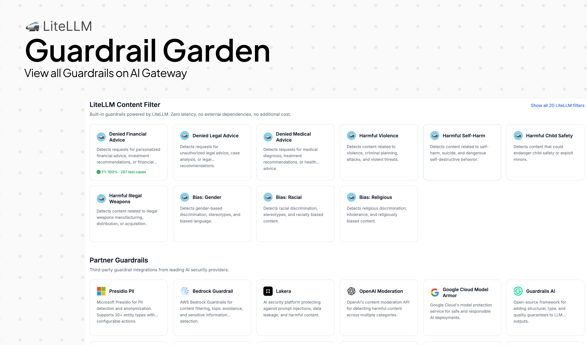
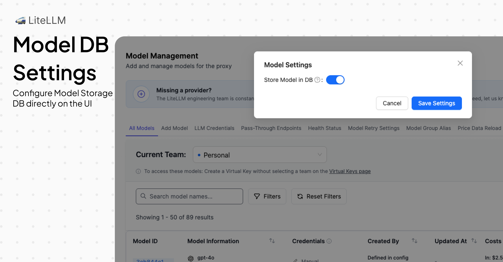
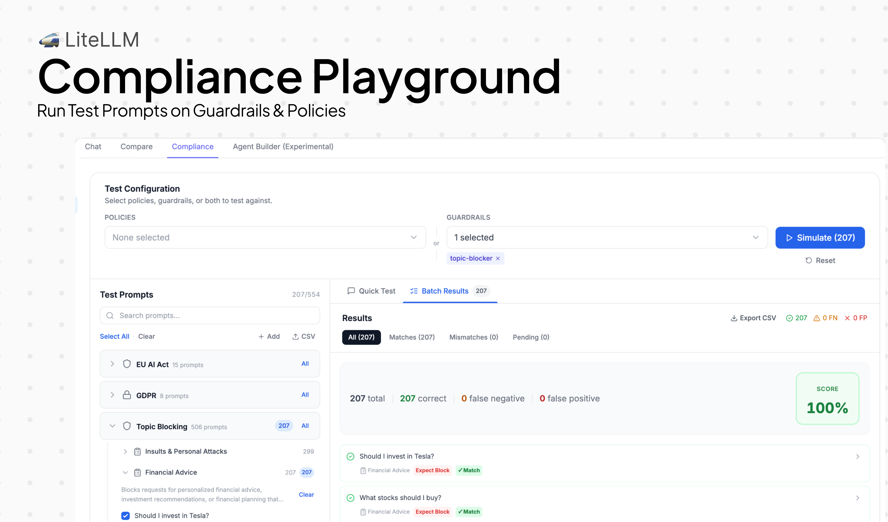
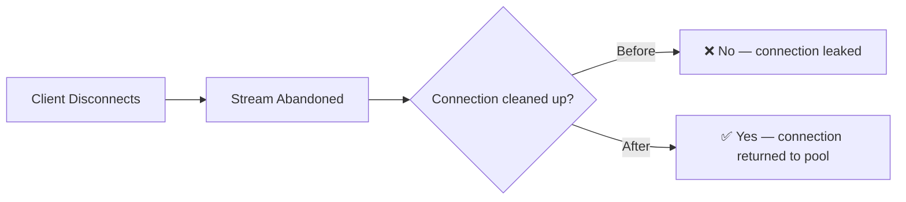
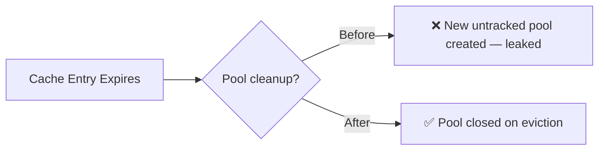

## Deploy this version

import Tabs from '@theme/Tabs';
import TabItem from '@theme/TabItem';
import Image from '@theme/IdealImage';

<Tabs>
<TabItem value="docker" label="Docker">

``` showLineNumbers title="docker run litellm"
docker run \
-e STORE_MODEL_IN_DB=True \
-p 4000:4000 \
ghcr.io/berriai/litellm:main-v1.81.14.rc.1
```

</TabItem>
<TabItem value="pip" label="Pip">

``` showLineNumbers title="pip install litellm"
pip install litellm==1.81.14
```

</TabItem>
</Tabs>

## Key Highlights

- **Guardrail Garden** — [Browse built-in and partner guardrails by use case — competitor blocking, topic filtering, GDPR, prompt injection, and more. Pick a template, customize it, attach it to a team or key.](../../docs/proxy/guardrails/policy_templates)
- **Compliance Playground** — [Test any guardrail policy against your own traffic before it goes live. See precision, recall, and false positive rate — so you know how it'll behave in production.](../../docs/proxy/guardrails/policy_templates)
- **3 new zero-cost built-in guardrails** — [Competitor name blocker, topic blocker, and insults filter — all gateway-level, &lt;0.1ms latency, no external API, configurable per-team or key](../../docs/proxy/guardrails)
- **Store Model in DB Settings via UI** - [Configure model storage directly in the Admin UI without editing config files or restarting the proxy—perfect for cloud deployments](../../docs/proxy/ui_store_model_db_setting)
- **Claude Sonnet 4.6 — day 0** — [Full support across Anthropic and Vertex AI: reasoning, computer use, prompt caching, 200K context](../../docs/providers/anthropic)
- **20+ performance optimizations** — Faster routing, lower logging overhead, reduced cost-calculator latency, and connection pool fixes — meaningfully less CPU and latency on every request

---


### Guardrail Garden

AI Platform Admins can now browse built-in and partner guardrails from the Guardrail Garden. Guardrails are organized by use case — blocking financial advice, filtering insults, detecting competitor mentions, and more — so you can find the right one and deploy it in a few clicks.



### 3 New Built-in Guardrails

This release brings 3 new built-in guardrails that run directly on the gateway. This is great for AI Gateway Admins who need low latency, zero cost guardrails for their scenarios.

- **Denied Financial Advice** — detects requests for personalized financial advice, investment recommendations, or financial planning
- **Denied Insults** — detects insults, name-calling, and personal attacks directed at the chatbot, staff, or other people
- **Competitor Name Blocker** — detects mentions of competitor brands in responses

These guardrails are built for production and on our benchmarks had a 100% Recall and Precision.

### Store Model in DB Settings via UI

Previously, the `store_model_in_db` setting could only be configured in `proxy_config.yaml` under `general_settings`, requiring a proxy restart to take effect. Now you can enable or disable this setting directly from the Admin UI without any restarts. This is especially useful for cloud deployments where you don't have direct access to config files or want to avoid downtime. Enable `store_model_in_db` to move model definitions from your YAML into the database—reducing config complexity, improving scalability, and enabling dynamic model management across multiple proxy instances.




#### Eval results

We benchmarked our new built-in guardrails against labeled datasets before shipping. You can see the results for Denied Financial Advice (207 cases) and Denied Insults (299 cases):

| Guardrail | Precision | Recall | F1 | Latency p50 | Cost/req |
|-----------|-----------|--------|----|-------------|----------|
| Denied Financial Advice | 100% | 100% | 100% | &lt;0.1ms | $0 |
| Denied Insults | 100% | 100% | 100% | &lt;0.1ms | $0 |

100% precision means zero false positives — no legitimate messages were incorrectly blocked. 100% recall means zero false negatives — every message that should have been blocked was caught.


### Compliance Playground

The Compliance Playground lets you test any guardrail against our pre-built eval datasets or your own custom datasets, so you can see precision, recall, and false positive rate before rolling it out to production.




---

## Performance & Reliability — Up to 13% Lower Latency

<Image img={require('../img/release_notes/v1_81_14_perf.png')} />

This release cuts latency across all percentiles through 20+ micro-optimizations across logging, cost calculation, routing, and connection management. See [benchmarking](../../docs/benchmarks) for more info about how to benchmark yourself. 

- **Mean latency:** 78.4 ms → **70.3 ms** (−10.3%)
- **p50 latency:** 64.8 ms → **57.3 ms** (−11.7%)
- **p99 latency:** 288.9 ms → **250.0 ms** (−13.4%)

**Streaming Connection Pool Fix**

Fixed a 3-fold connection leak that caused TCP connection starvation under streaming workloads: the aiohttp transport wasn't closing connections, no `finally` blocks were calling close on disconnect, and a Uvicorn bug prevented disconnect signaling. [PR #21213](https://github.com/BerriAI/litellm/pull/21213)



**Redis Connection Pool Reliability**

Fixed 4 separate connection pool bugs to make how we use Redis more reliable. The most important change was on pools being leaked on cache expiry and the other fixes are detailed here in [PR #21717](https://github.com/BerriAI/litellm/pull/21717).



---

## New Providers and Endpoints

### New Providers (1 new provider)

| Provider | Supported LiteLLM Endpoints | Description |
| -------- | --------------------------- | ----------- |
| [IBM watsonx.ai](../../docs/providers/watsonx) | `/rerank` | Rerank support for IBM watsonx.ai models |

### New LLM API Endpoints (1 new endpoint)

| Endpoint | Method | Description | Documentation |
| -------- | ------ | ----------- | ------------- |
| `/v1/evals` | POST/GET | OpenAI-compatible Evals API for model evaluation | [Docs](../../docs/evals_api) |

---

## New Models / Updated Models

#### New Model Support (13 new models)

| Provider | Model | Context Window | Input ($/1M tokens) | Output ($/1M tokens) | Features |
| -------- | ----- | -------------- | ------------------- | -------------------- | -------- |
| Anthropic | `claude-sonnet-4-6` | 200K | $3.00 | $15.00 | Reasoning, computer use, prompt caching, vision, PDF |
| Vertex AI | `vertex_ai/claude-opus-4-6@default` | 1M | $5.00 | $25.00 | Reasoning, computer use, prompt caching |
| Google Gemini | `gemini/gemini-3.1-pro-preview` | 1M | $2.00 | $12.00 | Audio, video, images, PDF |
| Google Gemini | `gemini/gemini-3.1-pro-preview-customtools` | 1M | $2.00 | $12.00 | Custom tools |
| GitHub Copilot | `github_copilot/gpt-5.3-codex` | 128K | - | - | Responses API, function calling, vision |
| GitHub Copilot | `github_copilot/claude-opus-4.6-fast` | 128K | - | - | Chat completions, function calling, vision |
| Mistral | `mistral/devstral-small-latest` | 256K | $0.10 | $0.30 | Function calling, response schema |
| Mistral | `mistral/devstral-latest` | 256K | $0.40 | $2.00 | Function calling, response schema |
| Mistral | `mistral/devstral-medium-latest` | 256K | $0.40 | $2.00 | Function calling, response schema |
| OpenRouter | `openrouter/minimax/minimax-m2.5` | 196K | $0.30 | $1.10 | Function calling, reasoning, prompt caching |
| Fireworks AI | `fireworks_ai/accounts/fireworks/models/glm-4p7` | - | - | - | Chat completions |
| Fireworks AI | `fireworks_ai/accounts/fireworks/models/minimax-m2p1` | - | - | - | Chat completions |
| Fireworks AI | `fireworks_ai/accounts/fireworks/models/kimi-k2p5` | - | - | - | Chat completions |

#### Features

- **[Anthropic](../../docs/providers/anthropic)**
    - Day 0 support for Claude Sonnet 4.6 with reasoning, computer use, and 200K context - [PR #21401](https://github.com/BerriAI/litellm/pull/21401)
    - Add Claude Sonnet 4.6 pricing - [PR #21395](https://github.com/BerriAI/litellm/pull/21395)
    - Add day 0 feature support for Claude Sonnet 4.6 (streaming, function calling, vision) - [PR #21448](https://github.com/BerriAI/litellm/pull/21448)
    - Add `reasoning` effort and extended thinking support for Sonnet 4.6 - [PR #21598](https://github.com/BerriAI/litellm/pull/21598)
    - Fix empty system messages in `translate_system_message` - [PR #21630](https://github.com/BerriAI/litellm/pull/21630)
    - Sanitize Anthropic messages for multi-turn compatibility - [PR #21464](https://github.com/BerriAI/litellm/pull/21464)
    - Map `websearch` tool from `/v1/messages` to `/chat/completions` - [PR #21465](https://github.com/BerriAI/litellm/pull/21465)
    - Forward `reasoning` field as `reasoning_content` in delta streaming - [PR #21468](https://github.com/BerriAI/litellm/pull/21468)
    - Add server-side compaction translation from OpenAI to Anthropic format - [PR #21555](https://github.com/BerriAI/litellm/pull/21555)

- **[AWS Bedrock](../../docs/providers/bedrock)**
    - Native structured outputs API support (`outputConfig.textFormat`) - [PR #21222](https://github.com/BerriAI/litellm/pull/21222)
    - Support `nova/` and `nova-2/` spec prefixes for custom imported models - [PR #21359](https://github.com/BerriAI/litellm/pull/21359)
    - Broaden Nova 2 model detection to support all `nova-2-*` variants - [PR #21358](https://github.com/BerriAI/litellm/pull/21358)
    - Clamp `thinking.budget_tokens` to minimum 1024 - [PR #21306](https://github.com/BerriAI/litellm/pull/21306)
    - Fix `parallel_tool_calls` mapping for Bedrock Converse - [PR #21659](https://github.com/BerriAI/litellm/pull/21659)

- **[Google Gemini / Vertex AI](../../docs/providers/gemini)**
    - Day 0 support for `gemini-3.1-pro-preview` - [PR #21568](https://github.com/BerriAI/litellm/pull/21568)
    - Fix `_map_reasoning_effort_to_thinking_level` for all Gemini 3 family models - [PR #21654](https://github.com/BerriAI/litellm/pull/21654)
    - Add reasoning support via config for Gemini models - [PR #21663](https://github.com/BerriAI/litellm/pull/21663)

- **[Databricks](../../docs/providers/databricks)**
    - Add Databricks to supported providers for response schema - [PR #21368](https://github.com/BerriAI/litellm/pull/21368)
    - Native Responses API support for Databricks GPT models - [PR #21460](https://github.com/BerriAI/litellm/pull/21460)

- **[GitHub Copilot](../../docs/providers/github_copilot)**
    - Add `github_copilot/gpt-5.3-codex` and `github_copilot/claude-opus-4.6-fast` models - [PR #21316](https://github.com/BerriAI/litellm/pull/21316)
    - Fix unsupported params for ChatGPT Codex - [PR #21209](https://github.com/BerriAI/litellm/pull/21209)
    - Allow GitHub model aliases to reuse upstream model metadata - [PR #21497](https://github.com/BerriAI/litellm/pull/21497)

- **[Mistral](../../docs/providers/mistral)**
    - Add `devstral-2512` model aliases (`devstral-small-latest`, `devstral-latest`, `devstral-medium-latest`) - [PR #21372](https://github.com/BerriAI/litellm/pull/21372)

- **[IBM watsonx.ai](../../docs/providers/watsonx)**
    - Add native rerank support - [PR #21303](https://github.com/BerriAI/litellm/pull/21303)

- **[xAI](../../docs/providers/xai)**
    - Fix usage object in xAI responses - [PR #21559](https://github.com/BerriAI/litellm/pull/21559)

- **[Dashscope](../../docs/providers/dashscope)**
    - Remove list-to-str transformation that caused incorrect request formatting - [PR #21547](https://github.com/BerriAI/litellm/pull/21547)

- **[hosted_vllm](../../docs/providers/vllm)**
    - Convert thinking blocks to content blocks for multi-turn conversations - [PR #21557](https://github.com/BerriAI/litellm/pull/21557)

- **[OCI / Oracle](../../docs/providers/oci_cohere)**
    - Fix Grok output pricing - [PR #21329](https://github.com/BerriAI/litellm/pull/21329)

- **[AU Anthropic](../../docs/providers/anthropic)**
    - Fix `au.anthropic.claude-opus-4-6-v1` model ID - [PR #20731](https://github.com/BerriAI/litellm/pull/20731)

- **General**
    - Add routing based on reasoning support — skip deployments that don't support reasoning when `thinking` params are present - [PR #21302](https://github.com/BerriAI/litellm/pull/21302)
    - Add `stop` as supported param for OpenAI and Azure - [PR #21539](https://github.com/BerriAI/litellm/pull/21539)
    - Add `store` and other missing params to `OPENAI_CHAT_COMPLETION_PARAMS` - [PR #21195](https://github.com/BerriAI/litellm/pull/21195), [PR #21360](https://github.com/BerriAI/litellm/pull/21360)
    - Preserve `provider_specific_fields` from proxy responses - [PR #21220](https://github.com/BerriAI/litellm/pull/21220)
    - Add default usage data configuration - [PR #21550](https://github.com/BerriAI/litellm/pull/21550)

### Bug Fixes

- **[AWS Bedrock](../../docs/providers/bedrock)**
    - Fix service_tier cost propagation - [PR #21172](https://github.com/BerriAI/litellm/pull/21172)
    - Fix per-image pricing for multimodal embeddings - [PR #21646](https://github.com/BerriAI/litellm/pull/21646)
    - Use `batch_` prefix for Vertex AI batch IDs in `encode_file_id_with_model` - [PR #21624](https://github.com/BerriAI/litellm/pull/21624)

- **[Bedrock Converse](../../docs/providers/bedrock)**
    - Fix Anthropic usage object to match v1/messages spec - [PR #21295](https://github.com/BerriAI/litellm/pull/21295)

- **[Fireworks AI](../../docs/providers/fireworks_ai)**
    - Add missing model pricing for `glm-4p7`, `minimax-m2p1`, `kimi-k2p5` - [PR #21642](https://github.com/BerriAI/litellm/pull/21642)

- **[Responses API](../../docs/response_api)**
    - Fix `use None` instead of `Reasoning()` for reasoning parameter - [PR #21103](https://github.com/BerriAI/litellm/pull/21103)
    - Preserve metadata for custom callbacks on codex/responses path - [PR #21243](https://github.com/BerriAI/litellm/pull/21243)

---

## LLM API Endpoints

#### Features

- **[Responses API](../../docs/response_api)**
    - Return `finish_reason='tool_calls'` when response contains function_call items - [PR #19745](https://github.com/BerriAI/litellm/pull/19745)
    - Eliminate per-chunk thread spawning in async streaming path for significantly better throughput - [PR #21709](https://github.com/BerriAI/litellm/pull/21709)

- **[Evals API](../../docs/evals_api)**
    - Add support for OpenAI Evals API - [PR #21375](https://github.com/BerriAI/litellm/pull/21375)

- **[Batch API](../../docs/batches)**
    - Add file deletion criteria with batch references - [PR #21456](https://github.com/BerriAI/litellm/pull/21456)
    - Misc bug fixes for managed batches - [PR #21157](https://github.com/BerriAI/litellm/pull/21157)

- **[Pass-Through Endpoints](../../docs/pass_through/bedrock)**
    - Add method-based routing for passthrough endpoints - [PR #21543](https://github.com/BerriAI/litellm/pull/21543)
    - Preserve and forward OAuth Authorization headers through proxy layer - [PR #19912](https://github.com/BerriAI/litellm/pull/19912)

- **[Websearch / Tool Calling](../../docs/completion/input)**
    - Add DuckDuckGo as a search tool - [PR #21467](https://github.com/BerriAI/litellm/pull/21467)
    - Fix `pre_call_deployment_hook` not triggering via proxy router for websearch - [PR #21433](https://github.com/BerriAI/litellm/pull/21433)

- **General**
    - Exclude tool params for models without function calling support - [PR #21244](https://github.com/BerriAI/litellm/pull/21244)
    - Add `store` param to OpenAI chat completion params - [PR #21195](https://github.com/BerriAI/litellm/pull/21195)
    - Add reasoning support via config for per-model reasoning configuration - [PR #21663](https://github.com/BerriAI/litellm/pull/21663)

#### Bugs

- **General**
    - Fix `api_base` resolution error for models with multiple potential endpoints - [PR #21658](https://github.com/BerriAI/litellm/pull/21658)
    - Fix session grouping broken for dict rows from `query_raw` - [PR #21435](https://github.com/BerriAI/litellm/pull/21435)

---

## Management Endpoints / UI

#### Features

- **Access Groups**
    - Add Access Group Selector to Create and Edit flow for Keys/Teams - [PR #21234](https://github.com/BerriAI/litellm/pull/21234)

- **Virtual Keys**
    - Fix virtual key grace period from env/UI - [PR #20321](https://github.com/BerriAI/litellm/pull/20321)
    - Fix key expiry default duration - [PR #21362](https://github.com/BerriAI/litellm/pull/21362)
    - Key Last Active Tracking — see when a key was last used - [PR #21545](https://github.com/BerriAI/litellm/pull/21545)
    - Fix `/v1/models` returning wildcard instead of expanded models for BYOK team keys - [PR #21408](https://github.com/BerriAI/litellm/pull/21408)
    - Return `failed_tokens` in delete_verification_tokens response - [PR #21609](https://github.com/BerriAI/litellm/pull/21609)

- **Models + Endpoints**
    - Add Model Settings Modal to Models & Endpoints page - [PR #21516](https://github.com/BerriAI/litellm/pull/21516)
    - Allow `store_model_in_db` to be set via database (not just config) - [PR #21511](https://github.com/BerriAI/litellm/pull/21511)
    - Fix `input_cost_per_token` masked/hidden in Model Info UI - [PR #21723](https://github.com/BerriAI/litellm/pull/21723)
    - Fix credentials for UI-created models in batch file uploads - [PR #21502](https://github.com/BerriAI/litellm/pull/21502)
    - Resolve credentials for UI-created models - [PR #21502](https://github.com/BerriAI/litellm/pull/21502)

- **Teams**
    - Allow team members to view entire team usage - [PR #21537](https://github.com/BerriAI/litellm/pull/21537)
    - Fix service account visibility for team members - [PR #21627](https://github.com/BerriAI/litellm/pull/21627)
    - Organization Info page: show member email, AntD tabs, reusable MemberTable - [PR #21745](https://github.com/BerriAI/litellm/pull/21745)

- **Usage / Spend Logs**
    - Allow filtering Usage by User - [PR #21351](https://github.com/BerriAI/litellm/pull/21351)
    - Inject Credential Name as Tag for Usage Page filtering - [PR #21715](https://github.com/BerriAI/litellm/pull/21715)
    - Prefix credential tags and update Tag usage banner - [PR #21739](https://github.com/BerriAI/litellm/pull/21739)
    - Show retry count for requests in Logs view - [PR #21704](https://github.com/BerriAI/litellm/pull/21704)
    - Fix Aggregated Daily Activity Endpoint performance - [PR #21613](https://github.com/BerriAI/litellm/pull/21613)

- **SSO / Auth**
    - Fix SSO PKCE support in multi-pod Kubernetes deployments - [PR #20314](https://github.com/BerriAI/litellm/pull/20314)
    - Preserve SSO role regardless of `role_mappings` config - [PR #21503](https://github.com/BerriAI/litellm/pull/21503)

- **Proxy CLI / Master Key**
    - Fix master key rotation Prisma validation errors - [PR #21330](https://github.com/BerriAI/litellm/pull/21330)
    - Handle missing `DATABASE_URL` in `append_query_params` - [PR #21239](https://github.com/BerriAI/litellm/pull/21239)

- **Project Management**
    - Add Project Management APIs for organizing resources - [PR #21078](https://github.com/BerriAI/litellm/pull/21078)

- **UI Improvements**
    - Content Filters: help edit/view categories and 1-click add with pagination - [PR #21223](https://github.com/BerriAI/litellm/pull/21223)
    - Playground: test fallbacks with UI - [PR #21007](https://github.com/BerriAI/litellm/pull/21007)
    - Add `forward_client_headers_to_llm_api` toggle to general settings - [PR #21776](https://github.com/BerriAI/litellm/pull/21776)
    - Fix `is_premium()` debug log spam on every request - [PR #20841](https://github.com/BerriAI/litellm/pull/20841)

#### Bugs

- Spend Logs: Fix cost calculation - [PR #21152](https://github.com/BerriAI/litellm/pull/21152)
- Logs: Fix table not updating and pagination issues - [PR #21708](https://github.com/BerriAI/litellm/pull/21708)
- Fix `/get_image` ignoring `UI_LOGO_PATH` when `cached_logo.jpg` exists - [PR #21637](https://github.com/BerriAI/litellm/pull/21637)
- Fix duplicate URL in `tagsSpendLogsCall` query string - [PR #20909](https://github.com/BerriAI/litellm/pull/20909)
- Preserve `key_alias` and `team_id` metadata in `/user/daily/activity/aggregated` after key deletion or regeneration - [PR #20684](https://github.com/BerriAI/litellm/pull/20684)
- Uncomment `response_model` in `user_info` endpoint - [PR #17430](https://github.com/BerriAI/litellm/pull/17430)
- Allow `internal_user_viewer` to access RAG endpoints; restrict ingest to existing vector stores - [PR #21508](https://github.com/BerriAI/litellm/pull/21508)
- Suppress warning for `litellm-dashboard` team in agent permission handler - [PR #21721](https://github.com/BerriAI/litellm/pull/21721)

---

## AI Integrations

### Logging

- **[DataDog](../../docs/proxy/logging#datadog)**
    - Add `team` tag to logs, metrics, and cost management - [PR #21449](https://github.com/BerriAI/litellm/pull/21449)

- **[Prometheus](../../docs/proxy/logging#prometheus)**
    - Fix double-counting of `litellm_proxy_total_requests_metric` - [PR #21159](https://github.com/BerriAI/litellm/pull/21159)
    - Guard against None metadata in Prometheus metrics - [PR #21489](https://github.com/BerriAI/litellm/pull/21489)
    - Add ASGI middleware for improved Prometheus metrics collection - [PR #20434](https://github.com/BerriAI/litellm/pull/20434)

- **[Langfuse](../../docs/proxy/logging#langfuse)**
    - Improve Langfuse test isolation (multiple stability fixes) - [PR #21214](https://github.com/BerriAI/litellm/pull/21214)

- **General**
    - Fix cost to 0 for cached responses in logging - [PR #21816](https://github.com/BerriAI/litellm/pull/21816)
    - Improve streaming proxy throughput by fixing middleware and logging bottlenecks - [PR #21501](https://github.com/BerriAI/litellm/pull/21501)
    - Reduce proxy overhead for large base64 payloads - [PR #21594](https://github.com/BerriAI/litellm/pull/21594)
    - Close streaming connections to prevent connection pool exhaustion - [PR #21213](https://github.com/BerriAI/litellm/pull/21213)

### Guardrails

- **Guardrail Garden**
    - Launch Guardrail Garden — a marketplace for pre-built guardrails deployable in one click - [PR #21732](https://github.com/BerriAI/litellm/pull/21732)
    - Redesign guardrail creation form with vertical stepper UI - [PR #21727](https://github.com/BerriAI/litellm/pull/21727)
    - Add guardrail jump link in log detail view - [PR #21437](https://github.com/BerriAI/litellm/pull/21437)
    - Guardrail tracing UI: show policy, detection method, and match details - [PR #21349](https://github.com/BerriAI/litellm/pull/21349)

- **AI Policy Templates**
    - Seven new ready-to-deploy policy templates ship in this release:
        - GDPR Art. 32 EU PII Protection - [PR #21340](https://github.com/BerriAI/litellm/pull/21340)
        - EU AI Act Article 5 (5 sub-guardrails, with French language support) - [PR #21342](https://github.com/BerriAI/litellm/pull/21342), [PR #21453](https://github.com/BerriAI/litellm/pull/21453), [PR #21427](https://github.com/BerriAI/litellm/pull/21427)
        - Prompt injection detection - [PR #21520](https://github.com/BerriAI/litellm/pull/21520)
        - Aviation and UAE topic filters with tag-based routing - [PR #21518](https://github.com/BerriAI/litellm/pull/21518)
        - Airline off-topic restriction - [PR #21607](https://github.com/BerriAI/litellm/pull/21607)
        - SQL injection - [PR #21806](https://github.com/BerriAI/litellm/pull/21806)
    - AI-powered policy template suggestions with latency overhead estimates - [PR #21589](https://github.com/BerriAI/litellm/pull/21589), [PR #21608](https://github.com/BerriAI/litellm/pull/21608), [PR #21620](https://github.com/BerriAI/litellm/pull/21620)

- **Compliance Checker**
    - Add compliance checker endpoints + UI panel - [PR #21432](https://github.com/BerriAI/litellm/pull/21432)
    - CSV dataset upload to compliance playground for batch testing - [PR #21526](https://github.com/BerriAI/litellm/pull/21526)

- **Built-in Guardrails**
    - Competitor name blocker: blocks by name, handles streaming, supports name variations, and splits pre/post call - [PR #21719](https://github.com/BerriAI/litellm/pull/21719), [PR #21533](https://github.com/BerriAI/litellm/pull/21533)
    - Topic blocker with both keyword and embedding-based implementations - [PR #21713](https://github.com/BerriAI/litellm/pull/21713)
    - Insults content filter - [PR #21729](https://github.com/BerriAI/litellm/pull/21729)
    - MCP Security guardrail to block unregistered MCP servers - [PR #21429](https://github.com/BerriAI/litellm/pull/21429)

- **[Generic Guardrails](../../docs/proxy/guardrails)**
    - Add configurable fallback to handle generic guardrail endpoint connection failures - [PR #21245](https://github.com/BerriAI/litellm/pull/21245)

- **[Presidio](../../docs/proxy/guardrails)**
    - Fix Presidio controls configuration - [PR #21798](https://github.com/BerriAI/litellm/pull/21798)

- **[LakeraAI](../../docs/proxy/guardrails)**
    - Avoid `KeyError` on missing `LAKERA_API_KEY` during initialization - [PR #21422](https://github.com/BerriAI/litellm/pull/21422)

### Auto Routing

- **Complexity-based auto routing** — new router strategy that scores requests across 7 dimensions (token count, code presence, reasoning markers, technical terms, etc.) and routes to the appropriate model tier — no embeddings or API calls required - [PR #21789](https://github.com/BerriAI/litellm/pull/21789), [Docs](../../docs/proxy/auto_routing)

### Prompt Management

- **Prompt Management API**
    - New API to interact with prompt management integrations without requiring a PR - [PR #17800](https://github.com/BerriAI/litellm/pull/17800), [PR #17946](https://github.com/BerriAI/litellm/pull/17946)
    - Fix prompt registry configuration issues - [PR #21402](https://github.com/BerriAI/litellm/pull/21402)

---

## Spend Tracking, Budgets and Rate Limiting

- **Fix Bedrock service_tier cost propagation** — costs from service-tier responses now correctly flow through to spend tracking - [PR #21172](https://github.com/BerriAI/litellm/pull/21172)
- **Fix cost for cached responses** — cached responses now correctly log $0 cost instead of re-billing - [PR #21816](https://github.com/BerriAI/litellm/pull/21816)
- **Aggregate daily activity endpoint performance** — faster queries for `/user/daily/activity/aggregated` - [PR #21613](https://github.com/BerriAI/litellm/pull/21613)
- **Preserve key_alias and team_id metadata** in `/user/daily/activity/aggregated` after key deletion or regeneration - [PR #20684](https://github.com/BerriAI/litellm/pull/20684)
- **Inject Credential Name as Tag** for granular usage page filtering by credential - [PR #21715](https://github.com/BerriAI/litellm/pull/21715)

---

## MCP Gateway

- **OpenAPI-to-MCP** — Convert any OpenAPI spec to an MCP server via API or UI - [PR #21575](https://github.com/BerriAI/litellm/pull/21575), [PR #21662](https://github.com/BerriAI/litellm/pull/21662)
- **MCP User Permissions** — Fine-grained permissions for end users on MCP servers - [PR #21462](https://github.com/BerriAI/litellm/pull/21462)
- **MCP Security Guardrail** — Block calls to unregistered MCP servers - [PR #21429](https://github.com/BerriAI/litellm/pull/21429)
- **Fix StreamableHTTPSessionManager** — Revert to stateless mode to prevent session state issues - [PR #21323](https://github.com/BerriAI/litellm/pull/21323)
- **Fix Bedrock AgentCore Accept header** — Add required Accept header for AgentCore MCP server requests - [PR #21551](https://github.com/BerriAI/litellm/pull/21551)

---

## Performance / Loadbalancing / Reliability improvements

**Logging & callback overhead**

- Move async/sync callback separation from per-request to callback registration time — ~30% speedup for callback-heavy deployments - [PR #20354](https://github.com/BerriAI/litellm/pull/20354)
- Skip Pydantic Usage round-trip in logging payload — reduces serialization overhead per request - [PR #21003](https://github.com/BerriAI/litellm/pull/21003)
- Skip duplicate `get_standard_logging_object_payload` calls for non-streaming requests - [PR #20440](https://github.com/BerriAI/litellm/pull/20440)
- Reuse `LiteLLM_Params` object across the request lifecycle - [PR #20593](https://github.com/BerriAI/litellm/pull/20593)
- Optimize `add_litellm_data_to_request` hot path - [PR #20526](https://github.com/BerriAI/litellm/pull/20526)
- Optimize `model_dump_with_preserved_fields` - [PR #20882](https://github.com/BerriAI/litellm/pull/20882)
- Pre-compute OpenAI client init params at module load instead of per-request - [PR #20789](https://github.com/BerriAI/litellm/pull/20789)
- Reduce proxy overhead for large base64 payloads - [PR #21594](https://github.com/BerriAI/litellm/pull/21594)
- Improve streaming proxy throughput by fixing middleware and logging bottlenecks - [PR #21501](https://github.com/BerriAI/litellm/pull/21501)
- Eliminate per-chunk thread spawning in Responses API async streaming - [PR #21709](https://github.com/BerriAI/litellm/pull/21709)

**Cost calculation**

- Optimize `completion_cost()` with early-exit and caching - [PR #20448](https://github.com/BerriAI/litellm/pull/20448)
- Cost calculator: reduce repeated lookups and dict copies - [PR #20541](https://github.com/BerriAI/litellm/pull/20541)

**Router & load balancing**

- Remove quadratic deployment scan in usage-based routing v2 - [PR #21211](https://github.com/BerriAI/litellm/pull/21211)
- Avoid O(n²) membership scans in team deployment filter - [PR #21210](https://github.com/BerriAI/litellm/pull/21210)
- Avoid O(n) alias scan for non-alias `get_model_list` lookups - [PR #21136](https://github.com/BerriAI/litellm/pull/21136)
- Increase default LRU cache size to reduce multi-model cache thrash - [PR #21139](https://github.com/BerriAI/litellm/pull/21139)
- Cache `get_model_access_groups()` no-args result on Router - [PR #20374](https://github.com/BerriAI/litellm/pull/20374)
- Deployment affinity routing callback — route to the same deployment for a session - [PR #19143](https://github.com/BerriAI/litellm/pull/19143)
- Session-ID-based routing — use `session_id` for consistent routing within a session - [PR #21763](https://github.com/BerriAI/litellm/pull/21763)

**Connection management & reliability**

- Fix Redis connection pool reliability — prevent connection exhaustion under load - [PR #21717](https://github.com/BerriAI/litellm/pull/21717)
- Fix Prisma connection self-heal for auth and runtime reconnection (reverted, will be re-introduced with fixes) - [PR #21706](https://github.com/BerriAI/litellm/pull/21706)
- Close streaming connections to prevent connection pool exhaustion - [PR #21213](https://github.com/BerriAI/litellm/pull/21213)
- Make `PodLockManager.release_lock` atomic compare-and-delete - [PR #21226](https://github.com/BerriAI/litellm/pull/21226)

---

## Database Changes

### Schema Updates

| Table | Change Type | Description | PR |
| ----- | ----------- | ----------- | -- |
| `LiteLLM_DeletedVerificationToken` | New Column | Added `project_id` column | [PR #21587](https://github.com/BerriAI/litellm/pull/21587) |
| `LiteLLM_ProjectTable` | New Table | Project management for organizing resources | [PR #21078](https://github.com/BerriAI/litellm/pull/21078) |
| `LiteLLM_VerificationToken` | New Column | Added `last_active` timestamp for key activity tracking | [PR #21545](https://github.com/BerriAI/litellm/pull/21545) |
| `LiteLLM_ManagedVectorStoreTable` | Migration | Make vector store migration idempotent | [PR #21325](https://github.com/BerriAI/litellm/pull/21325) |

---

## Documentation Updates

- Add OpenAI Agents SDK with LiteLLM guide - [PR #21311](https://github.com/BerriAI/litellm/pull/21311)
- Access Groups documentation - [PR #21236](https://github.com/BerriAI/litellm/pull/21236)
- Anthropic beta headers documentation - [PR #21320](https://github.com/BerriAI/litellm/pull/21320)
- Latency overhead troubleshooting guide - [PR #21600](https://github.com/BerriAI/litellm/pull/21600), [PR #21603](https://github.com/BerriAI/litellm/pull/21603)
- Add rollback safety check guide - [PR #21743](https://github.com/BerriAI/litellm/pull/21743)
- Incident report: vLLM Embeddings broken by encoding_format parameter - [PR #21474](https://github.com/BerriAI/litellm/pull/21474)
- Incident report: Claude Code beta headers - [PR #21485](https://github.com/BerriAI/litellm/pull/21485)
- Mark v1.81.12 as stable - [PR #21809](https://github.com/BerriAI/litellm/pull/21809)

---

## New Contributors

* @mjkam made their first contribution in [PR #21306](https://github.com/BerriAI/litellm/pull/21306)
* @saneroen made their first contribution in [PR #21243](https://github.com/BerriAI/litellm/pull/21243)
* @vincentkoc made their first contribution in [PR #21239](https://github.com/BerriAI/litellm/pull/21239)
* @felixti made their first contribution in [PR #19745](https://github.com/BerriAI/litellm/pull/19745)
* @anttttti made their first contribution in [PR #20731](https://github.com/BerriAI/litellm/pull/20731)
* @ndgigliotti made their first contribution in [PR #21222](https://github.com/BerriAI/litellm/pull/21222)
* @iamadamreed made their first contribution in [PR #19912](https://github.com/BerriAI/litellm/pull/19912)
* @sahukanishka made their first contribution in [PR #21220](https://github.com/BerriAI/litellm/pull/21220)
* @namabile made their first contribution in [PR #21195](https://github.com/BerriAI/litellm/pull/21195)
* @stronk7 made their first contribution in [PR #21372](https://github.com/BerriAI/litellm/pull/21372)
* @ZeroAurora made their first contribution in [PR #21547](https://github.com/BerriAI/litellm/pull/21547)
* @SolitudePy made their first contribution in [PR #21497](https://github.com/BerriAI/litellm/pull/21497)
* @SherifWaly made their first contribution in [PR #21557](https://github.com/BerriAI/litellm/pull/21557)
* @dkindlund made their first contribution in [PR #21633](https://github.com/BerriAI/litellm/pull/21633)
* @cagojeiger made their first contribution in [PR #21664](https://github.com/BerriAI/litellm/pull/21664)

---

## Full Changelog
[v1.81.12.rc.1...v1.81.14.rc.1](https://github.com/BerriAI/litellm/compare/v1.81.12.rc.1...v1.81.14.rc.1)
