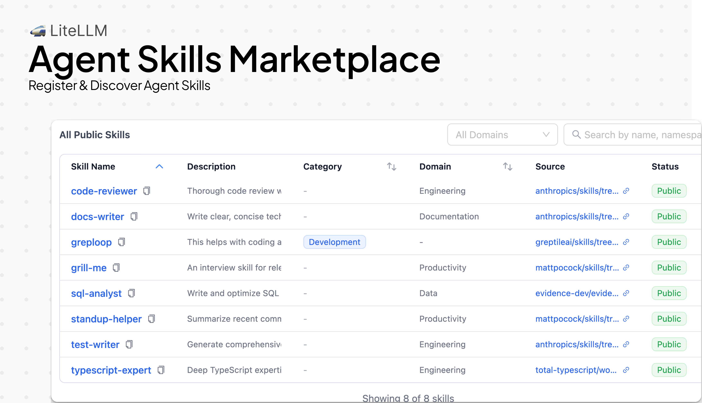
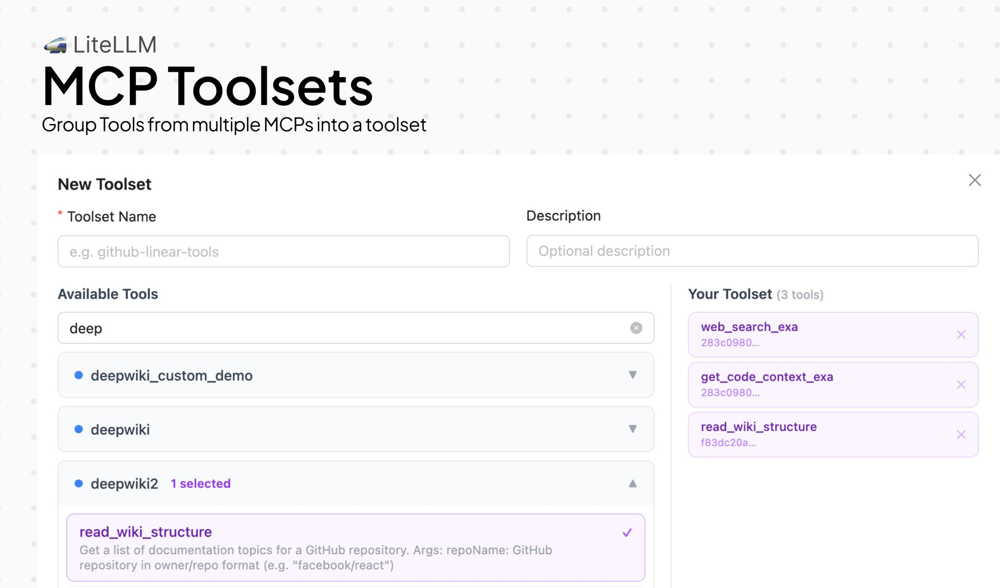

## Deploy this version

import Tabs from '@theme/Tabs';
import TabItem from '@theme/TabItem';

<Tabs>
<TabItem value="docker" label="Docker">

```bash
docker run \
-e STORE_MODEL_IN_DB=True \
-p 4000:4000 \
docker.litellm.ai/berriai/litellm:main-v1.83.3.rc.1
```

</TabItem>
<TabItem value="pip" label="Pip">

```bash
pip install litellm==1.83.3rc1
```

</TabItem>
</Tabs>

## Key Highlights

- **MCP Toolsets** — [Create curated tool subsets from one or more MCP servers with scoped permissions, and manage them from the UI or API](../../docs/mcp)
- **Skills Marketplace** — [Browse, install, and publish Claude Code skills from a self-hosted marketplace — works across Anthropic, Vertex AI, Azure, and Bedrock](../../docs/proxy/skills)
- **Guardrail Fallbacks** — [Configure `on_error` behavior so guardrail failures degrade gracefully instead of blocking the request](../../docs/proxy/guardrails)
- **Team Bring Your Own Guardrails** — [Teams can now attach and manage their own guardrails directly from team settings in the UI](../../docs/proxy/guardrails)

---


### Skills Marketplace

The Skills Marketplace gives teams a self-hosted catalog for discovering, installing, and publishing Claude Code skills. Skills are portable across Anthropic, Vertex AI, Azure, and Bedrock — so a skill published once works everywhere your gateway routes to.



[Get Started](../../docs/proxy/skills)

### Guardrail Fallbacks

Guardrail pipelines now support an optional `on_error` behavior. When a guardrail check fails or errors out, you can configure the pipeline to fall back gracefully — logging the failure and continuing the request — instead of returning a hard 500 to the caller. This is especially useful for non-critical guardrails where availability matters more than enforcement.

### Team Bring Your Own Guardrails

Teams can now attach guardrails directly from the team management UI. Admins configure available guardrails at the project or proxy level, and individual teams select which ones apply to their traffic — no config file changes or proxy restarts needed. This also ships with project-level guardrail support in the project create/edit flows.

### MCP Toolsets

MCP Toolsets let AI platform admins create curated subsets of tools from one or more MCP servers and assign them to teams and keys with scoped permissions. Instead of granting access to an entire MCP server, you can now bundle specific tools into a named toolset — controlling exactly which tools each team or API key can invoke. Toolsets are fully managed through the UI (new Toolsets tab) and API, and work seamlessly with the Responses API and Playground.



[Get Started](../../docs/mcp)
---

## New Models / Updated Models

#### New Model Support

| Provider | Model | Context Window | Input ($/1M tokens) | Output ($/1M tokens) | Features |
| -------- | ----- | -------------- | ------------------- | -------------------- | -------- |
| Brave Search | `brave/search` | - | - | - | Search tool integration metadata in cost map ([PR #25042](https://github.com/BerriAI/litellm/pull/25042)) |
| AWS Bedrock | `nvidia.nemotron-super-3-120b` | 256K | Added | Added | Chat completions, function calling, system messages ([PR #24588](https://github.com/BerriAI/litellm/pull/24588)) |
| OCI GenAI | Multiple new chat + embedding entries | Varies | Updated | Updated | Expanded chat + embedding model catalog |

#### Features

- **[AWS Bedrock](../../docs/providers/bedrock)**
    - Add Nova Canvas image edit support - [PR #25110](https://github.com/BerriAI/litellm/pull/25110), [PR #24869](https://github.com/BerriAI/litellm/pull/24869)
    - Improve cache usage exposure for Claude-compatible streaming paths - [PR #25110](https://github.com/BerriAI/litellm/pull/25110), [PR #24850](https://github.com/BerriAI/litellm/pull/24850)
    - Bedrock model catalog updates - [PR #24645](https://github.com/BerriAI/litellm/pull/24645)

- **[OCI GenAI](../../docs/providers/oci)**
    - Add native embeddings support + expanded model catalog - [PR #25151](https://github.com/BerriAI/litellm/pull/25151), [PR #24887](https://github.com/BerriAI/litellm/pull/24887)

- **[Google Vertex AI](../../docs/providers/vertex)**
    - Add unversioned Claude Haiku pricing entry to ensure accurate spend accounting - [PR #25151](https://github.com/BerriAI/litellm/pull/25151)

### Bug Fixes

- **General**
    - Fix `gpt-5.4` pricing metadata - [PR #24748](https://github.com/BerriAI/litellm/pull/24748)
    - Fix gov pricing tests and Bedrock model test follow-ups - [PR #25022](https://github.com/BerriAI/litellm/pull/25022), [PR #24947](https://github.com/BerriAI/litellm/pull/24947), [PR #24931](https://github.com/BerriAI/litellm/pull/24931)

## LLM API Endpoints

#### Features

- **[A2A / MCP Gateway API (/a2a, /mcp)](../../docs/mcp)**
    - Preserve JSON-RPC envelope for AgentCore A2A-native agents - [PR #25092](https://github.com/BerriAI/litellm/pull/25092)
    - Bedrock Anthropic file/document handling fix from internal staging - [PR #25050](https://github.com/BerriAI/litellm/pull/25050), [PR #25047](https://github.com/BerriAI/litellm/pull/25047)

#### Bugs

- **[Search API (/search)](../../docs/search)**
    - Support self-hosted Firecrawl response format in search transforms - [PR #25110](https://github.com/BerriAI/litellm/pull/25110), [PR #24866](https://github.com/BerriAI/litellm/pull/24866)

## Management Endpoints / UI

#### Features

- **Virtual Keys**
    - Add substring search for `user_id` and `key_alias` on `/key/list` - [PR #24751](https://github.com/BerriAI/litellm/pull/24751), [PR #24746](https://github.com/BerriAI/litellm/pull/24746)
    - Wire `team_id` filter to key alias dropdown on Virtual Keys tab - [PR #25119](https://github.com/BerriAI/litellm/pull/25119), [PR #25114](https://github.com/BerriAI/litellm/pull/25114)
    - Allow hashed `token_id` in `/key/update` endpoint - [PR #24969](https://github.com/BerriAI/litellm/pull/24969)

- **Teams + Organizations**
    - Resolve access-group models/MCP servers/agents in team endpoints and UI - [PR #25119](https://github.com/BerriAI/litellm/pull/25119), [PR #25027](https://github.com/BerriAI/litellm/pull/25027)
    - Allow changing team organization from team settings - [PR #25095](https://github.com/BerriAI/litellm/pull/25095)
    - Add per-model rate limits to team edit/info views - [PR #25156](https://github.com/BerriAI/litellm/pull/25156), [PR #25144](https://github.com/BerriAI/litellm/pull/25144)

- **Usage + Analytics**
    - Add paginated team search on usage page filters - [PR #25107](https://github.com/BerriAI/litellm/pull/25107)
    - Use entity key for usage export display correctness - [PR #25153](https://github.com/BerriAI/litellm/pull/25153)

- **Models + Providers**
    - Include access-group models in UI model listing - [PR #24743](https://github.com/BerriAI/litellm/pull/24743)
    - Expose Azure Entra ID credential fields in provider forms - [PR #25137](https://github.com/BerriAI/litellm/pull/25137)
    - Do not inject `vector_store_ids: []` when editing a model - [PR #25133](https://github.com/BerriAI/litellm/pull/25133)

- **Guardrails UI**
    - Add project-level guardrails support in project create/edit flows - [PR #25100](https://github.com/BerriAI/litellm/pull/25100)
    - Allow adding team guardrails from the UI - [PR #25038](https://github.com/BerriAI/litellm/pull/25038)

- **UI Cleanup**
    - Migrate Tremor Text/Badge to antd Tag and native spans - [PR #24750](https://github.com/BerriAI/litellm/pull/24750)

#### Bugs

- Fix logs page showing unfiltered results when backend filter returns zero rows - [PR #24745](https://github.com/BerriAI/litellm/pull/24745)
- Enforce upperbound key params on `/key/update` and bulk update hook paths - [PR #25110](https://github.com/BerriAI/litellm/pull/25110), [PR #25103](https://github.com/BerriAI/litellm/pull/25103)
- Fix team model update 500 due to unsupported Prisma JSON path filter - [PR #25152](https://github.com/BerriAI/litellm/pull/25152)

## AI Integrations

### Logging

- **General**
    - Eliminate race condition in streaming `guardrail_information` logging - [PR #24592](https://github.com/BerriAI/litellm/pull/24592)
    - Use actual `start_time` in failed request spend logs - [PR #24906](https://github.com/BerriAI/litellm/pull/24906)
    - Harden credential redaction + stop logging raw sensitive auth values - [PR #25151](https://github.com/BerriAI/litellm/pull/25151)

### Guardrails

- Add optional `on_error` for guardrail pipeline failures - [PR #25150](https://github.com/BerriAI/litellm/pull/25150), [PR #24831](https://github.com/BerriAI/litellm/pull/24831)
- Return HTTP 400 (vs 500) for Model Armor streaming blocks - [PR #24693](https://github.com/BerriAI/litellm/pull/24693)

### Prompt Management

- Add environment + user tracking for prompts (`development/staging/production`) in CRUD + UI flows - [PR #25110](https://github.com/BerriAI/litellm/pull/25110), [PR #24855](https://github.com/BerriAI/litellm/pull/24855)

### Secret Managers

- No major new secret manager provider additions in this RC.

## Spend Tracking, Budgets and Rate Limiting

- Enforce budget for models not directly present in the cost map - [PR #24949](https://github.com/BerriAI/litellm/pull/24949)
- Add per-model rate limits in team settings/info UI - [PR #25144](https://github.com/BerriAI/litellm/pull/25144)
- Fix unversioned Vertex Claude Haiku pricing entry to avoid `$0.00` accounting - [PR #25151](https://github.com/BerriAI/litellm/pull/25151)

## MCP Gateway

- Introduce **MCP Toolsets** with DB types, CRUD APIs, scoped permissions, and UI management tab - [PR #25155](https://github.com/BerriAI/litellm/pull/25155)
- Resolve toolset names and enforce toolset access correctly in Responses API and streamable MCP paths - [PR #25155](https://github.com/BerriAI/litellm/pull/25155)
- Switch toolset permission caching to shared cache path and improve cache invalidation behavior - [PR #25155](https://github.com/BerriAI/litellm/pull/25155)
- Allow JWT auth for `/v1/mcp/server/*` sub-paths - [PR #25113](https://github.com/BerriAI/litellm/pull/25113), [PR #24698](https://github.com/BerriAI/litellm/pull/24698)
- Add STS AssumeRole support for MCP SigV4 auth - [PR #25151](https://github.com/BerriAI/litellm/pull/25151)
- Add tag query fix + MCP metadata support cherry-pick - [PR #25145](https://github.com/BerriAI/litellm/pull/25145)

## Performance / Loadbalancing / Reliability improvements

- Integrate router health-check failures with cooldown behavior and transient 429/408 handling - [PR #25150](https://github.com/BerriAI/litellm/pull/25150), [PR #24988](https://github.com/BerriAI/litellm/pull/24988)
- Add distributed lock for key rotation job execution - [PR #25150](https://github.com/BerriAI/litellm/pull/25150), [PR #23364](https://github.com/BerriAI/litellm/pull/23364), [PR #23834](https://github.com/BerriAI/litellm/pull/23834)
- Improve team routing reliability with deterministic grouping, isolation fixes, stale alias controls, and order-based fallback - [PR #25154](https://github.com/BerriAI/litellm/pull/25154), [PR #25148](https://github.com/BerriAI/litellm/pull/25148)
- Regenerate GCP IAM token per async Redis cluster connection (fix token TTL failures) - [PR #25155](https://github.com/BerriAI/litellm/pull/25155), [PR #24426](https://github.com/BerriAI/litellm/pull/24426)
- Restore MCP server fields dropped by schema sync migration - [PR #24078](https://github.com/BerriAI/litellm/pull/24078)
- Proxy server reliability hardening with bounded queue usage - [PR #25155](https://github.com/BerriAI/litellm/pull/25155)

## Documentation Updates

- Improve HA control plane diagram clarity + mobile rendering updates - [PR #24747](https://github.com/BerriAI/litellm/pull/24747)
- Document `default_team_params` in config reference and examples - [PR #25032](https://github.com/BerriAI/litellm/pull/25032)
- Add JWT to Virtual Key mapping guide - [PR #24882](https://github.com/BerriAI/litellm/pull/24882)
- Add MCP Toolsets docs and sidebar updates - [PR #25155](https://github.com/BerriAI/litellm/pull/25155)
- Security docs updates and April hardening blog - [PR #24867](https://github.com/BerriAI/litellm/pull/24867), [PR #24868](https://github.com/BerriAI/litellm/pull/24868), [PR #24871](https://github.com/BerriAI/litellm/pull/24871), [PR #25102](https://github.com/BerriAI/litellm/pull/25102)
- General docs cleanup + townhall announcement updates - [PR #24839](https://github.com/BerriAI/litellm/pull/24839), [PR #25026](https://github.com/BerriAI/litellm/pull/25026), [PR #25021](https://github.com/BerriAI/litellm/pull/25021)

## Infrastructure / Security Notes

- Harden npm and Docker supply chain workflows and release pipeline checks - [PR #24838](https://github.com/BerriAI/litellm/pull/24838), [PR #24877](https://github.com/BerriAI/litellm/pull/24877), [PR #24881](https://github.com/BerriAI/litellm/pull/24881), [PR #24905](https://github.com/BerriAI/litellm/pull/24905), [PR #24951](https://github.com/BerriAI/litellm/pull/24951), [PR #25023](https://github.com/BerriAI/litellm/pull/25023), [PR #25034](https://github.com/BerriAI/litellm/pull/25034), [PR #25036](https://github.com/BerriAI/litellm/pull/25036), [PR #25037](https://github.com/BerriAI/litellm/pull/25037), [PR #25136](https://github.com/BerriAI/litellm/pull/25136), [PR #25158](https://github.com/BerriAI/litellm/pull/25158)
- Resolve CodeQL/security workflow issues and fix broken action SHA references - [PR #24880](https://github.com/BerriAI/litellm/pull/24880), [PR #24815](https://github.com/BerriAI/litellm/pull/24815)
- Re-add Codecov reporting in GHA matrix workflows - [PR #24804](https://github.com/BerriAI/litellm/pull/24804)
- Fix(docker): load enterprise hooks in non-root runtime image - [PR #24917](https://github.com/BerriAI/litellm/pull/24917)
- Apply Black formatting to 14 files - [PR #24532](https://github.com/BerriAI/litellm/pull/24532)
- Fix lint issues - [PR #24932](https://github.com/BerriAI/litellm/pull/24932)

## New Contributors

* @vanhtuan0409 made their first contribution in https://github.com/BerriAI/litellm/pull/24078
* @clfhhc made their first contribution in https://github.com/BerriAI/litellm/pull/24932

**Full Changelog**: https://github.com/BerriAI/litellm/compare/v1.83.0-nightly...v1.83.3.rc.1
