import Image from '@theme/IdealImage';
import Tabs from '@theme/Tabs';
import TabItem from '@theme/TabItem';


# Router - Load Balancing

LiteLLM manages:
- Load-balance across multiple deployments (e.g. Azure/OpenAI)
- Prioritizing important requests to ensure they don't fail (i.e. Queueing)
- Basic reliability logic - cooldowns, fallbacks, timeouts and retries (fixed + exponential backoff) across multiple deployments/providers.

In production, litellm supports using Redis as a way to track cooldown server and usage (managing tpm/rpm limits).

:::info

If you want a server to load balance across different LLM APIs, use our [LiteLLM Proxy Server](./proxy/load_balancing.md)

:::


## Load Balancing
(s/o [@paulpierre](https://www.linkedin.com/in/paulpierre/) and [sweep proxy](https://docs.sweep.dev/blogs/openai-proxy) for their contributions to this implementation)
[**See Code**](https://github.com/BerriAI/litellm/blob/main/litellm/router.py)

### Quick Start

Loadbalance across multiple [azure](./providers/azure)/[bedrock](./providers/bedrock.md)/[provider](./providers/) deployments. LiteLLM will handle retrying in different regions if a call fails.

<Tabs>
<TabItem value="sdk" label="SDK">

```python
from litellm import Router

model_list = [{ # list of model deployments 
	"model_name": "gpt-3.5-turbo", # model alias -> loadbalance between models with same `model_name`
	"litellm_params": { # params for litellm completion/embedding call 
		"model": "azure/chatgpt-v-2", # actual model name
		"api_key": os.getenv("AZURE_API_KEY"),
		"api_version": os.getenv("AZURE_API_VERSION"),
		"api_base": os.getenv("AZURE_API_BASE")
	}
}, {
    "model_name": "gpt-3.5-turbo", 
	"litellm_params": { # params for litellm completion/embedding call 
		"model": "azure/chatgpt-functioncalling", 
		"api_key": os.getenv("AZURE_API_KEY"),
		"api_version": os.getenv("AZURE_API_VERSION"),
		"api_base": os.getenv("AZURE_API_BASE")
	}
}, {
    "model_name": "gpt-3.5-turbo", 
	"litellm_params": { # params for litellm completion/embedding call 
		"model": "gpt-3.5-turbo", 
		"api_key": os.getenv("OPENAI_API_KEY"),
	}
}, {
    "model_name": "gpt-4", 
	"litellm_params": { # params for litellm completion/embedding call 
		"model": "azure/gpt-4", 
		"api_key": os.getenv("AZURE_API_KEY"),
		"api_base": os.getenv("AZURE_API_BASE"),
		"api_version": os.getenv("AZURE_API_VERSION"),
	}
}, {
    "model_name": "gpt-4", 
	"litellm_params": { # params for litellm completion/embedding call 
		"model": "gpt-4", 
		"api_key": os.getenv("OPENAI_API_KEY"),
	}
},

]

router = Router(model_list=model_list)

# openai.ChatCompletion.create replacement
# requests with model="gpt-3.5-turbo" will pick a deployment where model_name="gpt-3.5-turbo"
response = await router.acompletion(model="gpt-3.5-turbo", 
				messages=[{"role": "user", "content": "Hey, how's it going?"}])

print(response)

# openai.ChatCompletion.create replacement
# requests with model="gpt-4" will pick a deployment where model_name="gpt-4"
response = await router.acompletion(model="gpt-4", 
				messages=[{"role": "user", "content": "Hey, how's it going?"}])

print(response)
```
</TabItem>
<TabItem value="proxy" label="PROXY">

:::info

See detailed proxy loadbalancing/fallback docs [here](./proxy/reliability.md)

:::

1. Setup model_list with multiple deployments
```yaml
model_list:
  - model_name: gpt-3.5-turbo
    litellm_params:
      model: azure/<your-deployment-name>
      api_base: <your-azure-endpoint>
      api_key: <your-azure-api-key>
  - model_name: gpt-3.5-turbo
    litellm_params:
      model: azure/gpt-turbo-small-ca
      api_base: https://my-endpoint-canada-berri992.openai.azure.com/
      api_key: <your-azure-api-key>
  - model_name: gpt-3.5-turbo
    litellm_params:
      model: azure/gpt-turbo-large
      api_base: https://openai-france-1234.openai.azure.com/
      api_key: <your-azure-api-key>
```

2. Start proxy 

```bash
litellm --config /path/to/config.yaml 
```

3. Test it! 

```bash
curl -X POST 'http://0.0.0.0:4000/chat/completions' \
-H 'Content-Type: application/json' \
-H 'Authorization: Bearer sk-1234' \
-d '{
  "model": "gpt-3.5-turbo",
  "messages": [
        {"role": "user", "content": "Hi there!"}
    ],
    "mock_testing_rate_limit_error": true
}'
```
</TabItem>
</Tabs>

### Available Endpoints
- `router.completion()` - chat completions endpoint to call 100+ LLMs
- `router.acompletion()` - async chat completion calls
- `router.embedding()` - embedding endpoint for Azure, OpenAI, Huggingface endpoints
- `router.aembedding()` - async embeddings calls
- `router.text_completion()` - completion calls in the old OpenAI `/v1/completions` endpoint format
- `router.atext_completion()` - async text completion calls
- `router.image_generation()` - completion calls in OpenAI `/v1/images/generations` endpoint format
- `router.aimage_generation()` - async image generation calls

## Advanced - Routing Strategies ⭐️
#### Routing Strategies - Weighted Pick, Rate Limit Aware, Least Busy, Latency Based, Cost Based

Router provides multiple strategies for routing your calls across multiple deployments. **We recommend using `simple-shuffle` (default) for best performance in production.**

<Tabs>
<TabItem value="simple-shuffle" label="(Default) Weighted Pick - RECOMMENDED">

**Default and Recommended for Production** - Best performance with minimal latency overhead.

Picks a deployment based on the provided **Requests per minute (rpm) or Tokens per minute (tpm)**

If `rpm` or `tpm` is not provided, it randomly picks a deployment

You can also set a `weight` param, to specify which model should get picked when.

<Tabs>
<TabItem value="rpm" label="RPM-based shuffling">

##### **LiteLLM Proxy Config.yaml**

```yaml
model_list:
	- model_name: gpt-3.5-turbo
	  litellm_params:
	  	model: azure/chatgpt-v-2
		api_key: os.environ/AZURE_API_KEY
		api_version: os.environ/AZURE_API_VERSION
		api_base: os.environ/AZURE_API_BASE
		rpm: 900 
	- model_name: gpt-3.5-turbo
	  litellm_params:
	  	model: azure/chatgpt-functioncalling
		api_key: os.environ/AZURE_API_KEY
		api_version: os.environ/AZURE_API_VERSION
		api_base: os.environ/AZURE_API_BASE
		rpm: 10 
```

##### **Python SDK**

```python
from litellm import Router 
import asyncio

model_list = [{ # list of model deployments 
	"model_name": "gpt-3.5-turbo", # model alias 
	"litellm_params": { # params for litellm completion/embedding call 
		"model": "azure/chatgpt-v-2", # actual model name
		"api_key": os.getenv("AZURE_API_KEY"),
		"api_version": os.getenv("AZURE_API_VERSION"),
		"api_base": os.getenv("AZURE_API_BASE"),
		"rpm": 900,			# requests per minute for this API
	}
}, {
    "model_name": "gpt-3.5-turbo", 
	"litellm_params": { # params for litellm completion/embedding call 
		"model": "azure/chatgpt-functioncalling", 
		"api_key": os.getenv("AZURE_API_KEY"),
		"api_version": os.getenv("AZURE_API_VERSION"),
		"api_base": os.getenv("AZURE_API_BASE"),
		"rpm": 10,
	}
},]

# init router
router = Router(model_list=model_list, routing_strategy="simple-shuffle")
async def router_acompletion():
	response = await router.acompletion(
		model="gpt-3.5-turbo", 
		messages=[{"role": "user", "content": "Hey, how's it going?"}]
	)
	print(response)
	return response

asyncio.run(router_acompletion())
```

</TabItem>
<TabItem value="weight" label="Weight-based shuffling">

##### **LiteLLM Proxy Config.yaml**

```yaml
model_list:
	- model_name: gpt-3.5-turbo
	  litellm_params:
	  	model: azure/chatgpt-v-2
		api_key: os.environ/AZURE_API_KEY
		api_version: os.environ/AZURE_API_VERSION
		api_base: os.environ/AZURE_API_BASE
		weight: 9
	- model_name: gpt-3.5-turbo
	  litellm_params:
	  	model: azure/chatgpt-functioncalling
		api_key: os.environ/AZURE_API_KEY
		api_version: os.environ/AZURE_API_VERSION
		api_base: os.environ/AZURE_API_BASE
		weight: 1 
```

##### **Python SDK**

```python
from litellm import Router 
import asyncio

model_list = [{
	"model_name": "gpt-3.5-turbo", # model alias 
	"litellm_params": { 
		"model": "azure/chatgpt-v-2", # actual model name
		"api_key": os.getenv("AZURE_API_KEY"),
		"api_version": os.getenv("AZURE_API_VERSION"),
		"api_base": os.getenv("AZURE_API_BASE"),
		"weight": 9, # pick this 90% of the time
	}
}, {
    "model_name": "gpt-3.5-turbo", 
	"litellm_params": { 
		"model": "azure/chatgpt-functioncalling", 
		"api_key": os.getenv("AZURE_API_KEY"),
		"api_version": os.getenv("AZURE_API_VERSION"),
		"api_base": os.getenv("AZURE_API_BASE"),
		"weight": 1,
	}
}]

# init router
router = Router(model_list=model_list, routing_strategy="simple-shuffle")
async def router_acompletion():
	response = await router.acompletion(
		model="gpt-3.5-turbo", 
		messages=[{"role": "user", "content": "Hey, how's it going?"}]
	)
	print(response)
	return response

asyncio.run(router_acompletion())
```

</TabItem>
</Tabs>

</TabItem>
<TabItem value="usage-based-v2" label="Rate-Limit Aware v2 (ASYNC)">

> [!WARNING]  
**Usage-based routing is not recommended for production due to performance impacts.** Use `simple-shuffle` (default) for optimal performance in high-traffic scenarios. Usage-based routing adds significant latency due to Redis operations for tracking usage across deployments.


**🎉 NEW** This is an async implementation of usage-based-routing.

**Filters out deployment if tpm/rpm limit exceeded** - If you pass in the deployment's tpm/rpm limits.

Routes to **deployment with lowest TPM usage** for that minute. 

In production, we use Redis to track usage (TPM/RPM) across multiple deployments. This implementation uses **async redis calls** (redis.incr and redis.mget).

For Azure, [you get 6 RPM per 1000 TPM](https://stackoverflow.com/questions/77368844/what-is-the-request-per-minute-rate-limit-for-azure-openai-models-for-gpt-3-5-tu)

<Tabs>
<TabItem value="sdk" label="sdk">

```python
from litellm import Router 


model_list = [{ # list of model deployments 
	"model_name": "gpt-3.5-turbo", # model alias 
	"litellm_params": { # params for litellm completion/embedding call 
		"model": "azure/chatgpt-v-2", # actual model name
		"api_key": os.getenv("AZURE_API_KEY"),
		"api_version": os.getenv("AZURE_API_VERSION"),
		"api_base": os.getenv("AZURE_API_BASE")
		"tpm": 100000,
		"rpm": 10000,
	}, 
}, {
    "model_name": "gpt-3.5-turbo", 
	"litellm_params": { # params for litellm completion/embedding call 
		"model": "azure/chatgpt-functioncalling", 
		"api_key": os.getenv("AZURE_API_KEY"),
		"api_version": os.getenv("AZURE_API_VERSION"),
		"api_base": os.getenv("AZURE_API_BASE")
		"tpm": 100000,
		"rpm": 1000,
	},
}, {
    "model_name": "gpt-3.5-turbo", 
	"litellm_params": { # params for litellm completion/embedding call 
		"model": "gpt-3.5-turbo", 
		"api_key": os.getenv("OPENAI_API_KEY"),
		"tpm": 100000,
		"rpm": 1000,
	},
}]
router = Router(model_list=model_list, 
                redis_host=os.environ["REDIS_HOST"], 
				redis_password=os.environ["REDIS_PASSWORD"], 
				redis_port=os.environ["REDIS_PORT"], 
                routing_strategy="simple-shuffle" # 👈 RECOMMENDED - best performance
				enable_pre_call_checks=True, # enables router rate limits for concurrent calls
				)

response = await router.acompletion(model="gpt-3.5-turbo", 
				messages=[{"role": "user", "content": "Hey, how's it going?"}]

print(response)
```
</TabItem>
<TabItem value="proxy" label="proxy">

**1. Set strategy in config**

```yaml
model_list:
	- model_name: gpt-3.5-turbo # model alias 
	  litellm_params: # params for litellm completion/embedding call 
		model: azure/chatgpt-v-2 # actual model name
		api_key: os.environ/AZURE_API_KEY
		api_version: os.environ/AZURE_API_VERSION
		api_base: os.environ/AZURE_API_BASE
      tpm: 100000
	  rpm: 10000
	- model_name: gpt-3.5-turbo 
	  litellm_params: # params for litellm completion/embedding call 
		model: gpt-3.5-turbo 
		api_key: os.getenv(OPENAI_API_KEY)
      tpm: 100000
	  rpm: 1000

router_settings:
  routing_strategy: simple-shuffle # 👈 RECOMMENDED - best performance
  redis_host: <your-redis-host>
  redis_password: <your-redis-password>
  redis_port: <your-redis-port>
  enable_pre_call_check: true

general_settings:
  master_key: sk-1234
```

**2. Start proxy**

```bash
litellm --config /path/to/config.yaml
```

**3. Test it!**

```bash
curl --location 'http://localhost:4000/v1/chat/completions' \
--header 'Content-Type: application/json' \
--header 'Authorization: Bearer sk-1234' \
--data '{
    "model": "gpt-3.5-turbo", 
    "messages": [{"role": "user", "content": "Hey, how's it going?"}]
}'
```

</TabItem>
</Tabs>


</TabItem>
<TabItem value="latency-based" label="Latency-Based">


Picks the deployment with the lowest response time.

It caches, and updates the response times for deployments based on when a request was sent and received from a deployment.

[**How to test**](https://github.com/BerriAI/litellm/blob/main/tests/local_testing/test_lowest_latency_routing.py)

```python
from litellm import Router 
import asyncio

model_list = [{ ... }]

# init router
router = Router(model_list=model_list,
				routing_strategy="latency-based-routing",# 👈 set routing strategy
				enable_pre_call_check=True, # enables router rate limits for concurrent calls
				)

## CALL 1+2
tasks = []
response = None
final_response = None
for _ in range(2):
	tasks.append(router.acompletion(model=model, messages=messages))
response = await asyncio.gather(*tasks)

if response is not None:
	## CALL 3 
	await asyncio.sleep(1)  # let the cache update happen
	picked_deployment = router.lowestlatency_logger.get_available_deployments(
		model_group=model, healthy_deployments=router.healthy_deployments
	)
	final_response = await router.acompletion(model=model, messages=messages)
	print(f"min deployment id: {picked_deployment}")
	print(f"model id: {final_response._hidden_params['model_id']}")
	assert (
		final_response._hidden_params["model_id"]
		== picked_deployment["model_info"]["id"]
	)
```

#### Set Time Window 

Set time window for how far back to consider when averaging latency for a deployment. 

**In Router**
```python 
router = Router(..., routing_strategy_args={"ttl": 10})
```

**In Proxy**

```yaml
router_settings:
	routing_strategy_args: {"ttl": 10}
```

#### Set Lowest Latency Buffer

Set a buffer within which deployments are candidates for making calls to. 

E.g. 

if you have 5 deployments

```
https://litellm-prod-1.openai.azure.com/: 0.07s
https://litellm-prod-2.openai.azure.com/: 0.1s
https://litellm-prod-3.openai.azure.com/: 0.1s
https://litellm-prod-4.openai.azure.com/: 0.1s
https://litellm-prod-5.openai.azure.com/: 4.66s
```

to prevent initially overloading `prod-1`, with all requests - we can set a buffer of 50%, to consider deployments `prod-2, prod-3, prod-4`. 

**In Router**
```python 
router = Router(..., routing_strategy_args={"lowest_latency_buffer": 0.5})
```

**In Proxy**

```yaml
router_settings:
	routing_strategy_args: {"lowest_latency_buffer": 0.5}
```

</TabItem>

<TabItem value="usage-based" label="Rate-Limit Aware">

This will route to the deployment with the lowest TPM usage for that minute. 

In production, we use Redis to track usage (TPM/RPM) across multiple deployments. 

If you pass in the deployment's tpm/rpm limits, this will also check against that, and filter out any who's limits would be exceeded. 

For Azure, your RPM = TPM/6. 


```python
from litellm import Router 


model_list = [{ # list of model deployments 
	"model_name": "gpt-3.5-turbo", # model alias 
	"litellm_params": { # params for litellm completion/embedding call 
		"model": "azure/chatgpt-v-2", # actual model name
		"api_key": os.getenv("AZURE_API_KEY"),
		"api_version": os.getenv("AZURE_API_VERSION"),
		"api_base": os.getenv("AZURE_API_BASE")
	}, 
    "tpm": 100000,
	"rpm": 10000,
}, {
    "model_name": "gpt-3.5-turbo", 
	"litellm_params": { # params for litellm completion/embedding call 
		"model": "azure/chatgpt-functioncalling", 
		"api_key": os.getenv("AZURE_API_KEY"),
		"api_version": os.getenv("AZURE_API_VERSION"),
		"api_base": os.getenv("AZURE_API_BASE")
	},
    "tpm": 100000,
	"rpm": 1000,
}, {
    "model_name": "gpt-3.5-turbo", 
	"litellm_params": { # params for litellm completion/embedding call 
		"model": "gpt-3.5-turbo", 
		"api_key": os.getenv("OPENAI_API_KEY"),
	},
    "tpm": 100000,
	"rpm": 1000,
}]
router = Router(model_list=model_list, 
                redis_host=os.environ["REDIS_HOST"], 
				redis_password=os.environ["REDIS_PASSWORD"], 
				redis_port=os.environ["REDIS_PORT"], 
                routing_strategy="usage-based-routing"
				enable_pre_call_check=True, # enables router rate limits for concurrent calls
				)

response = await router.acompletion(model="gpt-3.5-turbo", 
				messages=[{"role": "user", "content": "Hey, how's it going?"}]

print(response)
```


</TabItem>
<TabItem value="least-busy" label="Least-Busy">


Picks a deployment with the least number of ongoing calls, it's handling.

[**How to test**](https://github.com/BerriAI/litellm/blob/main/tests/local_testing/test_least_busy_routing.py)

```python
from litellm import Router 
import asyncio

model_list = [{ # list of model deployments 
	"model_name": "gpt-3.5-turbo", # model alias 
	"litellm_params": { # params for litellm completion/embedding call 
		"model": "azure/chatgpt-v-2", # actual model name
		"api_key": os.getenv("AZURE_API_KEY"),
		"api_version": os.getenv("AZURE_API_VERSION"),
		"api_base": os.getenv("AZURE_API_BASE"),
	}
}, {
    "model_name": "gpt-3.5-turbo", 
	"litellm_params": { # params for litellm completion/embedding call 
		"model": "azure/chatgpt-functioncalling", 
		"api_key": os.getenv("AZURE_API_KEY"),
		"api_version": os.getenv("AZURE_API_VERSION"),
		"api_base": os.getenv("AZURE_API_BASE"),
	}
}, {
    "model_name": "gpt-3.5-turbo", 
	"litellm_params": { # params for litellm completion/embedding call 
		"model": "gpt-3.5-turbo", 
		"api_key": os.getenv("OPENAI_API_KEY"),
	}
}]

# init router
router = Router(model_list=model_list, routing_strategy="least-busy")
async def router_acompletion():
	response = await router.acompletion(
		model="gpt-3.5-turbo", 
		messages=[{"role": "user", "content": "Hey, how's it going?"}]
	)
	print(response)
	return response

asyncio.run(router_acompletion())
```

</TabItem>

<TabItem value="custom" label="Custom Routing Strategy">

**Plugin a custom routing strategy to select deployments**


Step 1. Define your custom routing strategy

```python

from litellm.router import CustomRoutingStrategyBase
class CustomRoutingStrategy(CustomRoutingStrategyBase):
    async def async_get_available_deployment(
        self,
        model: str,
        messages: Optional[List[Dict[str, str]]] = None,
        input: Optional[Union[str, List]] = None,
        specific_deployment: Optional[bool] = False,
        request_kwargs: Optional[Dict] = None,
    ):
        """
        Asynchronously retrieves the available deployment based on the given parameters.

        Args:
            model (str): The name of the model.
            messages (Optional[List[Dict[str, str]]], optional): The list of messages for a given request. Defaults to None.
            input (Optional[Union[str, List]], optional): The input for a given embedding request. Defaults to None.
            specific_deployment (Optional[bool], optional): Whether to retrieve a specific deployment. Defaults to False.
            request_kwargs (Optional[Dict], optional): Additional request keyword arguments. Defaults to None.

        Returns:
            Returns an element from litellm.router.model_list

        """
        print("In CUSTOM async get available deployment")
        model_list = router.model_list
        print("router model list=", model_list)
        for model in model_list:
            if isinstance(model, dict):
                if model["litellm_params"]["model"] == "openai/very-special-endpoint":
                    return model
        pass

    def get_available_deployment(
        self,
        model: str,
        messages: Optional[List[Dict[str, str]]] = None,
        input: Optional[Union[str, List]] = None,
        specific_deployment: Optional[bool] = False,
        request_kwargs: Optional[Dict] = None,
    ):
        """
        Synchronously retrieves the available deployment based on the given parameters.

        Args:
            model (str): The name of the model.
            messages (Optional[List[Dict[str, str]]], optional): The list of messages for a given request. Defaults to None.
            input (Optional[Union[str, List]], optional): The input for a given embedding request. Defaults to None.
            specific_deployment (Optional[bool], optional): Whether to retrieve a specific deployment. Defaults to False.
            request_kwargs (Optional[Dict], optional): Additional request keyword arguments. Defaults to None.

        Returns:
            Returns an element from litellm.router.model_list

        """
        pass
```

Step 2. Initialize Router with custom routing strategy
```python
from litellm import Router

router = Router(
    model_list=[
        {
            "model_name": "azure-model",
            "litellm_params": {
                "model": "openai/very-special-endpoint",
                "api_base": "https://exampleopenaiendpoint-production.up.railway.app/",  # If you are Krrish, this is OpenAI Endpoint3 on our Railway endpoint :)
                "api_key": "fake-key",
            },
            "model_info": {"id": "very-special-endpoint"},
        },
        {
            "model_name": "azure-model",
            "litellm_params": {
                "model": "openai/fast-endpoint",
                "api_base": "https://exampleopenaiendpoint-production.up.railway.app/",
                "api_key": "fake-key",
            },
            "model_info": {"id": "fast-endpoint"},
        },
    ],
    set_verbose=True,
    debug_level="DEBUG",
    timeout=1,
)  # type: ignore

router.set_custom_routing_strategy(CustomRoutingStrategy()) # 👈 Set your routing strategy here
```

Step 3. Test your routing strategy. Expect your custom routing strategy to be called when running `router.acompletion` requests
```python
for _ in range(10):
	response = await router.acompletion(
		model="azure-model", messages=[{"role": "user", "content": "hello"}]
	)
	print(response)
	_picked_model_id = response._hidden_params["model_id"]
	print("picked model=", _picked_model_id)
```


</TabItem>

<TabItem value="lowest-cost" label="Lowest Cost Routing (Async)">

Picks a deployment based on the lowest cost

How this works:
- Get all healthy deployments
- Select all deployments that are under their provided `rpm/tpm` limits
- For each deployment check if `litellm_param["model"]` exists in [`litellm_model_cost_map`](https://github.com/BerriAI/litellm/blob/main/model_prices_and_context_window.json) 
	- if deployment does not exist in `litellm_model_cost_map` -> use deployment_cost= `$1`
- Select deployment with lowest cost

```python
from litellm import Router 
import asyncio

model_list =  [
	{
		"model_name": "gpt-3.5-turbo",
		"litellm_params": {"model": "gpt-4"},
		"model_info": {"id": "openai-gpt-4"},
	},
	{
		"model_name": "gpt-3.5-turbo",
		"litellm_params": {"model": "groq/llama3-8b-8192"},
		"model_info": {"id": "groq-llama"},
	},
]

# init router
router = Router(model_list=model_list, routing_strategy="cost-based-routing")
async def router_acompletion():
	response = await router.acompletion(
		model="gpt-3.5-turbo", 
		messages=[{"role": "user", "content": "Hey, how's it going?"}]
	)
	print(response)

	print(response._hidden_params["model_id"]) # expect groq-llama, since groq/llama has lowest cost
	return response

asyncio.run(router_acompletion())

```


#### Using Custom Input/Output pricing

Set `litellm_params["input_cost_per_token"]` and `litellm_params["output_cost_per_token"]` for using custom pricing when routing

```python
model_list = [
	{
		"model_name": "gpt-3.5-turbo",
		"litellm_params": {
			"model": "azure/chatgpt-v-2",
			"input_cost_per_token": 0.00003,
			"output_cost_per_token": 0.00003,
		},
		"model_info": {"id": "chatgpt-v-experimental"},
	},
	{
		"model_name": "gpt-3.5-turbo",
		"litellm_params": {
			"model": "azure/chatgpt-v-1",
			"input_cost_per_token": 0.000000001,
			"output_cost_per_token": 0.00000001,
		},
		"model_info": {"id": "chatgpt-v-1"},
	},
	{
		"model_name": "gpt-3.5-turbo",
		"litellm_params": {
			"model": "azure/chatgpt-v-5",
			"input_cost_per_token": 10,
			"output_cost_per_token": 12,
		},
		"model_info": {"id": "chatgpt-v-5"},
	},
]
# init router
router = Router(model_list=model_list, routing_strategy="cost-based-routing")
async def router_acompletion():
	response = await router.acompletion(
		model="gpt-3.5-turbo", 
		messages=[{"role": "user", "content": "Hey, how's it going?"}]
	)
	print(response)

	print(response._hidden_params["model_id"]) # expect chatgpt-v-1, since chatgpt-v-1 has lowest cost
	return response

asyncio.run(router_acompletion())
```

</TabItem>
</Tabs>

## Basic Reliability

### Deployment Ordering (Priority)

Set `order` in `litellm_params` to prioritize deployments. Lower values = higher priority. When multiple deployments share the same `order`, the routing strategy picks among them.

<Tabs>
<TabItem value="sdk" label="SDK">

```python
from litellm import Router

model_list = [
    {
        "model_name": "gpt-4",
        "litellm_params": {
            "model": "azure/gpt-4-primary",
            "api_key": os.getenv("AZURE_API_KEY"),
            "order": 1,  # 👈 Highest priority
        },
    },
    {
        "model_name": "gpt-4",
        "litellm_params": {
            "model": "azure/gpt-4-fallback",
            "api_key": os.getenv("AZURE_API_KEY_2"),
            "order": 2,  # 👈 Used when order=1 is unavailable
        },
    },
]

router = Router(model_list=model_list)
```

</TabItem>
<TabItem value="proxy" label="PROXY">

```yaml
model_list:
  - model_name: gpt-4
    litellm_params:
      model: azure/gpt-4-primary
      api_key: os.environ/AZURE_API_KEY
      order: 1  # 👈 Highest priority

  - model_name: gpt-4
    litellm_params:
      model: azure/gpt-4-fallback
      api_key: os.environ/AZURE_API_KEY_2
      order: 2  # 👈 Used when order=1 is unavailable
```

</TabItem>
</Tabs>

### Weighted Deployments 

Set `weight` on a deployment to pick one deployment more often than others. 

This works across **simple-shuffle** routing strategy (this is the default, if no routing strategy is selected). 

<Tabs>
<TabItem value="sdk" label="SDK">

```python
from litellm import Router 

model_list = [
	{
		"model_name": "o1",
		"litellm_params": {
			"model": "o1-preview", 
			"api_key": os.getenv("OPENAI_API_KEY"), 
			"weight": 1
		},
	},
	{
		"model_name": "o1",
		"litellm_params": {
			"model": "o1-preview", 
			"api_key": os.getenv("OPENAI_API_KEY"), 
			"weight": 2 # 👈 PICK THIS DEPLOYMENT 2x MORE OFTEN THAN o1-preview
		},
	},
]

router = Router(model_list=model_list, routing_strategy="cost-based-routing")

response = await router.acompletion(
	model="gpt-3.5-turbo", 
	messages=[{"role": "user", "content": "Hey, how's it going?"}]
)
print(response)
```
</TabItem>
<TabItem value="proxy" label="PROXY">

```yaml
model_list:
  - model_name: o1
  	litellm_params:
		model: o1
		api_key: os.environ/OPENAI_API_KEY
		weight: 1	
  - model_name: o1
    litellm_params:
		model: o1-preview
		api_key: os.environ/OPENAI_API_KEY
		weight: 2 # 👈 PICK THIS DEPLOYMENT 2x MORE OFTEN THAN o1-preview
```

</TabItem>
</Tabs>

### Max Parallel Requests (ASYNC)

Used in semaphore for async requests on router. Limit the max concurrent calls made to a deployment. Useful in high-traffic scenarios. 

If tpm/rpm is set, and no max parallel request limit given, we use the RPM or calculated RPM (tpm/1000/6) as the max parallel request limit. 


```python
from litellm import Router 

model_list = [{
	"model_name": "gpt-4",
	"litellm_params": {
		"model": "azure/gpt-4",
		...
		"max_parallel_requests": 10 # 👈 SET PER DEPLOYMENT
	}
}]

### OR ### 

router = Router(model_list=model_list, default_max_parallel_requests=20) # 👈 SET DEFAULT MAX PARALLEL REQUESTS 


# deployment max parallel requests > default max parallel requests
```

[**See Code**](https://github.com/BerriAI/litellm/blob/a978f2d8813c04dad34802cb95e0a0e35a3324bc/litellm/utils.py#L5605)

### Cooldowns

Set the limit for how many calls a model is allowed to fail in a minute, before being cooled down for a minute. 

<Tabs>
<TabItem value="sdk" label="SDK">

```python
from litellm import Router

model_list = [{...}]

router = Router(model_list=model_list, 
                allowed_fails=1,      # cooldown model if it fails > 1 call in a minute. 
				cooldown_time=100    # cooldown the deployment for 100 seconds if it num_fails > allowed_fails
		)

user_message = "Hello, whats the weather in San Francisco??"
messages = [{"content": user_message, "role": "user"}]

# normal call 
response = router.completion(model="gpt-3.5-turbo", messages=messages)

print(f"response: {response}")
```

</TabItem>
<TabItem value="proxy" label="PROXY">

**Set Global Value**

```yaml
router_settings:
	allowed_fails: 3 # cooldown model if it fails > 1 call in a minute. 
  	cooldown_time: 30 # (in seconds) how long to cooldown model if fails/min > allowed_fails
```

Defaults:
- allowed_fails: 3
- cooldown_time: 5s (`DEFAULT_COOLDOWN_TIME_SECONDS` in constants.py)

**Set Per Model**

```yaml
model_list:
- model_name: fake-openai-endpoint
  litellm_params:
    model: predibase/llama-3-8b-instruct
    api_key: os.environ/PREDIBASE_API_KEY
    tenant_id: os.environ/PREDIBASE_TENANT_ID
    max_new_tokens: 256
    cooldown_time: 0 # 👈 KEY CHANGE
```

</TabItem>
</Tabs>

**Expected Response**

```
No deployments available for selected model, Try again in 60 seconds. Passed model=claude-3-5-sonnet. pre-call-checks=False, allowed_model_region=n/a.
```

#### **Disable cooldowns**


<Tabs>
<TabItem value="sdk" label="SDK">

```python
from litellm import Router 


router = Router(..., disable_cooldowns=True)
```
</TabItem>
<TabItem value="proxy" label="PROXY">

```yaml
router_settings:
	disable_cooldowns: True
```

</TabItem>
</Tabs>

### How Cooldowns Work

Cooldowns apply to individual deployments, not entire model groups. The router isolates failures to specific deployments while keeping healthy alternatives available.

#### What is a deployment?

A deployment is a single entry in your `config.yaml` model list. Each deployment represents a unique configuration with its own `litellm_params`. 

LiteLLM generates a unique `model_id` for each deployment by creating a deterministic hash of all the `litellm_params`. This allows the router to track and manage each deployment independently.

**Example: Multiple deployments for the same model**

```yaml showLineNumbers title="Load Balancing config.yaml"
model_list:
  - model_name: sonnet-4              # Deployment 1
    litellm_params:
      model: anthropic/claude-sonnet-4-20250514
      api_key: <our-real-key>
      
  - model_name: byok-sonnet-4         # Deployment 2  
    litellm_params:
      model: anthropic/claude-sonnet-4-20250514
      api_key: <customer-managed-key>
      api_base: https://proxy.litellm.ai/api.anthropic.com
      
  - model_name: sonnet-4              # Deployment 3
    litellm_params:
      model: vertex_ai/claude-sonnet-4-20250514
      vertex_project: my-project
```

Each deployment gets a unique `model_id` (e.g., `1234567890`, `9129922`, `4982929292`) that the router uses for tracking health and cooldown status.

#### When are deployments cooled down?

The router automatically cools down deployments based on the following conditions:

| Condition | Trigger | Cooldown Duration |
|-----------|---------|-------------------|
| **Rate Limiting (429)** | Immediate on 429 response | 5 seconds (default) |
| **High Failure Rate** | >50% failures in current minute | 5 seconds (default) |
| **Non-Retryable Errors** | 401 (Auth), 404 (Not Found), 408 (Timeout) | 5 seconds (default) |

During cooldown, the specific deployment is temporarily removed from the available pool, while other healthy deployments continue serving requests.

#### Cooldown Recovery

Deployments automatically recover from cooldown after the cooldown period expires. The router will:

1. **Monitor cooldown timers** for each deployment
2. **Automatically re-enable** deployments when cooldown expires  
3. **Gradually reintroduce** cooled-down deployments to the rotation
4. **Reset failure counters** once the deployment is healthy again

#### Real-World Example

Consider this high-availability setup with multiple providers:

```yaml showLineNumbers title="Load Balancing config.yaml"
model_list:
  - model_name: sonnet-4              # Primary: Anthropic Direct
    litellm_params:
      model: anthropic/claude-sonnet-4-20250514
      api_key: <anthropic-key>
      
  - model_name: byok-sonnet-4         # BYOK: Customer-managed keys
    litellm_params:
      model: anthropic/claude-sonnet-4-20250514
      api_key: <customer-managed-key>
      api_base: https://proxy.litellm.ai/api.anthropic.com
      
  - model_name: sonnet-4              # Fallback: Vertex AI
    litellm_params:
      model: vertex_ai/claude-sonnet-4-20250514
      vertex_project: my-project
```

**Failure Scenario:**

```mermaid
flowchart TD
    A["Request for 'sonnet-4'"] --> B["Router finds available deployments"]
    B --> C["Available:<br/>• Anthropic Direct<br/>• Vertex AI"]
    C --> D["Selects Anthropic Direct"]
    D --> E{"Request fails with 429?"}
    E -->|No| F["Success ✅"]
    E -->|Yes| G["Cooldown Anthropic Direct<br/>for 5 seconds"]
    G --> H["Next request for 'sonnet-4'"]
    H --> I["Route to Vertex AI<br/>(only available deployment for model_name='sonnet-4')"]
    I --> J["Success ✅"]
    
    style G fill:#ffcccc
    style I fill:#ccffcc
```



### Retries

For both async + sync functions, we support retrying failed requests. 

For RateLimitError we implement exponential backoffs 

For generic errors, we retry immediately 

Here's a quick look at how we can set `num_retries = 3`: 

```python 
from litellm import Router

model_list = [{...}]

router = Router(model_list=model_list,  
                num_retries=3)

user_message = "Hello, whats the weather in San Francisco??"
messages = [{"content": user_message, "role": "user"}]

# normal call 
response = router.completion(model="gpt-3.5-turbo", messages=messages)

print(f"response: {response}")
```

We also support setting minimum time to wait before retrying a failed request. This is via the `retry_after` param. 

```python 
from litellm import Router

model_list = [{...}]

router = Router(model_list=model_list,  
                num_retries=3, retry_after=5) # waits min 5s before retrying request

user_message = "Hello, whats the weather in San Francisco??"
messages = [{"content": user_message, "role": "user"}]

# normal call 
response = router.completion(model="gpt-3.5-turbo", messages=messages)

print(f"response: {response}")
```

### [Advanced]: Custom Retries, Cooldowns based on Error Type

- Use `RetryPolicy` if you want to set a `num_retries` based on the Exception received
- Use `AllowedFailsPolicy` to set a custom number of `allowed_fails`/minute before cooling down a deployment

[**See All Exception Types**](https://github.com/BerriAI/litellm/blob/ccda616f2f881375d4e8586c76fe4662909a7d22/litellm/types/router.py#L436)


<Tabs>
<TabItem value="sdk" label="SDK">

Example:

```python
retry_policy = RetryPolicy(
    ContentPolicyViolationErrorRetries=3, 		  # run 3 retries for ContentPolicyViolationErrors
    AuthenticationErrorRetries=0,         		  # run 0 retries for AuthenticationErrorRetries
)

allowed_fails_policy = AllowedFailsPolicy(
	ContentPolicyViolationErrorAllowedFails=1000, # Allow 1000 ContentPolicyViolationError before cooling down a deployment
	RateLimitErrorAllowedFails=100,               # Allow 100 RateLimitErrors before cooling down a deployment
)
```

Example Usage

```python
from litellm.router import RetryPolicy, AllowedFailsPolicy

retry_policy = RetryPolicy(
	ContentPolicyViolationErrorRetries=3,         # run 3 retries for ContentPolicyViolationErrors
	AuthenticationErrorRetries=0,		          # run 0 retries for AuthenticationErrorRetries
	BadRequestErrorRetries=1,
	TimeoutErrorRetries=2,
	RateLimitErrorRetries=3,
)

allowed_fails_policy = AllowedFailsPolicy(
	ContentPolicyViolationErrorAllowedFails=1000, # Allow 1000 ContentPolicyViolationError before cooling down a deployment
	RateLimitErrorAllowedFails=100,               # Allow 100 RateLimitErrors before cooling down a deployment
)

router = litellm.Router(
	model_list=[
		{
			"model_name": "gpt-3.5-turbo",  # openai model name
			"litellm_params": {  # params for litellm completion/embedding call
				"model": "azure/chatgpt-v-2",
				"api_key": os.getenv("AZURE_API_KEY"),
				"api_version": os.getenv("AZURE_API_VERSION"),
				"api_base": os.getenv("AZURE_API_BASE"),
			},
		},
		{
			"model_name": "bad-model",  # openai model name
			"litellm_params": {  # params for litellm completion/embedding call
				"model": "azure/chatgpt-v-2",
				"api_key": "bad-key",
				"api_version": os.getenv("AZURE_API_VERSION"),
				"api_base": os.getenv("AZURE_API_BASE"),
			},
		},
	],
	retry_policy=retry_policy,
	allowed_fails_policy=allowed_fails_policy,
)

response = await router.acompletion(
	model=model,
	messages=messages,
)
```

</TabItem>
<TabItem value="proxy" label="PROXY">

```yaml
router_settings: 
  retry_policy: {
    "BadRequestErrorRetries": 3,
    "ContentPolicyViolationErrorRetries": 4
  }
  allowed_fails_policy: {
	"ContentPolicyViolationErrorAllowedFails": 1000, # Allow 1000 ContentPolicyViolationError before cooling down a deployment
	"RateLimitErrorAllowedFails": 100 # Allow 100 RateLimitErrors before cooling down a deployment
  }
```

</TabItem>
</Tabs>

### Caching

In production, we recommend using a Redis cache. For quickly testing things locally, we also support simple in-memory caching. 

**In-memory Cache**

```python
router = Router(model_list=model_list, 
                cache_responses=True)

print(response)
```

**Redis Cache**
```python
router = Router(model_list=model_list, 
                redis_host=os.getenv("REDIS_HOST"), 
                redis_password=os.getenv("REDIS_PASSWORD"), 
                redis_port=os.getenv("REDIS_PORT"),
                cache_responses=True)

print(response)
```

**Pass in Redis URL, additional kwargs** 
```python 
router = Router(model_list: Optional[list] = None,
                 ## CACHING ## 
                 redis_url=os.getenv("REDIS_URL")",
				 cache_kwargs= {}, # additional kwargs to pass to RedisCache (see caching.py)
				 cache_responses=True)
```

## Pre-Call Checks (Context Window, EU-Regions)

Enable pre-call checks to filter out:
1. deployments with context window limit < messages for a call.
2. deployments outside of eu-region

<Tabs>
<TabItem value="sdk" label="SDK">

**1. Enable pre-call checks**
```python 
from litellm import Router 
# ...
router = Router(model_list=model_list, enable_pre_call_checks=True) # 👈 Set to True
```


**2. Set Model List**

For context window checks on azure deployments, set the base model. Pick the base model from [this list](https://github.com/BerriAI/litellm/blob/main/model_prices_and_context_window.json), all the azure models start with `azure/`. 

For 'eu-region' filtering, Set 'region_name' of deployment. 

**Note:** We automatically infer region_name for Vertex AI, Bedrock, and IBM WatsonxAI based on your litellm params. For Azure, set `litellm.enable_preview = True`.


[**See Code**](https://github.com/BerriAI/litellm/blob/d33e49411d6503cb634f9652873160cd534dec96/litellm/router.py#L2958)

```python
model_list = [
            {
                "model_name": "gpt-3.5-turbo", # model group name
                "litellm_params": {  # params for litellm completion/embedding call
                    "model": "azure/chatgpt-v-2",
                    "api_key": os.getenv("AZURE_API_KEY"),
                    "api_version": os.getenv("AZURE_API_VERSION"),
                    "api_base": os.getenv("AZURE_API_BASE"),
					"region_name": "eu" # 👈 SET 'EU' REGION NAME
					"base_model": "azure/gpt-35-turbo", # 👈 (Azure-only) SET BASE MODEL
                },
            },
            {
                "model_name": "gpt-3.5-turbo", # model group name
                "litellm_params": {  # params for litellm completion/embedding call
                    "model": "gpt-3.5-turbo-1106",
                    "api_key": os.getenv("OPENAI_API_KEY"),
                },
            },
			{
				"model_name": "gemini-pro",
				"litellm_params: {
					"model": "vertex_ai/gemini-pro-1.5", 
					"vertex_project": "adroit-crow-1234",
					"vertex_location": "us-east1" # 👈 AUTOMATICALLY INFERS 'region_name'
				}
			}
        ]

router = Router(model_list=model_list, enable_pre_call_checks=True) 
```


**3. Test it!**


<Tabs>
<TabItem value="context-window-check" label="Context Window Check">

```python
"""
- Give a gpt-3.5-turbo model group with different context windows (4k vs. 16k)
- Send a 5k prompt
- Assert it works
"""
from litellm import Router
import os

model_list = [
	{
		"model_name": "gpt-3.5-turbo",  # model group name
		"litellm_params": {  # params for litellm completion/embedding call
			"model": "azure/chatgpt-v-2",
			"api_key": os.getenv("AZURE_API_KEY"),
			"api_version": os.getenv("AZURE_API_VERSION"),
			"api_base": os.getenv("AZURE_API_BASE"),
			"base_model": "azure/gpt-35-turbo",
		},
		"model_info": {
			"base_model": "azure/gpt-35-turbo", 
		}
	},
	{
		"model_name": "gpt-3.5-turbo",  # model group name
		"litellm_params": {  # params for litellm completion/embedding call
			"model": "gpt-3.5-turbo-1106",
			"api_key": os.getenv("OPENAI_API_KEY"),
		},
	},
]

router = Router(model_list=model_list, enable_pre_call_checks=True) 

text = "What is the meaning of 42?" * 5000

response = router.completion(
	model="gpt-3.5-turbo",
	messages=[
		{"role": "system", "content": text},
		{"role": "user", "content": "Who was Alexander?"},
	],
)

print(f"response: {response}")
```
</TabItem>
<TabItem value="eu-region-check" label="EU Region Check">

```python
"""
- Give 2 gpt-3.5-turbo deployments, in eu + non-eu regions
- Make a call
- Assert it picks the eu-region model
"""

from litellm import Router
import os

model_list = [
	{
		"model_name": "gpt-3.5-turbo",  # model group name
		"litellm_params": {  # params for litellm completion/embedding call
			"model": "azure/chatgpt-v-2",
			"api_key": os.getenv("AZURE_API_KEY"),
			"api_version": os.getenv("AZURE_API_VERSION"),
			"api_base": os.getenv("AZURE_API_BASE"),
			"region_name": "eu"
		},
		"model_info": {
			"id": "1"
		}
	},
	{
		"model_name": "gpt-3.5-turbo",  # model group name
		"litellm_params": {  # params for litellm completion/embedding call
			"model": "gpt-3.5-turbo-1106",
			"api_key": os.getenv("OPENAI_API_KEY"),
		},
		"model_info": {
			"id": "2"
		}
	},
]

router = Router(model_list=model_list, enable_pre_call_checks=True) 

response = router.completion(
	model="gpt-3.5-turbo",
	messages=[{"role": "user", "content": "Who was Alexander?"}],
)

print(f"response: {response}")

print(f"response id: {response._hidden_params['model_id']}")
```

</TabItem>
</Tabs>
</TabItem>
<TabItem value="proxy" label="Proxy">

:::info
Go [here](./proxy/reliability.md#advanced---context-window-fallbacks) for how to do this on the proxy
:::
</TabItem>
</Tabs>

## Caching across model groups

If you want to cache across 2 different model groups (e.g. azure deployments, and openai), use caching groups. 

```python
import litellm, asyncio, time
from litellm import Router 

# set os env
os.environ["OPENAI_API_KEY"] = ""
os.environ["AZURE_API_KEY"] = ""
os.environ["AZURE_API_BASE"] = ""
os.environ["AZURE_API_VERSION"] = ""

async def test_acompletion_caching_on_router_caching_groups(): 
	# tests acompletion + caching on router 
	try:
		litellm.set_verbose = True
		model_list = [
			{
				"model_name": "openai-gpt-3.5-turbo",
				"litellm_params": {
					"model": "gpt-3.5-turbo-0613",
					"api_key": os.getenv("OPENAI_API_KEY"),
				},
			},
			{
				"model_name": "azure-gpt-3.5-turbo",
				"litellm_params": {
					"model": "azure/chatgpt-v-2",
					"api_key": os.getenv("AZURE_API_KEY"),
					"api_base": os.getenv("AZURE_API_BASE"),
					"api_version": os.getenv("AZURE_API_VERSION")
				},
			}
		]

		messages = [
			{"role": "user", "content": f"write a one sentence poem {time.time()}?"}
		]
		start_time = time.time()
		router = Router(model_list=model_list, 
				cache_responses=True, 
				caching_groups=[("openai-gpt-3.5-turbo", "azure-gpt-3.5-turbo")])
		response1 = await router.acompletion(model="openai-gpt-3.5-turbo", messages=messages, temperature=1)
		print(f"response1: {response1}")
		await asyncio.sleep(1) # add cache is async, async sleep for cache to get set
		response2 = await router.acompletion(model="azure-gpt-3.5-turbo", messages=messages, temperature=1)
		assert response1.id == response2.id
		assert len(response1.choices[0].message.content) > 0
		assert response1.choices[0].message.content == response2.choices[0].message.content
	except Exception as e:
		traceback.print_exc()

asyncio.run(test_acompletion_caching_on_router_caching_groups())
```

## Alerting 🚨

Send alerts to slack / your webhook url for the following events
- LLM API Exceptions
- Slow LLM Responses

Get a slack webhook url from https://api.slack.com/messaging/webhooks

#### Usage
Initialize an `AlertingConfig` and pass it to `litellm.Router`. The following code will trigger an alert because `api_key=bad-key` which is invalid

```python
from litellm.router import AlertingConfig
import litellm
import os

router = litellm.Router(
	model_list=[
		{
			"model_name": "gpt-3.5-turbo",
			"litellm_params": {
				"model": "gpt-3.5-turbo",
				"api_key": "bad_key",
			},
		}
	],
	alerting_config= AlertingConfig(
		alerting_threshold=10,                        # threshold for slow / hanging llm responses (in seconds). Defaults to 300 seconds
		webhook_url= os.getenv("SLACK_WEBHOOK_URL")   # webhook you want to send alerts to
	),
)
try:
	await router.acompletion(
		model="gpt-3.5-turbo",
		messages=[{"role": "user", "content": "Hey, how's it going?"}],
	)
except:
	pass
```

## Track cost for Azure Deployments

**Problem**: Azure returns `gpt-4` in the response when `azure/gpt-4-1106-preview` is used. This leads to inaccurate cost tracking

**Solution** ✅ :  Set `model_info["base_model"]` on your router init so litellm uses the correct model for calculating azure cost

Step 1. Router Setup

```python
from litellm import Router

model_list = [
	{ # list of model deployments 
		"model_name": "gpt-4-preview", # model alias 
		"litellm_params": { # params for litellm completion/embedding call 
			"model": "azure/chatgpt-v-2", # actual model name
			"api_key": os.getenv("AZURE_API_KEY"),
			"api_version": os.getenv("AZURE_API_VERSION"),
			"api_base": os.getenv("AZURE_API_BASE")
		},
		"model_info": {
			"base_model": "azure/gpt-4-1106-preview" # azure/gpt-4-1106-preview will be used for cost tracking, ensure this exists in litellm model_prices_and_context_window.json
		}
	}, 
	{
		"model_name": "gpt-4-32k", 
		"litellm_params": { # params for litellm completion/embedding call 
			"model": "azure/chatgpt-functioncalling", 
			"api_key": os.getenv("AZURE_API_KEY"),
			"api_version": os.getenv("AZURE_API_VERSION"),
			"api_base": os.getenv("AZURE_API_BASE")
		},
		"model_info": {
			"base_model": "azure/gpt-4-32k" # azure/gpt-4-32k will be used for cost tracking, ensure this exists in litellm model_prices_and_context_window.json
		}
	}
]

router = Router(model_list=model_list)

```

Step 2. Access `response_cost` in the custom callback, **litellm calculates the response cost for you**

```python
import litellm
from litellm.integrations.custom_logger import CustomLogger

class MyCustomHandler(CustomLogger):        
	def log_success_event(self, kwargs, response_obj, start_time, end_time): 
		print(f"On Success")
		response_cost = kwargs.get("response_cost")
		print("response_cost=", response_cost)

customHandler = MyCustomHandler()
litellm.callbacks = [customHandler]

# router completion call
response = router.completion(
	model="gpt-4-32k", 
	messages=[{ "role": "user", "content": "Hi who are you"}]
)
```


#### Default litellm.completion/embedding params

You can also set default params for litellm completion/embedding calls. Here's how to do that: 

```python 
from litellm import Router

fallback_dict = {"gpt-3.5-turbo": "gpt-3.5-turbo-16k"}

router = Router(model_list=model_list, 
                default_litellm_params={"context_window_fallback_dict": fallback_dict})

user_message = "Hello, whats the weather in San Francisco??"
messages = [{"content": user_message, "role": "user"}]

# normal call 
response = router.completion(model="gpt-3.5-turbo", messages=messages)

print(f"response: {response}")
```

## Custom Callbacks - Track API Key, API Endpoint, Model Used 

If you need to track the api_key, api endpoint, model, custom_llm_provider used for each completion call, you can setup a [custom callback](https://docs.litellm.ai/docs/observability/custom_callback) 

### Usage

```python
import litellm
from litellm.integrations.custom_logger import CustomLogger

class MyCustomHandler(CustomLogger):        
	def log_success_event(self, kwargs, response_obj, start_time, end_time): 
		print(f"On Success")
		print("kwargs=", kwargs)
		litellm_params= kwargs.get("litellm_params")
		api_key = litellm_params.get("api_key")
		api_base = litellm_params.get("api_base")
		custom_llm_provider= litellm_params.get("custom_llm_provider")
		response_cost = kwargs.get("response_cost")

		# print the values
		print("api_key=", api_key)
		print("api_base=", api_base)
		print("custom_llm_provider=", custom_llm_provider)
		print("response_cost=", response_cost)

	def log_failure_event(self, kwargs, response_obj, start_time, end_time): 
		print(f"On Failure")
		print("kwargs=")

customHandler = MyCustomHandler()

litellm.callbacks = [customHandler]

# Init Router
router = Router(model_list=model_list, routing_strategy="simple-shuffle")

# router completion call
response = router.completion(
	model="gpt-3.5-turbo", 
	messages=[{ "role": "user", "content": "Hi who are you"}]
)
```

## Deploy Router 

If you want a server to load balance across different LLM APIs, use our [LiteLLM Proxy Server](./simple_proxy#load-balancing---multiple-instances-of-1-model)


## Debugging Router
### Basic Debugging
Set `Router(set_verbose=True)`

```python
from litellm import Router

router = Router(
    model_list=model_list,
    set_verbose=True
)
```

### Detailed Debugging
Set `Router(set_verbose=True,debug_level="DEBUG")`

```python
from litellm import Router

router = Router(
    model_list=model_list,
    set_verbose=True,
    debug_level="DEBUG"  # defaults to INFO
)
```

### Very Detailed Debugging
Set `litellm.set_verbose=True` and `Router(set_verbose=True,debug_level="DEBUG")`

```python
from litellm import Router
import litellm

litellm.set_verbose = True

router = Router(
    model_list=model_list,
    set_verbose=True,
    debug_level="DEBUG"  # defaults to INFO
)
```

## Router General Settings

### Usage 

```python
router = Router(model_list=..., router_general_settings=RouterGeneralSettings(async_only_mode=True))
```

### Spec 
```python
class RouterGeneralSettings(BaseModel):
    async_only_mode: bool = Field(
        default=False
    )  # this will only initialize async clients. Good for memory utils
    pass_through_all_models: bool = Field(
        default=False
    )  # if passed a model not llm_router model list, pass through the request to litellm.acompletion/embedding
```