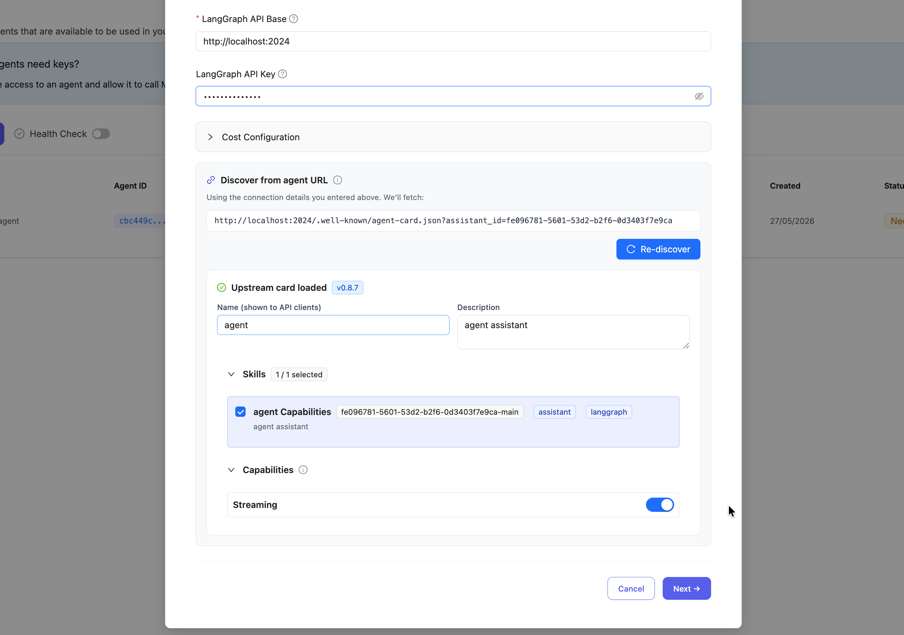
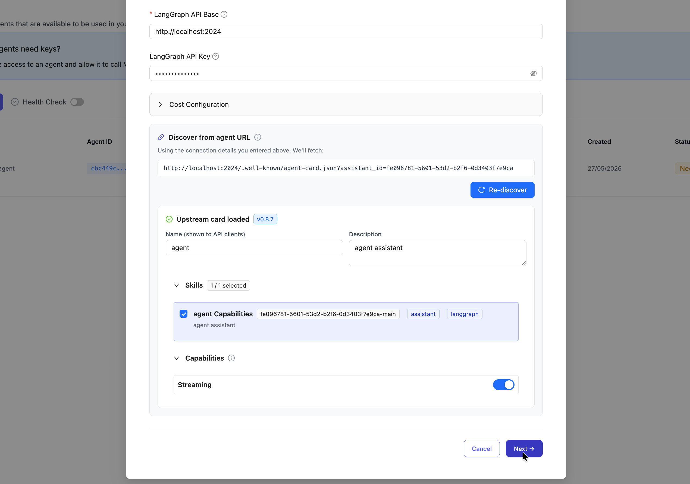

import Tabs from '@theme/Tabs';
import TabItem from '@theme/TabItem';

# LangGraph

Call LangGraph agents through LiteLLM using the OpenAI chat completions format.

| Property | Details |
|----------|---------|
| Description | LangGraph is a framework for building stateful, multi-actor applications with LLMs. LiteLLM supports calling LangGraph agents via their streaming and non-streaming endpoints. |
| Provider Route on LiteLLM | `langgraph/{agent_id}` |
| Provider Doc | [LangGraph Platform ↗](https://langchain-ai.github.io/langgraph/cloud/quick_start/) |

**Prerequisites:** You need a running LangGraph server. See [Setting Up a Local LangGraph Server](#setting-up-a-local-langgraph-server) below.

## Quick Start

### Model Format

```shell showLineNumbers title="Model Format"
langgraph/{agent_id}
```

**Example:**
- `langgraph/agent` - calls the default agent

### LiteLLM Python SDK

```python showLineNumbers title="Basic LangGraph Completion"
import litellm

response = litellm.completion(
    model="langgraph/agent",
    messages=[
        {"role": "user", "content": "What is 25 * 4?"}
    ],
    api_base="http://localhost:2024",
)

print(response.choices[0].message.content)
```

```python showLineNumbers title="Streaming LangGraph Response"
import litellm

response = litellm.completion(
    model="langgraph/agent",
    messages=[
        {"role": "user", "content": "What is the weather in Tokyo?"}
    ],
    api_base="http://localhost:2024",
    stream=True,
)

for chunk in response:
    if chunk.choices[0].delta.content:
        print(chunk.choices[0].delta.content, end="")
```

### LiteLLM Proxy

#### 1. Configure your model in config.yaml

<Tabs>
<TabItem value="config-yaml" label="config.yaml">

```yaml showLineNumbers title="LiteLLM Proxy Configuration"
model_list:
  - model_name: langgraph-agent
    litellm_params:
      model: langgraph/agent
      api_base: http://localhost:2024
```

</TabItem>
</Tabs>

#### 2. Start the LiteLLM Proxy

```bash showLineNumbers title="Start LiteLLM Proxy"
litellm --config config.yaml
```

#### 3. Make requests to your LangGraph agent

<Tabs>
<TabItem value="curl" label="Curl">

```bash showLineNumbers title="Basic Request"
curl http://localhost:4000/v1/chat/completions \
  -H "Content-Type: application/json" \
  -H "Authorization: Bearer $LITELLM_API_KEY" \
  -d '{
    "model": "langgraph-agent",
    "messages": [
      {"role": "user", "content": "What is 25 * 4?"}
    ]
  }'
```

```bash showLineNumbers title="Streaming Request"
curl http://localhost:4000/v1/chat/completions \
  -H "Content-Type: application/json" \
  -H "Authorization: Bearer $LITELLM_API_KEY" \
  -d '{
    "model": "langgraph-agent",
    "messages": [
      {"role": "user", "content": "What is the weather in Tokyo?"}
    ],
    "stream": true
  }'
```

</TabItem>

<TabItem value="openai-sdk" label="OpenAI Python SDK">

```python showLineNumbers title="Using OpenAI SDK with LiteLLM Proxy"
from openai import OpenAI

client = OpenAI(
    base_url="http://localhost:4000",
    api_key="your-litellm-api-key"
)

response = client.chat.completions.create(
    model="langgraph-agent",
    messages=[
        {"role": "user", "content": "What is 25 * 4?"}
    ]
)

print(response.choices[0].message.content)
```

```python showLineNumbers title="Streaming with OpenAI SDK"
from openai import OpenAI

client = OpenAI(
    base_url="http://localhost:4000",
    api_key="your-litellm-api-key"
)

stream = client.chat.completions.create(
    model="langgraph-agent",
    messages=[
        {"role": "user", "content": "What is the weather in Tokyo?"}
    ],
    stream=True
)

for chunk in stream:
    if chunk.choices[0].delta.content is not None:
        print(chunk.choices[0].delta.content, end="")
```

</TabItem>
</Tabs>

## Environment Variables

| Variable | Description |
|----------|-------------|
| `LANGGRAPH_API_BASE` | Base URL of your LangGraph server (default: `http://localhost:2024`) |
| `LANGGRAPH_API_KEY` | Optional API key for authentication |

## Supported Parameters

| Parameter | Type | Description |
|-----------|------|-------------|
| `model` | string | The agent ID in format `langgraph/{agent_id}` |
| `messages` | array | Chat messages in OpenAI format |
| `stream` | boolean | Enable streaming responses |
| `api_base` | string | LangGraph server URL |
| `api_key` | string | Optional API key |


## Setting Up a Local LangGraph Server

Before using LiteLLM with LangGraph, you need a running LangGraph server.

### Prerequisites

- Python 3.11+
- An LLM API key (OpenAI or Google Gemini)

### 1. Install the LangGraph CLI

```bash
uv add "langgraph-cli[inmem]"
```

### 2. Create a new LangGraph project

```bash
langgraph new my-agent --template new-langgraph-project-python
cd my-agent
```

### 3. Install dependencies

```bash
uv add -e .
```

### 4. Set your API key

```bash
echo "OPENAI_API_KEY=your_key_here" > .env
```

### 5. Start the server

```bash
langgraph dev
```

The server will start at `http://localhost:2024`.

### Verify the server is running

```bash
curl -s --request POST \
  --url "http://localhost:2024/runs/wait" \
  --header 'Content-Type: application/json' \
  --data '{
    "assistant_id": "agent",
    "input": {
      "messages": [{"role": "human", "content": "Hello!"}]
    }
  }'
```


## LiteLLM A2A Gateway

You can register LangGraph agents in LiteLLM's [A2A (Agent-to-Agent) Gateway](../a2a.md), discover their upstream agent card, curate skills and capabilities, and invoke them through the LiteLLM proxy.

### 1. Navigate to Agents

From the sidebar, click "Agents" to open the agent management page, then click "+ Add New Agent".


### 2. Select LangGraph Agent Type

Click "A2A Standard" to see available agent types, then search for "langgraph" and select "Connect to LangGraph agents via the LangGraph Platform API".


### 3. Configure the Agent

Fill in the following fields:

- **Agent Name** - A unique identifier (e.g., `lan-agent`)
- **LangGraph API Base** - Your LangGraph server URL, typically `http://127.0.0.1:2024/`
- **API Key** - Optional. LangGraph doesn't require an API key by default
- **Assistant ID** - Not used by LangGraph, you can enter any string here


### 4: Discover the agent card

Discovery runs automatically once the base URL and assistant ID are filled in. You can also trigger it manually from the discovery panel. 

The preview is a form. You can:

- **Edit** the name, description, provider, icon URL, and documentation URL.
- **Add, remove, or reorder skills**, and edit each skill's name, description, tags, examples, and input/output modes.
- **Toggle capabilities** that LiteLLM supports.

Select or deselect skills and capabilities before saving. LiteLLM only persists what you keep in the form.

Fields LiteLLM does not proxy are not shown. For the full support matrix, see [Agent card support](../a2a_agent_card.md#agent-card-support).



### 5: Save the agent

Click on Next to save. And complete the rest of the steps



### 6: Verify the served card

From your terminal, fetch the agent card LiteLLM is serving:

```bash
curl -H "Authorization: Bearer sk-1234" \
  http://localhost:4000/a2a/{agent_id}/.well-known/agent.json | jq
```

You should see the card you saved, with:

- `supportedInterfaces[0].url` pointing at LiteLLM, not the upstream
- `securitySchemes` showing `LiteLLMKey` (HTTP bearer)
- The skills you kept during registration

### 7. Test in Playground
Go to "Playground" in the sidebar to test your agent. Change the endpoint type to `/v1/a2a/message/send`.


### 8. Select Your Agent and Send a Message
Pick your LangGraph agent from the dropdown and send a test message.


### 9: Invoke the agent manually

Send an A2A `message/send` request to the LiteLLM proxy URL:

```bash
curl -X POST http://localhost:4000/a2a/{agent_id} \
  -H "Authorization: Bearer sk-1234" \
  -H "Content-Type: application/json" \
  -H "Accept: application/json" \
  -d '{
    "jsonrpc": "2.0",
    "id": "req-1",
    "method": "message/send",
    "params": {
      "message": {
        "messageId": "msg-001",
        "role": "user",
        "parts": [{"kind": "text", "text": "My order is urgent and still not delivered"}],
        "metadata": {"skillId": "triage_ticket"}
      }
    }
  }'
```

For streaming, use `message/stream` and add `-N -H "Accept: text/event-stream"` to the curl.

See also [Invoking A2A Agents](../a2a_invoking_agents.md) for SDK examples.


## Further Reading

- [LangGraph Platform Documentation](https://langchain-ai.github.io/langgraph/cloud/quick_start/)
- [LangGraph A2A endpoint docs](https://docs.langchain.com/langsmith/server-a2a)
- [LangGraph GitHub](https://github.com/langchain-ai/langgraph)
- [A2A Agent Gateway](../a2a.md)
- [A2A Agent Card on LiteLLM](../a2a_agent_card.md)
- [A2A Cost Tracking](../a2a_cost_tracking.md)
- [A2A Protocol Specification](https://a2a-protocol.org/latest/specification/)

