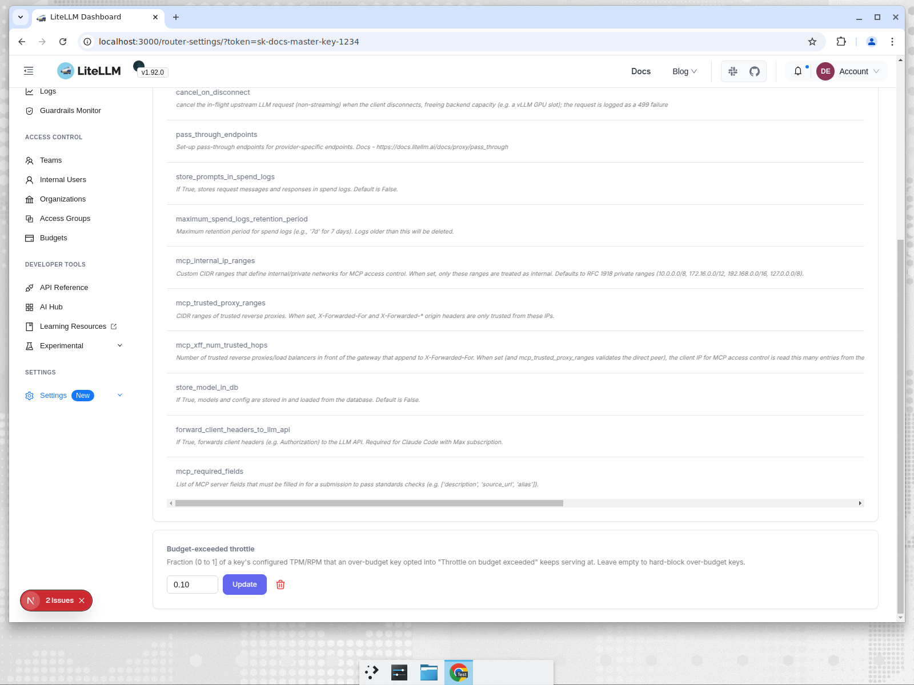
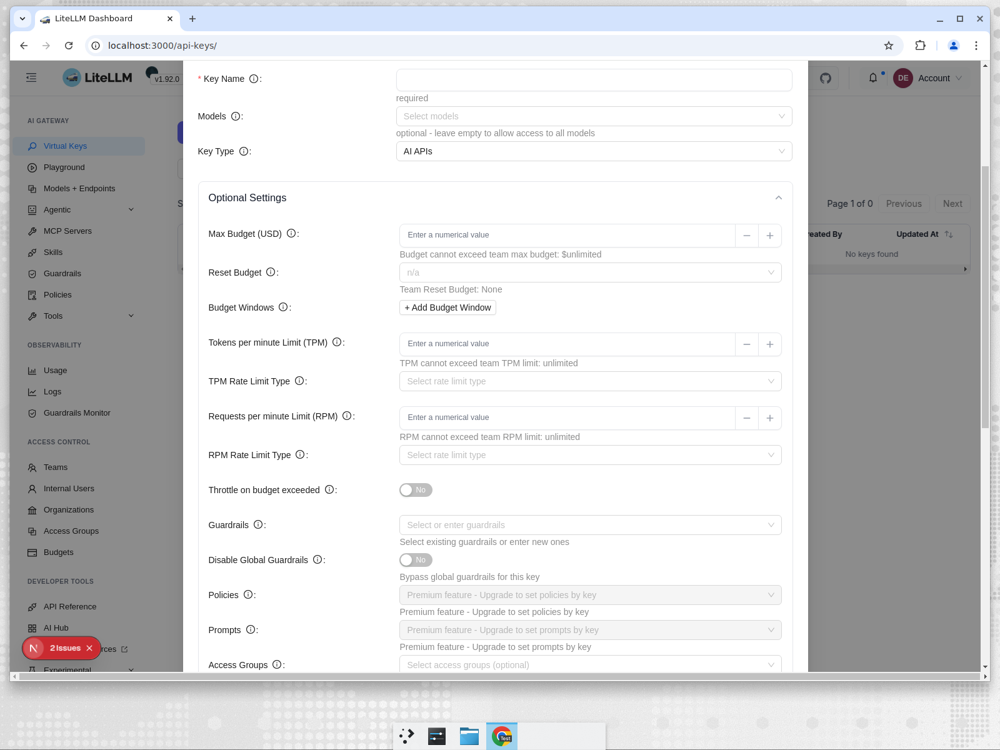

# Throttle Keys on Budget Exceeded

By default, a virtual key that hits its `max_budget` is hard-blocked and returns a `budget_exceeded` error on every subsequent request. Budget throttling changes this: an over-budget key keeps serving requests but at a reduced TPM/RPM instead of going dark entirely. This is useful when you want to degrade gracefully rather than cut off access.

## How it works

Two settings control the behavior:

**`budget_exceeded_throttle_percentage`** (global, in `litellm_settings`) sets the fraction of a key's configured TPM/RPM limits to allow once over budget. For example, `0.1` means 10%. A key with `tpm_limit=1000` and `rpm_limit=100` would be throttled down to `tpm=100` and `rpm=10` once it exceeds its `max_budget`.

**`throttle_on_budget_exceeded`** (per-key) opts an individual key in. Keys without this flag keep hard-blocking as before. Only a proxy admin can enable this flag on a key; non-admin users cannot self-opt-in.

The throttle is recomputed from the key's original limits on every request, so it never compounds across requests. If a key has no TPM or RPM limit configured, it stays hard-blocked even with the flag enabled (there is nothing to scale down).

## Quick Start

### 1. Set the global throttle percentage

**config.yaml**

```yaml
litellm_settings:
  budget_exceeded_throttle_percentage: 0.1  # 10% of configured limits
```

**Admin Dashboard**

Go to **Settings > General Settings**, scroll to "Budget-exceeded throttle", enter a value between 0 and 1, and click **Update**.



**API**

```bash
# Set the throttle percentage
curl -X PATCH 'http://localhost:4000/update/budget_settings' \
  -H 'Authorization: Bearer LITELLM_MASTER_KEY' \
  -H 'Content-Type: application/json' \
  -d '{"budget_exceeded_throttle_percentage": 0.1}'
```

```bash
# Read it back
curl 'http://localhost:4000/get/budget_settings' \
  -H 'Authorization: Bearer LITELLM_MASTER_KEY'
```

### 2. Create a key with throttling enabled

**API**

```bash
curl -X POST 'http://localhost:4000/key/generate' \
  -H 'Authorization: Bearer LITELLM_MASTER_KEY' \
  -H 'Content-Type: application/json' \
  -d '{
    "max_budget": 0.01,
    "tpm_limit": 1000,
    "rpm_limit": 100,
    "throttle_on_budget_exceeded": true
  }'
```

**Admin Dashboard**

When creating or editing a key, expand **Optional Settings** and toggle **Throttle on budget exceeded** to **Yes**. Make sure the key also has a TPM and/or RPM limit set.



### 3. Test it

Once the key exceeds its budget, it will receive a rate-limit error (`throttling_error`) instead of a budget-exceeded error, with its limits scaled to 10% of the configured values. After the rate window resets it will serve again at the reduced rate.

```bash
# Over-budget key with throttle enabled: rate-limited, not blocked
curl 'http://localhost:4000/v1/chat/completions' \
  -H 'Authorization: Bearer sk-throttled-key' \
  -H 'Content-Type: application/json' \
  -d '{"model": "gpt-4o-mini", "messages": [{"role": "user", "content": "hi"}]}'
```

Throttled response (TPM scaled from 1000 to 100):

```json
{
  "error": {
    "message": "Rate limit exceeded ... Current limit: 100, Remaining: 0 ...",
    "type": "throttling_error",
    "code": "429"
  }
}
```

Without the flag, the same over-budget key would return:

```json
{
  "error": {
    "message": "Budget has been exceeded! ...",
    "type": "budget_exceeded",
    "code": "429"
  }
}
```

## Enabling on an existing key

Use `/key/update` with the master key:

```bash
curl -X POST 'http://localhost:4000/key/update' \
  -H 'Authorization: Bearer LITELLM_MASTER_KEY' \
  -H 'Content-Type: application/json' \
  -d '{
    "key": "sk-existing-key",
    "throttle_on_budget_exceeded": true
  }'
```

Or toggle it on from the key's edit view in the Admin Dashboard.

## Requirements and constraints

**Admin-only**: only a proxy admin can set `throttle_on_budget_exceeded: true` on a key. A non-admin user will receive a 403 error if they try to enable it via `/key/generate` or `/key/update`.

**Rate limits required**: a key that opts in but has no `tpm_limit` or `rpm_limit` configured has nothing to scale, so it stays hard-blocked. Always set a TPM and/or RPM limit alongside the throttle flag.

**Key-level budgets only**: the throttle applies to the key's own `max_budget`. Team, user, and organization budgets are unaffected and will still hard-block when exceeded.

**Percentage must be in (0, 1]**: values outside this range are rejected by both the config and the API.
