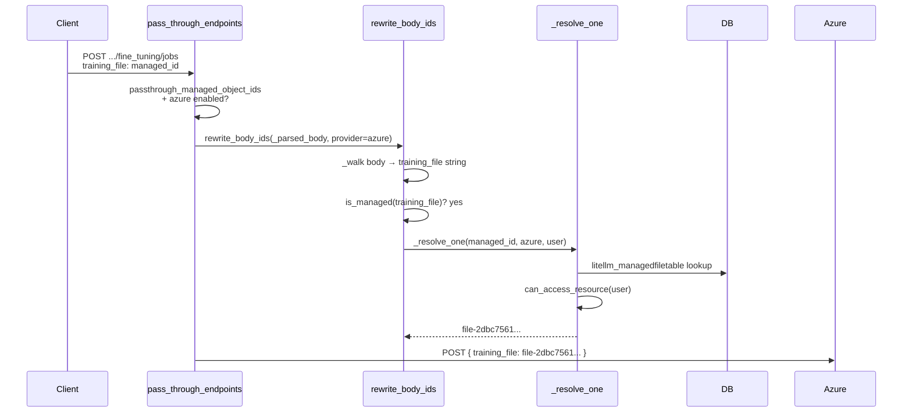

# Passthrough Managed IDs

When you use LiteLLM's passthrough endpoints (e.g. `/openai/v1/files`, `/azure/openai/batches`) the upstream provider returns its own raw IDs such as `file-abc123` or `batch_xyz`. By default those IDs are returned directly to your client, which means:

- Any user who guesses or intercepts another user's `file-abc123` can use it.
- You have no proxy-level record of who owns what.
- Multi-tenant isolation has to be done entirely in your application code.

**Passthrough Managed IDs** solves this. When the feature is enabled the proxy:

1. **Mints** a stable, opaque managed ID for every raw provider ID it sees in a response.
2. **Stores** the `managed_id → raw_id` mapping in the proxy database, tagged with the creating user/team.
3. **Resolves** a managed ID back to the raw provider ID just before forwarding any request upstream, after running an ownership/permission check.

Your clients never see raw provider IDs and can never access resources they do not own — even if they guess or forge a managed ID string.

## How to enable

Add one line to `general_settings` in your proxy config:

```yaml
general_settings:
  passthrough_managed_object_ids: true
```

The feature requires:
- A database configured for the proxy (Prisma / PostgreSQL).
- The `managed_files` enterprise hook to be available.

The feature is active only for **OpenAI** and **Azure OpenAI** passthrough routes.

## Native managed endpoints vs passthrough

| | Native managed endpoints | Passthrough with managed IDs |
|---|---|---|
| **URL prefix** | `/v1/files`, `/v1/batches` | `/openai/v1/files`, `/azure/openai/batches` |
| **Routing** | LiteLLM internal logic; model-based routing | Direct forward to upstream provider |
| **Credential resolution** | Via `model_list` router | Via `PassthroughEndpointRouter` / env vars |
| **Use when** | You want LiteLLM to pick the right deployment automatically, or you need cross-provider batching | You want to call a provider API directly (e.g. fine-tuning, responses, custom endpoints) but still need proxy-level access control |
| **ID management** | Always managed by LiteLLM | Managed IDs only when `passthrough_managed_object_ids: true` |
| **Streaming ID minting** | Supported | **Not yet supported** (output IDs in streaming responses are not rewritten) |

## Supported endpoints

### Response ID minting (OUTPUT)

These are the specific routes where LiteLLM will mint a managed ID for raw provider IDs it sees in the **response body** and swap them before returning to the client.

| Provider | Method | Path | Fields rewritten |
|----------|--------|------|-----------------|
| OpenAI | `POST` | `/v1/files` | `id` (`file-`) |
| OpenAI | `GET` | `/v1/files/{file_id}` | `id` (`file-`) |
| OpenAI | `DELETE` | `/v1/files/{file_id}` | `id` (`file-`) |
| OpenAI | `POST` | `/v1/batches` | `id` (`batch_`), `input_file_id`, `output_file_id`, `error_file_id` |
| OpenAI | `GET` | `/v1/batches/{batch_id}` | `id` (`batch_`), `input_file_id`, `output_file_id`, `error_file_id` |
| OpenAI | `POST` | `/v1/batches/{batch_id}/cancel` | `id` (`batch_`), `input_file_id`, `output_file_id`, `error_file_id` |
| OpenAI | `POST` | `/v1/responses` | `id` (`resp_`) |
| OpenAI | `GET` | `/v1/responses/{response_id}` | `id` (`resp_`) |
| OpenAI | `DELETE` | `/v1/responses/{response_id}` | `id` (`resp_`) |
| Azure | `POST` | `/v1/files` | `id` (`file-`) |
| Azure | `GET` | `/v1/files/{file_id}` | `id` (`file-`) |
| Azure | `DELETE` | `/v1/files/{file_id}` | `id` (`file-`) |
| Azure | `POST` | `/v1/batches` | `id` (`batch_`), `input_file_id`, `output_file_id`, `error_file_id` |
| Azure | `GET` | `/v1/batches/{batch_id}` | `id` (`batch_`), `input_file_id`, `output_file_id`, `error_file_id` |
| Azure | `POST` | `/v1/batches/{batch_id}/cancel` | `id` (`batch_`), `input_file_id`, `output_file_id`, `error_file_id` |
| Azure | `POST` | `/v1/responses` | `id` (`resp_`) |
| Azure | `GET` | `/v1/responses/{response_id}` | `id` (`resp_`) |
| Azure | `DELETE` | `/v1/responses/{response_id}` | `id` (`resp_`) |

### Managed ID resolution (INPUT)

This is **not route-specific**. For every OpenAI or Azure passthrough request, LiteLLM scans the entire request before forwarding it upstream:

| Location | What is scanned |
|----------|-----------------|
| **URL path** | Each path segment |
| **Query params** | Every string-valued parameter |
| **Request body** | All string values, recursively (works in nested objects and arrays) |

This means any endpoint that accepts a file ID, batch ID, or response ID in path, query, or body will automatically resolve managed IDs — including endpoints not listed in the output table above, such as fine-tuning jobs (`/v1/fine_tuning/jobs`), assistants, or any custom endpoint.

**Example — fine-tuning job:**

```python
# Client sends managed IDs for training_file and validation_file
response = client.post("/azure/openai/v1/fine_tuning/jobs", json={
    "model": "gpt-4o-mini",
    "training_file": "bGl0ZWxsbV9wcm94eTpwYXNzdGhyb3VnaDtwcm92...",  # managed ID
    "validation_file": "bGl0ZWxsbV9wcm94eTpwYXNzdGhyb3VnaDtwcm92...",  # managed ID
})

# Proxy resolves both to raw file IDs and forwards:
# POST .../fine_tuning/jobs
# { "model": "gpt-4o-mini", "training_file": "file-2dbc75...", "validation_file": "file-2dbc75..." }
```

## Request flow - any endpoint

This applies to **any** OpenAI or Azure passthrough endpoint — not just fine-tuning. The same path/query/body scan runs on every request; the example below uses a fine-tuning job with a managed file ID in the body.



On the **response** path, `rewrite_response_ids()` mints managed IDs for raw provider IDs — but only on routes listed in the output map (files, batches, responses). Other endpoints (e.g. fine-tuning) return upstream IDs as-is unless they appear in that map.

## Permission checks

Every managed ID resolution runs four checks in order. **All must pass** or the request is rejected.

### 1. Provider match

The managed ID encodes the provider it was minted for (e.g. `azure`). If you send an Azure-minted ID on an OpenAI passthrough route (or vice versa), the proxy returns **404** and never forwards the ID upstream.

### 2. DB existence

The managed ID must map to a real row in the proxy database. A guessed, forged, or base64-crafted string that does not correspond to a real row returns **404**. The raw provider ID is **never** forwarded to the upstream when the DB check fails.

### 3. Access check - per-request

`can_access_resource()` decides whether the caller may use a specific resource:

| Caller identity | Access granted when |
|-----------------|---------------------|
| Proxy admin / master key | Always |
| Has `user_id` | `created_by == user_id` |
| Has `team_id` (service account) | `team_id == resource.team_id` |
| Has both `user_id` and `team_id` | Either condition above |
| Neither | Never (**403**) |

### 4. Access check - list endpoints

`build_owner_filter()` scopes the database query for list operations (see below). Same rules, expressed as a Prisma `WHERE` clause:

| Caller | WHERE clause |
|--------|-------------|
| Proxy admin / master key | `{}` (no filter — sees all rows) |
| `user_id` only | `created_by = user_id` |
| `team_id` only | `team_id = team_id` |
| Both `user_id` and `team_id` | `created_by = user_id OR team_id = team_id` |
| Neither | Empty list returned immediately — no DB query |

## How list endpoints work

`GET /openai/v1/files` and `GET /openai/v1/batches` (and their Azure equivalents) are **fully intercepted**. The request is never forwarded to the upstream provider. Instead, the proxy queries its own database and returns only the rows the caller owns:

```
GET /openai/v1/files
                                     ┌─────────────────────────────┐
                         admin key?  │  WHERE {}                   │
                                     │  (all rows)                 │
                                     └─────────────────────────────┘
                         user key?   ┌─────────────────────────────┐
                                     │  WHERE created_by = user_id │
                                     │  OR team_id = team_id       │
                                     └─────────────────────────────┘
                                               │
                                               ▼
                              OpenAI-style paginated response
                              { "object": "list", "data": [...] }
                              All IDs in data[] are managed IDs
```

Pagination parameters `limit`, `after`, and `before` are supported and map directly to a cursor on `created_at`.

A caller with no `user_id` and no `team_id` always receives an empty list — the proxy never falls back to an unscoped query.

## Limitations

### Streaming responses - output ID minting not supported

When the upstream returns a **streaming** (SSE) response, managed IDs are **not minted** for raw provider IDs in the stream chunks. The client receives the raw upstream IDs.

### Raw IDs are passed through unchanged

If you send a raw provider ID (e.g. `file-abc123`) instead of a managed ID, the proxy passes it through without any ownership check. The permission system only applies to strings that decode as passthrough managed IDs.

### IDs are provider-scoped

A managed ID minted for `azure` cannot be used on `openai` passthrough routes and vice versa. Attempting to do so returns **404**.
