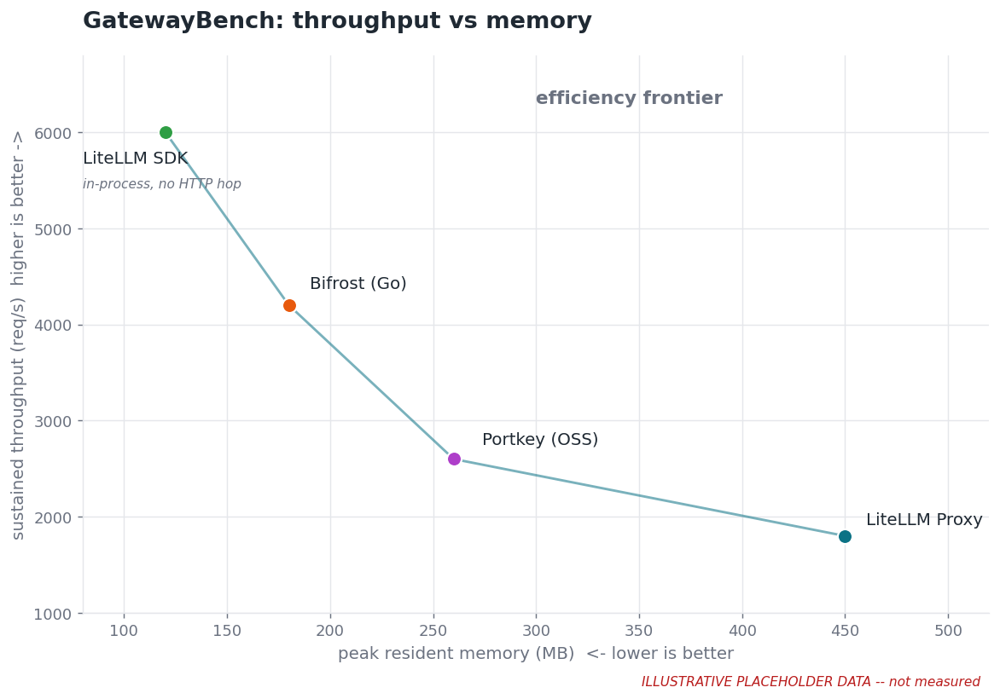
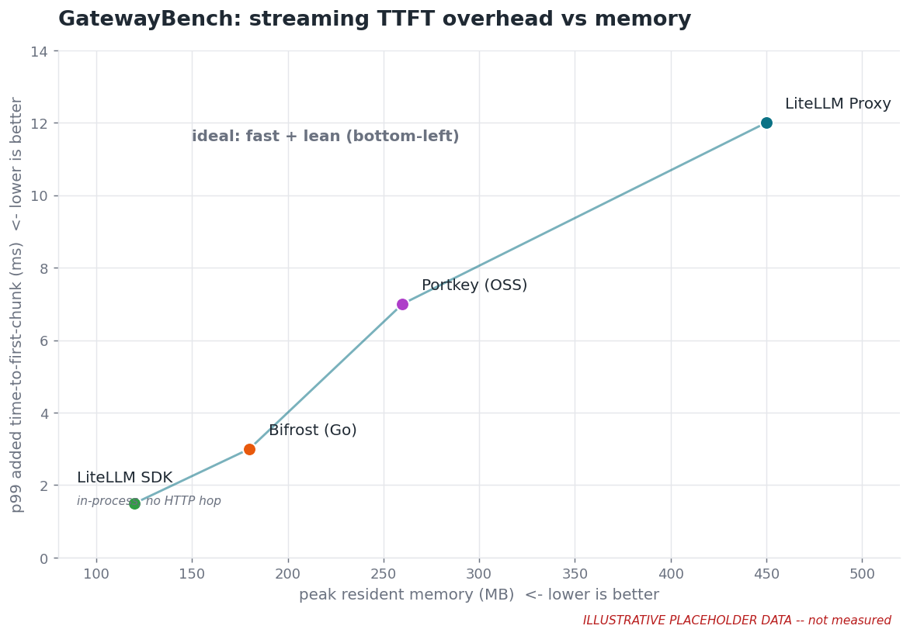

# GatewayBench

A reproducible benchmark for **AI-gateway overhead**: the latency, throughput ceiling, and resource cost a gateway adds *on top of* the upstream LLM.

CursorBench measures model *quality*. The right question for a gateway is not quality but overhead, and specifically the overhead that a coding agent feels on every turn: how much longer until the first token, how evenly the stream flows, how tool calls behave, and how the whole thing holds up under concurrency. GatewayBench measures that, and it measures it the same way for every gateway so the numbers are comparable.





> The charts above use **illustrative placeholder data** to show the design. They are regenerated from real `results/*.jsonl` once the harness has run; see [Generating the charts](#generating-the-charts).

## The core idea: isolate the gateway from the provider

Real provider latency is hundreds of milliseconds to several seconds with large variance. Gateway overhead is microseconds to low-single-digit milliseconds. Benchmarking against a live provider drowns the signal in provider noise and nothing reproduces.

So every self-hostable gateway points at a **local mock upstream** we control (`crates/mock-upstream`): an OpenAI-compatible server with deterministic, configurable behavior

- fixed, configurable time-to-first-byte and inter-token delay, so streaming is realistic without real-world variance
- configurable request size (prompt tokens) and response size (completion tokens)
- correct SSE streaming for `stream: true`, a normal JSON body otherwise
- a valid `usage` block, so spend-tracking and logging code paths actually run

Overhead is then

```
overhead = latency(client -> gateway -> mock) - latency(client -> mock directly)
```

measured through the same client over the same loopback. The direct-to-mock path is the zero point.

## Why Rust

The mock and the load driver must never be the bottleneck. A Python mock or closed-loop Python driver caps throughput well below where these gateways saturate, and it cannot measure tail latency honestly. The harness is a Rust (tokio) workspace so that

- the mock and driver stay far above the gateways' saturation point
- latency is captured losslessly with `hdrhistogram`
- the driver is **open-loop** (constant arrival rate), which avoids coordinated omission and keeps the p99/p99.9 tail honest
- runs are deterministic: fixed seeds, fixed payloads, a discarded warmup window

Only the harness is Rust. The gateways run as their real selves: LiteLLM (Python), Bifrost (Go), Portkey (the OSS JS gateway).

## Metrics

Coding agents stream, call tools, and send large contexts, so the streaming and payload metrics carry the most weight.

Streaming, what an agent feels every turn

- **TTFT overhead** - added time to the first chunk. The single most perceived metric
- **Inter-chunk latency (ITL) and jitter** - added gap between SSE chunks (p50/p99/max and standard deviation). This exposes gateways that buffer or re-chunk the stream; some coalesce the whole response and re-emit it, which is catastrophic for an agent
- **Chunk fidelity** - whether chunks pass through 1:1 or get coalesced (chunk-count ratio versus the mock)
- **Time-to-last-token** - added total stream duration

Tool calls, core to coding agents

- **Tool-call TTFT and total overhead** versus plain text; streamed `tool_calls` argument deltas are a heavier transform path than text
- **Tool-call correctness under streaming** - whether the gateway reassembles partial JSON argument deltas without corrupting or reordering them

Payload scaling, agents send whole files

- **Large-prompt overhead** - overhead as a function of input size (1k / 10k / 100k tokens), where JSON parse and serialize cost dominates

Load and cost

- **Throughput ceiling** - max sustained req/s before the latency knee or errors
- **Tail latency** - p99 / p99.9 added latency under concurrency
- **Resource footprint** - peak RSS and CPU at a fixed req/s, from which we derive cost per 1M requests

## Fairness

Since LiteLLM publishes this, transparency is the whole point. Every gateway config, image, and pinned version lives in `gateways/` and is meant to be challenged. Rules

- each gateway runs in its **recommended production config**, not a strawman, and we run two configs per gateway: *bare passthrough* (no logging, DB, cache, or rate limit) to isolate pure proxy cost, and *realistic prod* (key auth plus a logging or spend callback on) to match what people actually run
- equal resources for every gateway (same container CPU and memory limits), so a result is never "who got more cores"
- load driver, gateway, and mock run on separate pinned cores so the driver never steals the gateway's CPU
- fixed seeds and payloads, a discarded warmup window, multiple runs with median-of-runs and variance reported

Category differences we state honestly rather than hide

- **LiteLLM SDK** is an in-process library with no HTTP hop, so it is a different product category from the network proxies. It is reported but kept off the same latency axis
- **OpenRouter** is SaaS only and cannot be pointed at the mock. Any number for it includes their infrastructure, the network round trip to their datacenter, and a real upstream, so it is not comparable to the self-hosted numbers. It is either excluded from the isolated-overhead charts or reported separately as an end-to-end measurement, always clearly labeled
- **Portkey** is benchmarked as the open-source self-hostable gateway, not the SaaS

## Layout

Each folder under `tests/` is one self-contained test: its own crate, its own driver invocation, its own assertion.

```
gatewaybench/                 cargo workspace
  crates/
    gwbench-core/             shared types: Scenario, tagged-union Outcome,
                              hdrhistogram-backed LatencySummary, ResourceSample,
                              JSONL BenchResult writer
    mock-upstream/            axum mock: configurable TTFT, inter-token gap, size, SSE, usage
    driver/                   open-loop (constant-arrival-rate) load engine
  tests/                      each subdir = ONE test (bin + README describing it)
    ttft/                     added time-to-first-chunk
    inter-chunk-latency/      added inter-chunk gap + jitter; buffering detection
    chunk-fidelity/           1:1 passthrough vs coalescing
    tool-call-latency/        tool-call TTFT + streamed-arg reassembly correctness
    large-prompt/             overhead vs input size (1k/10k/100k tokens)
    throughput/               RPS ceiling + CPU/RSS cost per 1M requests
    tail-latency/             p99/p99.9 added latency under concurrency
  gateways/                   per-gateway configs (bare + prod), pinned versions
    litellm-proxy/  bifrost/  portkey/  openrouter/
  xtask/                      `cargo xtask bench` sweeps the matrix -> results/*.jsonl
  analyze/                    chart generation for RESULTS.md
```

## Quickstart

```bash
# build the workspace
cargo build --workspace --release

# run the mock upstream (defaults to :8080)
GWBENCH_MOCK_PORT=8080 cargo run --release -p mock-upstream

# run a single test against a target (e.g. a gateway on :4000, or the mock directly for the baseline)
cargo run --release -p ttft

# sweep the full matrix and write results/*.jsonl
cargo xtask bench
```

## Generating the charts

The hero charts are produced from the benchmark results by `analyze/make_hero_charts.py`. Point `_DATA` at real rows from `results/*.jsonl` and regenerate

```bash
python analyze/make_hero_charts.py
```

## Status

Scaffold: the workspace compiles, the domain types are real, and the mock serves a valid non-streaming response. The measurement internals (open-loop driver, streaming mock knobs, cgroup resource sampling, per-test assertions, the `xtask` matrix sweep) land in follow-ups. The charts show placeholder data until then.
