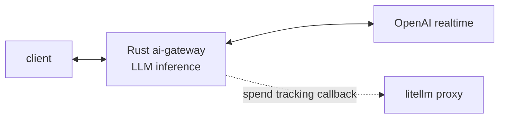

# ai-gateway architecture

The Rust ai-gateway does LLM inference (realtime WebSocket). Spend tracking is an
API callback: it POSTs each finished session to the LiteLLM proxy, which records
spend and runs the usual callbacks.

