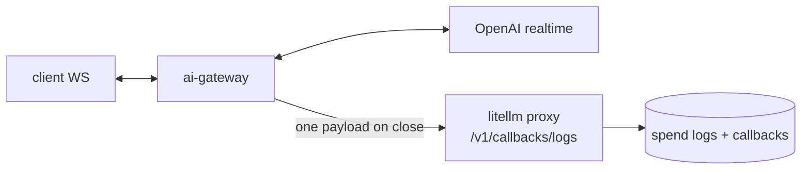

# ai-gateway architecture

The gateway owns the realtime WebSocket but runs no spend logic. When a session
ends it builds one `StandardLoggingPayload` and POSTs it to the LiteLLM proxy,
which replays it through the usual callbacks (spend logs, Langfuse, …).

Notes:

- Logging never blocks the splice. `observe` is an O(1) call on each upstream
  event; the finished payload is `try_send` to a bounded channel that a worker
  drains and POSTs. A full channel drops + counts rather than blocking.
- One payload per session — no per-frame buffering, so long calls stay flat in memory.
- `request_id` is the OpenAI session id (`sess_…`).

Code: `routes/realtime/` (the splice), `realtime/streaming.rs`
(`RealTimeStreaming`, the collector), `integrations/` (the `CustomLogger` and the
proxy POST).
