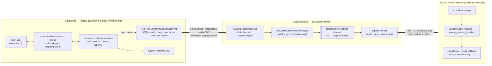
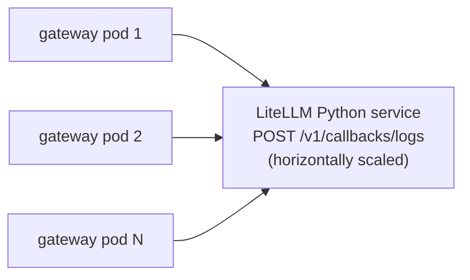

# ai-gateway — architecture

The Rust gateway owns the **data plane** (the realtime WebSocket connection and the
LLM splice). It is **never** in the request path for logging: when a session ends it
hands a finished `StandardLoggingPayload` to a callback, and a background worker ships
that to the **LiteLLM Python service** over HTTP. Python does spend logs + the full
callback fan-out. This keeps the gateway non-blocking under high traffic — Python
slowness, batching, or downtime can never stall or crash a live session.

The realtime logging wrapper is a 1:1 port of Python's `RealTimeStreaming`
(`litellm/litellm_core_utils/realtime_streaming.py`): accumulate O(1) per-session
state during the call, emit **one** payload at close.

## Data plane → logging plane → Python



## Why it holds up under high traffic

The request path does **zero** logging I/O. Each event costs one `observe()` call —
a `match` on the event type that drops the frame (audio deltas hit no branch). The
only network hop for logs is the worker's, off the hot path:



- **Non-blocking emit** — handlers only `try_send`; if the channel is full they drop
  the record and bump a metric, then keep serving. Python latency/downtime degrades
  to dropped log lines + a rising counter, never a stalled or crashed gateway.
- **Bounded memory** — the channel is capped by **bytes** (not record count), and
  `RealTimeStreaming` keeps **O(1)** per-session state (no buffered frames), so a
  long voice call can't OOM the pod.
- **Batching + gzip** — the worker coalesces records and compresses, so many gateway
  pods fan into a Python service that scales out independently.

## Map to Python

| Python (`realtime_streaming.py` / `integrations/`) | Rust (this crate + `integrations/`) |
| --- | --- |
| `RealTimeStreaming` (wrapper, assemble-then-emit-once) | `RealTimeStreaming` (1:1) |
| `store_message` / `_collect_*` (accumulate) | `RealTimeStreaming.observe(&event)` (O(1)) |
| `log_messages()` at WS close (once) | `RealTimeStreaming::log_messages()` (once) |
| `CustomLogger` base class | `trait CustomLogger` (sync, typed args, `-> Result`) |
| `async_log_success_event` / `async_log_failure_event` | `log_success_event` / `log_failure_event` |
| a concrete integration (datadog, langfuse, …) | `LiteLLMPythonProxyAPILogger` (POSTs to the proxy) |
| in-process `async_success_handler` | `POST /v1/callbacks/logs` → same `async_success_handler` |

## Where the code lives

```
crates/ai-gateway/
  routes/realtime/        # axum surface + splice service (data plane)
  integrations/           # the callback layer (mirrors litellm/integrations/)
    custom_logger.rs       #   trait CustomLogger — base contract
    types.rs               #   typed StandardLoggingPayload, Usage, RequestMetadata, LoggingError
    litellm_python_proxy_api.rs  #   LiteLLMPythonProxyAPILogger: bounded channel + egress worker
  realtime/streaming.rs   # RealTimeStreaming — per-session O(1) collector
```

The Python ingest endpoint (`POST /v1/callbacks/logs`) ships in
[BerriAI/litellm#31134](https://github.com/BerriAI/litellm/pull/31134); the realtime
splice in [#31135](https://github.com/BerriAI/litellm/pull/31135).
