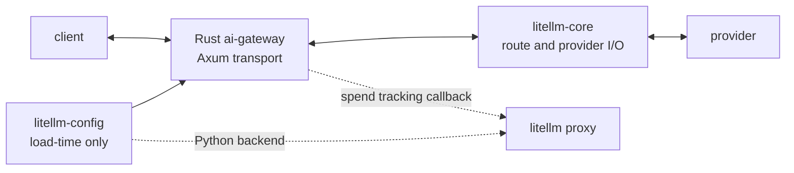

# ai-gateway architecture

The Rust ai-gateway is the Axum transport host for core routes. It authenticates
clients, selects deployments, adapts HTTP or WebSocket traffic, and supplies
terminal logging services. Provider transformation, authentication, HTTP and
WebSocket I/O, stream instrumentation, and session completion live in
`litellm-core`.

Spend tracking is an API callback: the gateway's terminal logger POSTs each
finished call or session to the LiteLLM proxy, which records spend and runs the
usual callbacks. Streaming and WebSocket routes retain their core completion
owner until the stream or session ends, so committed calls produce one terminal
record. Realtime pool warmup is only connection preparation and produces zero
terminal records on success or failure.

```mermaid
flowchart LR
  C[client] <--> G[Rust ai-gateway<br/>Axum transport]
  G <--> K[litellm-core<br/>route and provider I/O]
  K <--> O[provider]
  G -. spend tracking callback .-> P[litellm proxy]
  F[litellm-config<br/>load-time only] --> G
  F -. Python backend .-> P
```
