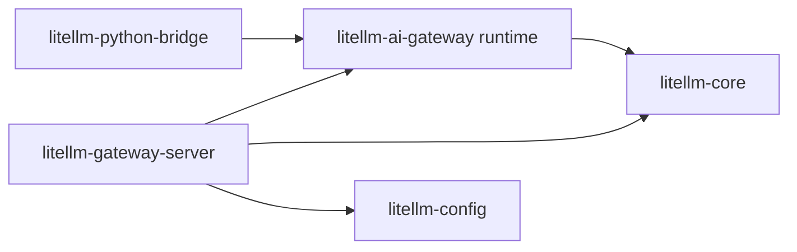

# ai-gateway architecture

`litellm-ai-gateway` is between hosts and `litellm-core`. It exposes
framework-independent runtime services and callback integrations without
depending on an HTTP framework

```mermaid
flowchart LR
  S[litellm-gateway-server] --> G[litellm-ai-gateway runtime]
  B[litellm-python-bridge] --> G
  G --> C[litellm-core]
  S --> C
  S --> F[litellm-config]
```

The server may depend on the runtime, core, and config crates. Reusable crates
must not depend on the server
