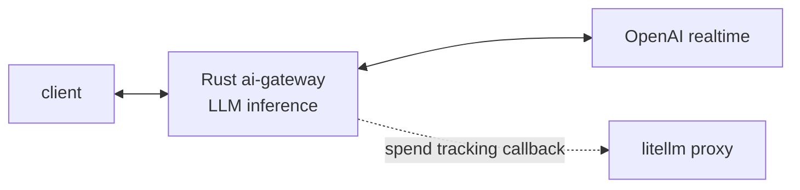

# ai-gateway architecture

The Rust ai-gateway does LLM inference (realtime WebSocket). Spend tracking is an
API callback: it POSTs each finished session to the LiteLLM proxy, which records
spend and runs the usual callbacks.

OCR provider execution lives in `litellm-runtime`. The gateway OCR module is a
compatibility host adapter for custom logger, guardrail, and request metadata
types; runtime has no dependency on the gateway.

```mermaid
flowchart LR
  C[client] <--> G[Rust ai-gateway<br/>LLM inference]
  G <--> O[OpenAI realtime]
  G -. spend tracking callback .-> P[litellm proxy]
```
