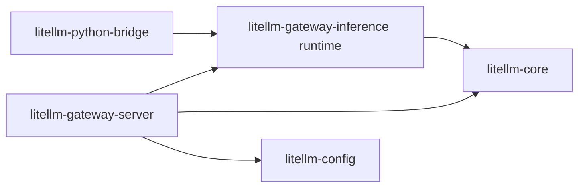

# gateway-inference architecture

`litellm-gateway-inference` is the first extracted gateway domain. It sits
between hosts and `litellm-core`, exposing framework-independent inference
services and callback integrations without depending on an HTTP framework

The server may depend on the runtime, core, and config crates. Reusable crates
must not depend on the server
