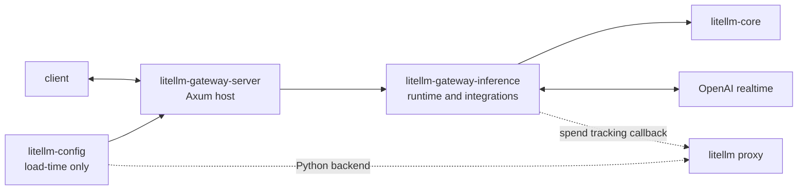

# gateway-server architecture

The Rust gateway server is the root composition crate. It owns the Axum binary,
HTTP/WebSocket routes, auth extractors, application state, and startup config.
It delegates inference behavior to `litellm-gateway-inference`; future domain
crates plug into this composition root the same way

