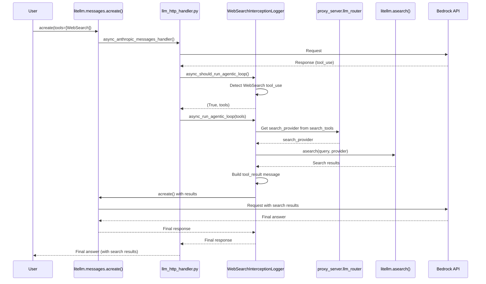

# WebSearch Interception Architecture

Server-side WebSearch tool execution for models that don't natively support it (e.g., Bedrock/Claude).

## How It Works

User makes **ONE** `litellm.messages.acreate()` call → Gets final answer with search results.
The agentic loop happens transparently on the server.

---

## Request Flow

### Without Interception (Client-Side)
User manually handles tool execution:
1. User calls `litellm.messages.acreate()` → Gets `tool_use` response
2. User executes `litellm.asearch()`
3. User calls `litellm.messages.acreate()` again with results
4. User gets final answer

**Result**: 2 API calls, manual tool execution

### With Interception (Server-Side)
Server handles tool execution automatically:



**Result**: 1 API call from user, server handles agentic loop

---

## Key Components

| Component | File | Purpose |
|-----------|------|---------|
| **WebSearchInterceptionLogger** | `handler.py` | CustomLogger that implements agentic loop hooks |
| **Transformation Logic** | `transformation.py` | Detect tool_use, build tool_result messages, format search responses |
| **Agentic Loop Hooks** | `integrations/custom_logger.py` | Base hooks: `async_should_run_agentic_loop()`, `async_run_agentic_loop()` |
| **Hook Orchestration** | `llms/custom_httpx/llm_http_handler.py` | `_call_agentic_completion_hooks()` - calls hooks after response |
| **Router Search Tools** | `proxy/proxy_server.py` | `llm_router.search_tools` - configured search providers |
| **Search Endpoints** | `proxy/search_endpoints/endpoints.py` | Router logic for selecting search provider |

---

## Configuration

```python
from litellm.integrations.websearch_interception import WebSearchInterceptionLogger
from litellm.types.utils import LlmProviders

# Enable for Bedrock with specific search tool
litellm.callbacks = [
    WebSearchInterceptionLogger(
        enabled_providers=[LlmProviders.BEDROCK],
        search_tool_name="my-perplexity-tool"  # Optional: uses router's first tool if None
    )
]

# Make request (streaming or non-streaming both work)
response = await litellm.messages.acreate(
    model="bedrock/us.anthropic.claude-3-5-sonnet-20241022-v2:0",
    messages=[{"role": "user", "content": "What is LiteLLM?"}],
    tools=[{"name": "WebSearch", ...}],
    max_tokens=1024,
    stream=True  # Streaming is automatically converted to non-streaming for WebSearch
)
```

---

## Streaming Support

WebSearch interception works transparently with both streaming and non-streaming requests.

**How streaming is handled:**
1. User makes request with `stream=True` and WebSearch tool
2. Before API call, `anthropic_messages()` detects WebSearch + interception enabled
3. Converts `stream=True` → `stream=False` internally
4. Agentic loop executes with non-streaming responses
5. Final response returned to user (non-streaming)

**Why this approach:**
- Server-side agentic loops require consuming full responses to detect tool_use
- User opts into this behavior by enabling WebSearch interception
- Provides seamless experience without client changes

**Testing:**
- **Non-streaming**: `test_websearch_interception_e2e.py`
- **Streaming**: `test_websearch_interception_streaming_e2e.py`

---

## Search Provider Selection

1. If `search_tool_name` specified → Look up in `llm_router.search_tools`
2. If not found or None → Use first available search tool
3. If no router or no tools → Fallback to `perplexity`

Example router config:
```yaml
search_tools:
  - search_tool_name: "my-perplexity-tool"
    litellm_params:
      search_provider: "perplexity"
  - search_tool_name: "my-tavily-tool"
    litellm_params:
      search_provider: "tavily"
```

---

## Message Flow

### Initial Request
```python
messages = [{"role": "user", "content": "What is LiteLLM?"}]
tools = [{"name": "WebSearch", ...}]
```

### First API Call (Internal)
**Response**: `tool_use` with `name="WebSearch"`, `input={"query": "what is litellm"}`

### Server Processing
1. Logger detects WebSearch tool_use
2. Looks up search provider from router
3. Executes `litellm.asearch(query="what is litellm", search_provider="perplexity")`
4. Gets results: `"Title: LiteLLM Docs\nURL: docs.litellm.ai\n..."`

### Follow-Up Request (Internal)
```python
messages = [
    {"role": "user", "content": "What is LiteLLM?"},
    {"role": "assistant", "content": [{"type": "tool_use", ...}]},
    {"role": "user", "content": [{"type": "tool_result", "content": "search results..."}]}
]
```

### User Receives
```python
response.content[0].text
# "Based on the search results, LiteLLM is a unified interface..."
```

---

## Testing

**E2E Tests**:
- `test_websearch_interception_e2e.py` - Non-streaming real API calls to Bedrock
- `test_websearch_interception_streaming_e2e.py` - Streaming real API calls to Bedrock

**Unit Tests**: `test_websearch_interception.py`
Mocked tests for tool detection, provider filtering, edge cases.
