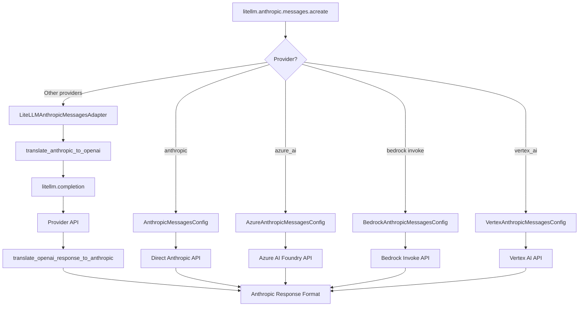
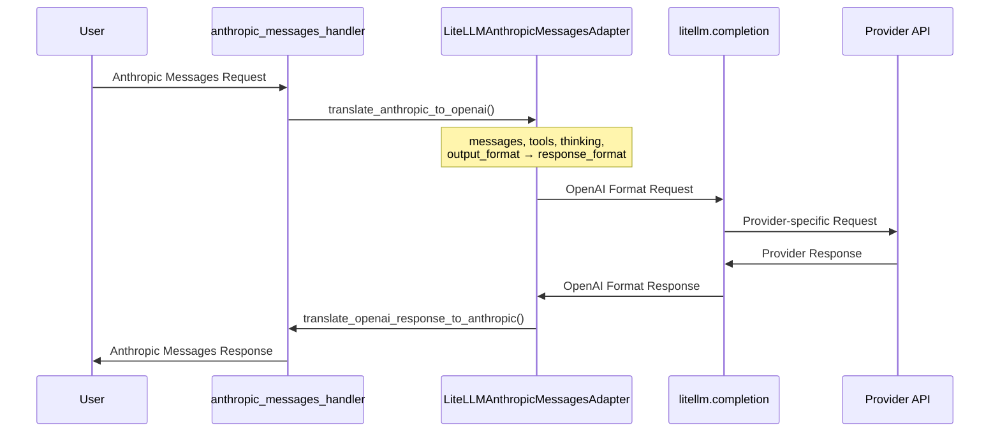

# Anthropic Messages Pass-Through Architecture

## Request Flow

```mermaid
flowchart TD
    A[litellm.anthropic.messages.acreate] --> B{Provider?}
    
    B -->|anthropic| C[AnthropicMessagesConfig]
    B -->|azure_ai| D[AzureAnthropicMessagesConfig]
    B -->|bedrock invoke| E[BedrockAnthropicMessagesConfig]
    B -->|vertex_ai| F[VertexAnthropicMessagesConfig]
    B -->|Other providers| G[LiteLLMAnthropicMessagesAdapter]
    
    C --> H[Direct Anthropic API]
    D --> I[Azure AI Foundry API]
    E --> J[Bedrock Invoke API]
    F --> K[Vertex AI API]
    
    G --> L[translate_anthropic_to_openai]
    L --> M[litellm.completion]
    M --> N[Provider API]
    N --> O[translate_openai_response_to_anthropic]
    O --> P[Anthropic Response Format]
    
    H --> P
    I --> P
    J --> P
    K --> P
```

## Adapter Flow (Non-Native Providers)

```mermaid
sequenceDiagram
    participant User
    participant Handler as anthropic_messages_handler
    participant Adapter as LiteLLMAnthropicMessagesAdapter
    participant LiteLLM as litellm.completion
    participant Provider as Provider API

    User->>Handler: Anthropic Messages Request
    Handler->>Adapter: translate_anthropic_to_openai()
    Note over Adapter: messages, tools, thinking,<br/>output_format → response_format
    Adapter->>LiteLLM: OpenAI Format Request
    LiteLLM->>Provider: Provider-specific Request
    Provider->>LiteLLM: Provider Response
    LiteLLM->>Adapter: OpenAI Format Response
    Adapter->>Handler: translate_openai_response_to_anthropic()
    Handler->>User: Anthropic Messages Response
```
