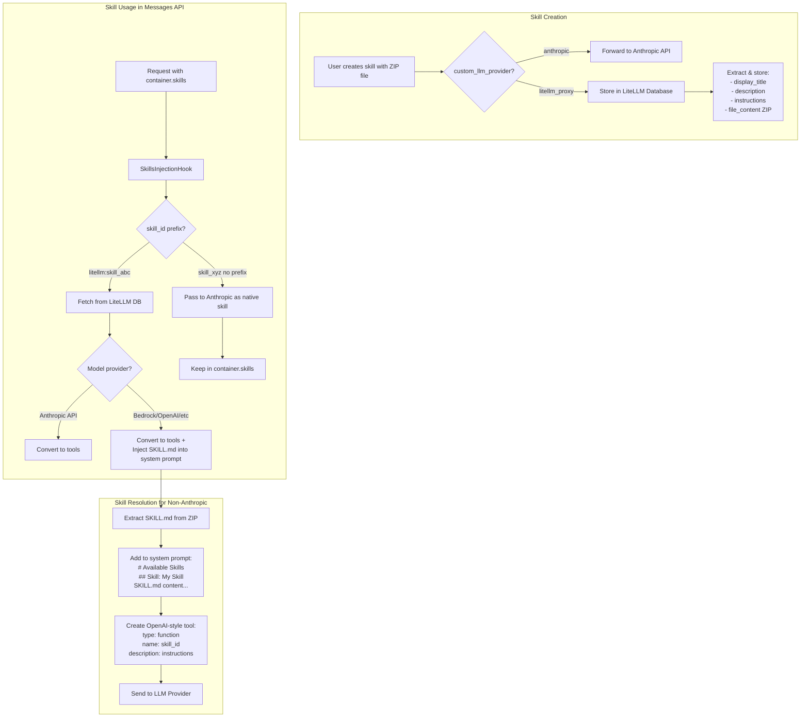
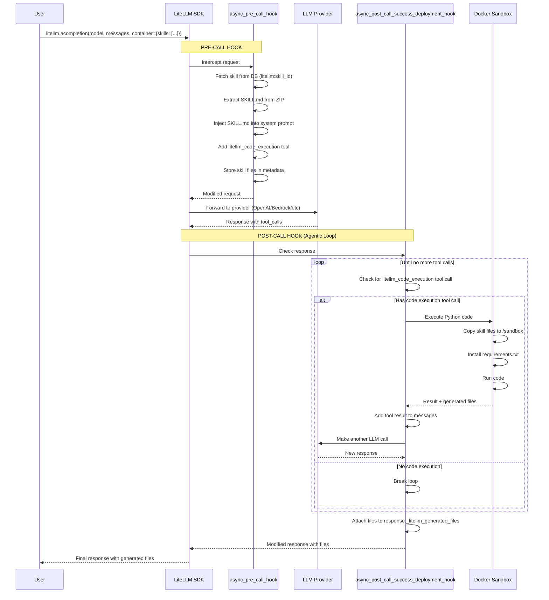

# LiteLLM Skills - Database-Backed Skills Storage

This module provides database-backed skills storage as an alternative to Anthropic's cloud-based Skills API. It enables using skills with **any LLM provider** (Bedrock, OpenAI, Azure, etc.) by storing skills locally and converting them to tools + system prompt injection.

## Architecture



## Automatic Code Execution

For skills that include executable code (Python files), LiteLLM automatically handles:

1. **Pre-call hook** (`async_pre_call_hook`): Adds `litellm_code_execution` tool, injects SKILL.md content
2. **Post-call hook** (`async_post_call_success_deployment_hook`): Detects tool calls, executes code in Docker sandbox, continues loop
3. **Returns files**: Generated files (GIFs, images, etc.) returned directly on response



```python
import litellm
from litellm.proxy.hooks.litellm_skills import SkillsInjectionHook

# Register the hook (done once at startup)
hook = SkillsInjectionHook()
litellm.callbacks.append(hook)

# ONE request - LiteLLM handles everything automatically
# The container parameter triggers the SkillsInjectionHook
response = await litellm.acompletion(
    model="gpt-4o-mini",
    messages=[{"role": "user", "content": "Create a bouncing ball GIF"}],
    container={
        "skills": [{"type": "custom", "skill_id": "litellm:skill_abc123"}]
    },
)

# Files are attached directly to response
generated_files = response._litellm_generated_files
for f in generated_files:
    print(f"Generated: {f['name']} ({f['size']} bytes)")
    # f['content_base64'] contains the file data
```

This mimics Anthropic's behavior - no manual agentic loop needed!

### How it works

The `SkillsInjectionHook` uses two hooks:

1. **`async_pre_call_hook`** (proxy only): Transforms the request before LLM call
   - Fetches skills from DB
   - Injects SKILL.md into system prompt
   - Adds `litellm_code_execution` tool
   - Sets `_litellm_code_execution_enabled=True` in metadata

2. **`async_post_call_success_deployment_hook`** (SDK + proxy): Called after LLM response
   - Checks if response has `litellm_code_execution` tool call
   - Executes code in Docker sandbox
   - Adds result to messages, makes another LLM call
   - Repeats until model gives final response
   - Attaches generated files to `response._litellm_generated_files`

## File Structure

```
litellm/llms/litellm_proxy/skills/
├── __init__.py           # Exports all skill components
├── handler.py            # LiteLLMSkillsHandler - database CRUD operations (Prisma)
├── transformation.py     # LiteLLMSkillsTransformationHandler - SDK transformation layer
├── prompt_injection.py   # SkillPromptInjectionHandler - SKILL.md extraction and injection
├── sandbox_executor.py   # SkillsSandboxExecutor - Docker sandbox code execution
├── code_execution.py     # CodeExecutionHandler - automatic agentic loop
└── README.md             # This file

litellm/proxy/hooks/litellm_skills/
├── __init__.py           # Re-exports from SDK + SkillsInjectionHook
└── main.py               # SkillsInjectionHook - CustomLogger hook for proxy
```

## Components

### 1. `handler.py` - LiteLLMSkillsHandler

Database operations for skills CRUD:

```python
from litellm.llms.litellm_proxy.skills import LiteLLMSkillsHandler

# Create skill
skill = await LiteLLMSkillsHandler.create_skill(
    data=NewSkillRequest(
        display_title="My Skill",
        description="A helpful skill",
        instructions="Use this skill when...",
        file_content=zip_bytes,  # ZIP file content
        file_name="my-skill.zip",
        file_type="application/zip",
    ),
    user_id="user_123"
)

# List skills
skills = await LiteLLMSkillsHandler.list_skills(limit=10, offset=0)

# Get skill
skill = await LiteLLMSkillsHandler.get_skill(skill_id="skill_abc123")

# Delete skill
await LiteLLMSkillsHandler.delete_skill(skill_id="skill_abc123")
```

### 2. `transformation.py` - LiteLLMSkillsTransformationHandler

SDK-level transformation layer that wraps handler operations:

```python
from litellm.llms.litellm_proxy.skills import LiteLLMSkillsTransformationHandler

handler = LiteLLMSkillsTransformationHandler()

# Async create
skill = await handler.create_skill_handler(
    display_title="My Skill",
    files=[zip_file],
    _is_async=True
)
```

## Skill ZIP Format

Skills must be packaged as ZIP files with a `SKILL.md` file:

```
my-skill.zip
└── my-skill/
    └── SKILL.md
```

### SKILL.md Format

```markdown
---
name: my-skill
description: A brief description of what this skill does
---

# My Skill

Detailed instructions for the LLM on how to use this skill.

## Usage

When the user asks about X, use this skill to...

## Examples

- Example 1: ...
- Example 2: ...
```

## SDK Usage

### Create Skill in LiteLLM Database

```python
import litellm

# Create skill stored in LiteLLM DB
skill = litellm.create_skill(
    display_title="Data Analysis Skill",
    files=[open("data-analysis.zip", "rb")],
    custom_llm_provider="litellm_proxy",  # Store in LiteLLM DB
)

print(f"Created skill: {skill.id}")  # skill_abc123
```

### Use Skill with Any Provider

```python
import litellm

# Use LiteLLM-stored skill with Bedrock
response = litellm.completion(
    model="bedrock/anthropic.claude-3-sonnet-20240229-v1:0",
    messages=[{"role": "user", "content": "Analyze this data..."}],
    container={
        "skills": [
            {"type": "custom", "skill_id": "litellm:skill_abc123"}  # litellm: prefix
        ]
    }
)
```

## How Skill Resolution Works

### Step 1: Request with Skills

```python
{
    "model": "bedrock/claude-3-sonnet",
    "messages": [{"role": "user", "content": "Help me analyze data"}],
    "container": {
        "skills": [
            {"type": "custom", "skill_id": "litellm:skill_abc123"}
        ]
    }
}
```

### Step 2: SkillsInjectionHook Processing

The hook (`litellm/proxy/hooks/litellm_skills/main.py`) intercepts the request:

1. **Detects `litellm:` prefix** → Fetches skill from database
2. **Checks model provider** → Bedrock is not Anthropic
3. **Extracts SKILL.md** from stored ZIP file
4. **Converts skill to tool** + **Injects content into system prompt**

### Step 3: Transformed Request

```python
{
    "model": "bedrock/claude-3-sonnet",
    "messages": [
        {
            "role": "system",
            "content": """
---

# Available Skills

## Skill: Data Analysis Skill

# Data Analysis Skill

This skill helps with data analysis tasks...

## Usage
When the user asks about data analysis...
"""
        },
        {"role": "user", "content": "Help me analyze data"}
    ],
    "tools": [
        {
            "type": "function",
            "function": {
                "name": "skill_abc123",
                "description": "This skill helps with data analysis tasks...",
                "parameters": {"type": "object", "properties": {}, "required": []}
            }
        }
    ]
    # container is removed for non-Anthropic providers
}
```

## Database Schema

Skills are stored in `LiteLLM_SkillsTable`:

```prisma
model LiteLLM_SkillsTable {
  skill_id       String   @id @default(uuid())
  display_title  String?
  description    String?
  instructions   String?
  source         String   @default("custom")
  latest_version String?
  metadata       Json?    @default("{}")
  file_content   Bytes?   // ZIP file binary content
  file_name      String?  // Original filename
  file_type      String?  // MIME type
  created_at     DateTime @default(now())
  created_by     String?
  updated_at     DateTime @default(now()) @updatedAt
  updated_by     String?
}
```

## Routing Summary

| Scenario | custom_llm_provider | skill_id Format | Behavior |
|----------|---------------------|-----------------|----------|
| Create skill on Anthropic | `anthropic` | N/A | Forward to Anthropic API |
| Create skill in LiteLLM DB | `litellm_proxy` | N/A | Store in database |
| Use Anthropic native skill | N/A | `skill_xyz` | Pass to Anthropic container.skills |
| Use LiteLLM skill on Anthropic | N/A | `litellm:skill_abc` | Convert to tools |
| Use LiteLLM skill on Bedrock/OpenAI | N/A | `litellm:skill_abc` | Convert to tools + inject SKILL.md |

## Testing

Run the tests:

```bash
pytest tests/proxy_unit_tests/test_skills_db.py -v
```

Tests cover:
- Creating skills with file content
- Listing and retrieving skills
- Deleting skills
- Hook resolution with ZIP file extraction
- System prompt injection for non-Anthropic models

