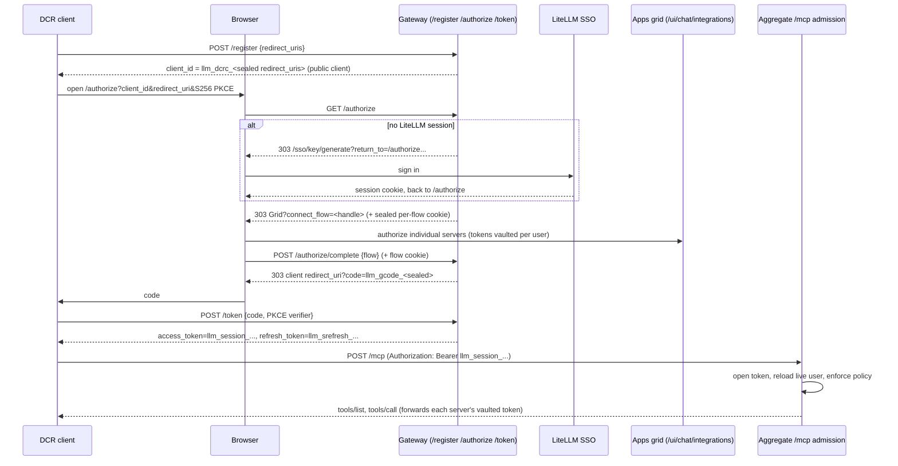

# Aggregate gateway DCR sign-in

## What this is for

An OAuth-only DCR client (Claude Desktop, Claude Code, MCP Inspector) can point at the aggregate `/mcp` endpoint, sign in through LiteLLM once, and reach every MCP server it has access to, without a pre-provisioned virtual key. The client ends up holding a single identity-only session bearer; the upstream servers' tokens are vaulted per user on the gateway and forwarded at egress by user id.

This is the custody sibling of the `dcr_bridge` `oauth_delegate` track. Both give OAuth-only DCR clients a way in and share the same front door (a DCR client hits the gateway, gets sent through LiteLLM SSO once, and receives a client-held bearer that carries the user's identity). They differ on who holds the upstream credentials. The bridge seals the upstream token into an envelope the client holds and targets a single server. This flow keeps the client bearer identity-only, vaults the upstream tokens server-side, and targets the aggregate `/mcp` endpoint across many servers.

This is always on and needs no configuration. It is additive and does not change any existing flow: the aggregate discovery lives at new `/.well-known/*/mcp` routes, the sign-in challenge fires only on the bare aggregate `/mcp` scope, and the authorize/token/register/admission arms engage only for the `llm_dcrc_` client ids and `llm_session_` bearers this flow itself mints. Per-server (`/{server}/mcp`) and bare-origin discovery are untouched, a request carrying an `x-litellm-api-key` is authenticated as a key before any of this runs, and a server literally named `mcp` keeps its own discovery through a name disambiguation.

## Config

Nothing to enable. The one relevant setting is the master key (every sealed value and the session token derive from it):

```yaml
general_settings:
  master_key: sk-...
```

`LITELLM_UI_SESSION_DURATION` (default `24h`) bounds both the UI session cookie the sign-in reads and, indirectly, how long a user stays signed in for the flow.

## The flow



1. **Discovery.** The aggregate `/mcp` endpoint answers RFC 9728 / RFC 8414 discovery at `/.well-known/oauth-protected-resource/mcp` and `/.well-known/oauth-authorization-server/mcp`, advertising the gateway itself as the authorization server for the aggregate resource. An anonymous `/mcp` request gets a 401 with the `resource_metadata` challenge that points here. The advertised authorization-server identifier is `{base}/mcp` (not the bare origin), because the bare-origin well-known is owned by the BYOK OAuth feature; path-insertion then resolves aggregate discovery to the routes this module owns.

2. **Registration** (`register_aggregate_client`). Stateless. The `client_id` is the registration: the client's redirect URIs are sealed into it with the repo's authenticated symmetric helper, so nothing is persisted and a forged or tampered `client_id` simply fails to open. Every client is registered public (`token_endpoint_auth_method "none"`); the gateway issues no client secrets, and mandatory S256 PKCE is what protects the code. Redirect URIs must be https (or http on a loopback host per RFC 8252), fragment-free, and bounded in count and length.

3. **Authorize** (`aggregate_authorize`). Validates the client and redirect URI, requires S256 PKCE, and interposes LiteLLM sign-in. A validation failure answers 400 directly and never redirects (RFC 6749 §4.1.2.1). With no session cookie the browser is sent through `/sso/key/generate` with a strictly-relative `return_to`, so login can only bounce it back to this same authorize request. With a session, the flow parameters and the SSO user are sealed into a per-flow HttpOnly cookie (the same handle-plus-cookie pattern as the upstream OAuth state relay) and the browser lands on the apps grid.

4. **Grid interlude.** On the apps grid (`/ui/chat/integrations?connect_flow=<handle>`) the user authorizes the servers they need through the existing per-user OAuth flow, which vaults each server's `access_token` / `refresh_token` in `LiteLLM_MCPUserCredentials` keyed by `(user_id, server_id)`. A server already authorized (through this grid or the dashboard Apps panel) shows as connected; the two share one vault.

5. **Complete** (`complete_connect_flow`). A deliberate finish step reached by POST, bound to the HttpOnly flow cookie and an exact match between the signed-in user and the user sealed into the flow, so a cross-site link cannot mint a code for a victim's session. It seals a short-lived (120s), single-use, PKCE- and client-bound authorization code (`llm_gcode_`) and redirects to the client's registered redirect URI.

6. **Token** (`aggregate_token`). The `authorization_code` grant checks the code has not expired, is bound to this client and redirect URI, passes PKCE, and has not been used (a best-effort single-use guard over the shared cache), then re-validates the litellm user is still active before minting the identity-only session pair. The `refresh_token` grant re-validates the same way and rotates the pair, with the refresh token bound to its issuing client (RFC 6749 §6).

7. **Admission** (`_admit_gateway_session`). At the aggregate `/mcp` edge, a session-shaped bearer is opened, the sealed `user_id` reloads the live user through the same `_reload_admitted_user` the bridge user-envelope path uses, and the admitted identity runs through the centralized policy gate. The user's server access is the union of their direct grants and every team they belong to, capped by their organization's MCP ceiling (a user who spans organizations is capped conservatively to their primary org; the ceiling can only narrow). Egress resolves each targeted server's vaulted token by user id; the session seals no upstream credential. Expired, tampered, foreign, or refresh tokens fail closed with the `invalid_token` challenge.

## Security model

Every client-held and sealed value is bounded and opened totally (bad input maps to an error, never a raise):

- The **session token** (`session_token.py`) is an identity-only HS256 JWT: `iss`/`iat`/`exp`/`jti`/`kind`/`user_id`/`client_id`, no upstream secret, a strict `extra="forbid"` claims model as the sole type gate, a signed `kind` so an access and a refresh token cannot be swapped by prefix, 1h access / 14d refresh caps, and a size cap enforced before any JWT parsing. The signing key is scrypt-derived from the master key under a domain label distinct from the bridge envelope's, so the two token families never share key material.
- The **session token is a reference, not an authorization.** The signature proves the user signed in, but team/org/budget/SCIM state is resolved live on every call, so deactivating a user or their team takes effect immediately with no revocation store. Rotating the master key invalidates every outstanding session.
- The **client_id, connect flow, and authorization code** are authenticated-encrypted with the repo's symmetric helper; a tampered value fails to open, and each sealed model rejects extra fields so a value of one type can never be read as another. The authorization code and the connect flow are each single-use through an atomic claim (`INCR`-based, so a concurrent double-redeem cannot both win) on top of their short TTLs; the connect flow lives only in an HttpOnly SameSite=Lax cookie; the finish step is a POST with an identity match, so none of these can be replayed or triggered cross-site. For the authorization code, PKCE binding is the primary defense against interception and the single-use claim makes the RFC 6749 single-use property reliable on top of it.
- **Refresh is stateless, not reuse-detecting.** A refresh grant re-validates the live user and issues a fresh access + refresh pair, but there is no server-side revocation store, so the prior refresh token stays valid until its 14-day expiry; revocation is via deactivating the user (re-checked at every mint and refresh) or rotating the master key. This matches the bridge refresh envelope and is the intended tradeoff of the stateless design.
- **Upstream server credentials never appear in this flow.** They are vaulted per user by the existing `/v1/mcp` authorize endpoints and resolved at egress by user id.

## Where the pieces live

- `discoverable_endpoints.py` — aggregate discovery routes (with the `mcp`-named-server disambiguation), and the root `/register` `/authorize` `/token` plus `POST /authorize/complete` wiring into the flow
- `gateway_dcr_flow.py` — the flow itself (register, authorize, complete, token) and every sealed value
- `outbound_credentials/session_token.py` — the identity-only session token (pure)
- `outbound_credentials/session_credentials.py` — the session KDF and the edge / token-endpoint resolvers
- `auth/user_api_key_auth_mcp.py` — `_admit_gateway_session` (admission), `_is_aggregate_mcp_scope`, the aggregate 401 challenge, and the multi-team union in `_get_allowed_mcp_servers_for_team`
- `ui/litellm-dashboard/src/components/chat/ConnectFlowBanner.tsx` — the grid interlude finish step

The customer-facing tutorial (Claude Desktop setup screenshots, config walkthrough) belongs in the `litellm-docs` site, not here.
