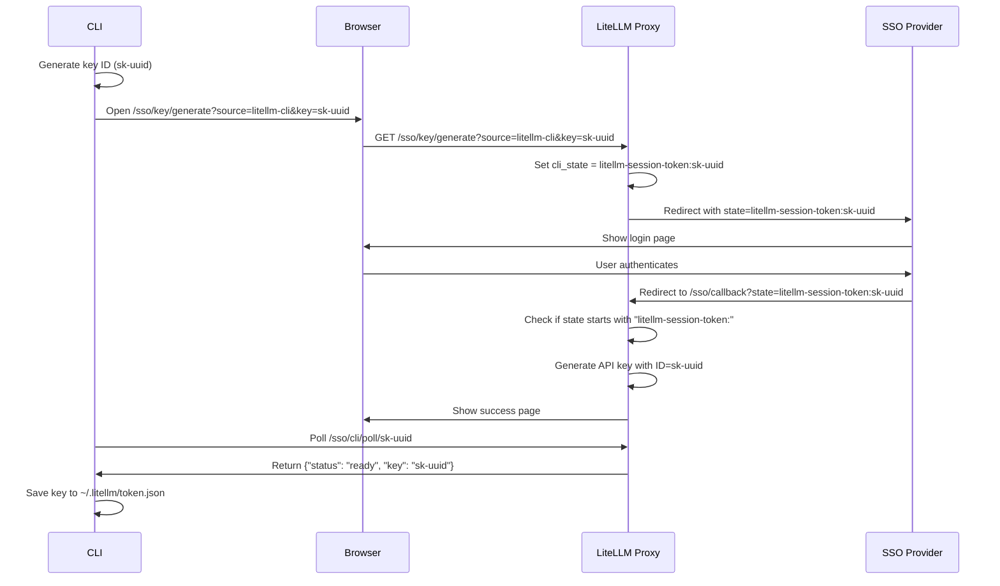

# LiteLLM Proxy Client

A Python client library for interacting with the LiteLLM proxy server. This client provides a clean, typed interface for managing models, keys, credentials, and making chat completions.

## Installation

```bash
pip install litellm
```

## Quick Start

```python
from litellm.proxy.client import Client

# Initialize the client
client = Client(
    base_url="http://localhost:4000",  # Your LiteLLM proxy server URL
    api_key="sk-api-key"               # Optional: API key for authentication
)

# Make a chat completion request
response = client.chat.completions.create(
    model="gpt-3.5-turbo",
    messages=[
        {"role": "user", "content": "Hello, how are you?"}
    ]
)
print(response.choices[0].message.content)
```

## Features

The client is organized into several resource clients for different functionality:

- `chat`: Chat completions
- `models`: Model management
- `model_groups`: Model group management
- `keys`: API key management
- `credentials`: Credential management
- `users`: User management

## Chat Completions

Make chat completion requests to your LiteLLM proxy:

```python
# Basic chat completion
response = client.chat.completions.create(
    model="gpt-4",
    messages=[
        {"role": "system", "content": "You are a helpful assistant."},
        {"role": "user", "content": "What's the capital of France?"}
    ]
)

# Stream responses
for chunk in client.chat.completions.create(
    model="gpt-4",
    messages=[{"role": "user", "content": "Tell me a story"}],
    stream=True
):
    print(chunk.choices[0].delta.content or "", end="")
```

## Model Management

Manage available models on your proxy:

```python
# List available models
models = client.models.list()

# Add a new model
client.models.add(
    model_name="gpt-4",
    litellm_params={
        "api_key": "your-openai-key",
        "api_base": "https://api.openai.com/v1"
    }
)

# Delete a model
client.models.delete(model_name="gpt-4")
```

## API Key Management

Manage virtual API keys:

```python
# Generate a new API key
key = client.keys.generate(
    models=["gpt-4", "gpt-3.5-turbo"],
    aliases={"gpt4": "gpt-4"},
    duration="24h",
    key_alias="my-key",
    team_id="team123"
)

# List all keys
keys = client.keys.list(
    page=1,
    size=10,
    return_full_object=True
)

# Delete keys
client.keys.delete(
    keys=["sk-key1", "sk-key2"],
    key_aliases=["alias1", "alias2"]
)
```

## Credential Management

Manage model credentials:

```python
# Create new credentials
client.credentials.create(
    credential_name="azure1",
    credential_info={"api_type": "azure"},
    credential_values={
        "api_key": "your-azure-key",
        "api_base": "https://example.azure.openai.com"
    }
)

# List all credentials
credentials = client.credentials.list()

# Get a specific credential
credential = client.credentials.get(credential_name="azure1")

# Delete credentials
client.credentials.delete(credential_name="azure1")
```

## Model Groups

Manage model groups for load balancing and fallbacks:

```python
# Create a model group
client.model_groups.create(
    name="gpt4-group",
    models=[
        {"model_name": "gpt-4", "litellm_params": {"api_key": "key1"}},
        {"model_name": "gpt-4-backup", "litellm_params": {"api_key": "key2"}}
    ]
)

# List model groups
groups = client.model_groups.list()

# Delete a model group
client.model_groups.delete(name="gpt4-group")
```

## Users Management

Manage users on your proxy:

```python
from litellm.proxy.client import UsersManagementClient

users = UsersManagementClient(base_url="http://localhost:4000", api_key="sk-test")

# List users
user_list = users.list_users()

# Get user info
user_info = users.get_user(user_id="u1")

# Create a new user
created = users.create_user({
    "user_email": "a@b.com",
    "user_role": "internal_user",
    "user_alias": "Alice",
    "teams": ["team1"],
    "max_budget": 100.0
})

# Delete users
users.delete_user(["u1", "u2"])
```

## Low-Level HTTP Client

The client provides access to a low-level HTTP client for making direct requests
to the LiteLLM proxy server. This is useful when you need more control or when
working with endpoints that don't yet have a high-level interface.

```python
# Access the HTTP client
client = Client(
    base_url="http://localhost:4000",
    api_key="sk-api-key"
)

# Make a custom request
response = client.http.request(
    method="POST",
    uri="/health/test_connection",
    json={
        "litellm_params": {
            "model": "gpt-4",
            "api_key": "your-api-key",
            "api_base": "https://api.openai.com/v1"
        },
        "mode": "chat"
    }
)

# The response is automatically parsed from JSON
print(response)
```

### HTTP Client Features

- Automatic URL handling (handles trailing/leading slashes)
- Built-in authentication (adds Bearer token if `api_key` is provided)
- JSON request/response handling
- Configurable timeout (default: 30 seconds)
- Comprehensive error handling
- Support for custom headers and request parameters

### HTTP Client `request` method parameters

- `method`: HTTP method (GET, POST, PUT, DELETE, etc.)
- `uri`: URI path (will be appended to base_url)
- `data`: (optional) Data to send in the request body
- `json`: (optional) JSON data to send in the request body
- `headers`: (optional) Custom HTTP headers
- Additional keyword arguments are passed to the underlying requests library

## Error Handling

The client provides clear error handling with custom exceptions:

```python
from litellm.proxy.client.exceptions import UnauthorizedError

try:
    response = client.chat.completions.create(
        model="gpt-4",
        messages=[{"role": "user", "content": "Hello"}]
    )
except UnauthorizedError as e:
    print("Authentication failed:", e)
except Exception as e:
    print("Request failed:", e)
```

## Advanced Usage

### Request Customization

All methods support returning the raw request object for inspection or modification:

```python
# Get the prepared request without sending it
request = client.models.list(return_request=True)
print(request.method)  # GET
print(request.url)     # http://localhost:8000/models
print(request.headers) # {'Content-Type': 'application/json', ...}
```

### Pagination

Methods that return lists support pagination:

```python
# Get the first page of keys
page1 = client.keys.list(page=1, size=10)

# Get the second page
page2 = client.keys.list(page=2, size=10)
```

### Filtering

Many list methods support filtering:

```python
# Filter keys by user and team
keys = client.keys.list(
    user_id="user123",
    team_id="team456",
    include_team_keys=True
)
```

## Contributing

Contributions are welcome! Please check out our [contributing guidelines](../../CONTRIBUTING.md) for details.

## License

This project is licensed under the MIT License - see the [LICENSE](../../LICENSE) file for details.

## CLI Authentication Flow

The LiteLLM CLI supports SSO authentication through a polling-based approach that works with any OAuth-compatible SSO provider.

### How CLI Authentication Works



### Authentication Commands

The CLI provides three authentication commands:

- **`litellm-proxy login`** - Start SSO authentication flow
- **`litellm-proxy logout`** - Clear stored authentication token
- **`litellm-proxy whoami`** - Show current authentication status

### Authentication Flow Steps

1. **Generate Session ID**: CLI generates a unique key ID (`sk-{uuid}`)
2. **Open Browser**: CLI opens browser to `/sso/key/generate` with CLI source and key parameters
3. **SSO Redirect**: Proxy sets the formatted state (`litellm-session-token:sk-uuid`) as OAuth state parameter and redirects to SSO provider
4. **User Authentication**: User completes SSO authentication in browser
5. **Callback Processing**: SSO provider redirects back to proxy with state parameter
6. **Key Generation**: Proxy detects CLI login (state starts with "litellm-session-token:") and generates API key with pre-specified ID
7. **Polling**: CLI polls `/sso/cli/poll/{key_id}` endpoint until key is ready
8. **Token Storage**: CLI saves the authentication token to `~/.litellm/token.json`

### Benefits of This Approach

- **No Local Server**: No need to run a local callback server
- **Standard OAuth**: Uses OAuth 2.0 state parameter correctly
- **Remote Compatible**: Works with remote proxy servers
- **Secure**: Uses UUID session identifiers
- **Simple Setup**: No additional OAuth redirect URL configuration needed

### Token Storage

Authentication tokens are stored in `~/.litellm/token.json` with restricted file permissions (600). The stored token includes:

```json
{
  "key": "sk-...",
  "user_id": "cli-user",
  "user_email": "user@example.com",
  "user_role": "cli",
  "auth_header_name": "Authorization",
  "timestamp": 1234567890
}
```

### Usage

Once authenticated, the CLI will automatically use the stored token for all requests. You no longer need to specify `--api-key` for subsequent commands.

```bash
# Login
litellm-proxy login

# Use CLI without specifying API key
litellm-proxy models list

# Check authentication status
litellm-proxy whoami

# Logout
litellm-proxy logout
``` 