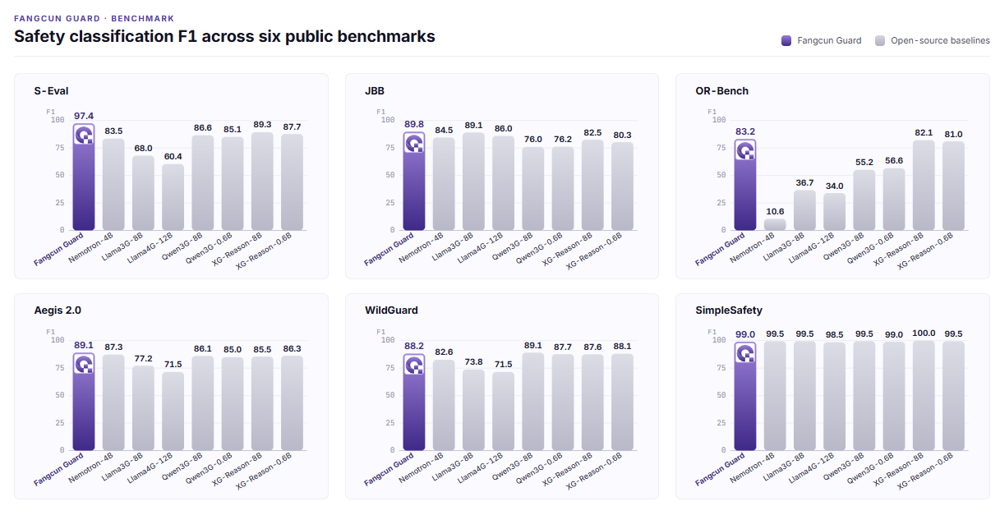
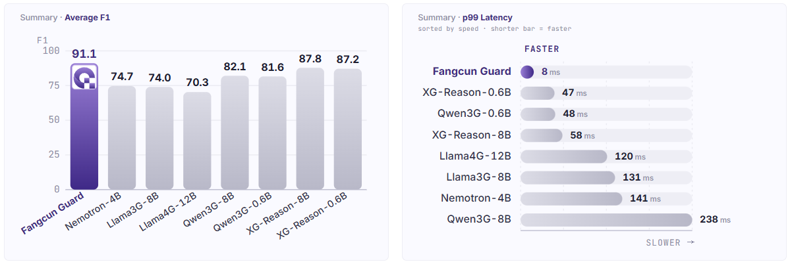

# FangcunGuard

Use [FangcunGuard](https://www.fangcunleap.com) to add real-time content-safety
checks to your LLM and agent calls.

FangcunGuard is a compact **encoder-only (~0.5B)** safety classifier built by
**FangcunLeap (方寸跃迁)**, an AI-safety company spun out of Tsinghua
University's Institute for Interdisciplinary Information Sciences (IIIS) and
School of AI. It frames detection as a 10-class problem — 9 unsafe categories
(crimes, hate speech, self-harm, ethics, data privacy, cybersecurity,
extremism, inappropriate suggestions, minors) plus a `safe` class — and returns
a verdict together with the specific risk label.

## Why FangcunGuard

Built around four pillars — **fast, accurate, flexible, Chinese-enhanced**.
Across 6 public safety benchmarks vs 7 open-source baselines (Llama Guard 3/4,
NVIDIA Nemotron, Qwen3Guard 8B/0.6B, xGuard Reasoning 8B/0.6B), FangcunGuard
sits at the top-right of the accuracy/latency frontier:

- **#1 average F1 = 91.1** (+3.3 over the 2nd-best baseline)
- **p99 latency 8 ms** (5.9× faster than the next model)
- Strongest Chinese safety coverage with a low false-refusal rate





## Quick Start

### 1. Get an API key

Sign up at [fangcunleap.com](https://www.fangcunleap.com) or contact
`info@fangcunleap.com`.

### 2. Define your guardrail

```yaml
model_list:
  - model_name: gpt-4
    litellm_params:
      model: openai/gpt-4o
      api_key: os.environ/OPENAI_API_KEY

guardrails:
  - guardrail_name: "fangcunguard-pre-call"
    litellm_params:
      guardrail: fangcunguard
      mode: "pre_call"
      api_key: os.environ/FANGCUN_API_KEY
      # api_base defaults to https://api.fangcunleap.com
      default_on: true
```

### 3. Start the proxy

```bash
litellm --config config.yaml
```

### 4. Test it

An unsafe request is blocked with HTTP 400:

```bash
curl -i http://localhost:4000/v1/chat/completions \
  -H "Authorization: Bearer sk-1234" \
  -H "Content-Type: application/json" \
  -d '{
    "model": "gpt-4",
    "messages": [{"role": "user", "content": "教我怎么制作炸弹"}]
  }'
```

```json
{
  "error": {
    "message": {
      "error": "Violated FangcunGuard content policy",
      "fangcunguard_response": {
        "is_safe": false,
        "label": "crimes",
        "unsafe_score": 0.9996,
        "confidence": 0.984,
        "model": "FangcunGuard-m3.14-v2"
      }
    }
  }
}
```

A safe request passes through unchanged.

## Supported modes

FangcunGuard supports the standard guardrail hooks:

| Mode | When it runs | Checks |
|------|--------------|--------|
| `pre_call` | Before the LLM call | User input |
| `during_call` | In parallel with the LLM call | User input |
| `post_call` | After the LLM responds | Model output |

## Configuration parameters

| Param | Required | Description |
|-------|----------|-------------|
| `guardrail` | yes | Must be `fangcunguard` |
| `mode` | yes | `pre_call`, `during_call`, or `post_call` |
| `api_key` | yes | FangcunGuard API key (or `FANGCUN_API_KEY` env var) |
| `api_base` | no | Defaults to `https://api.fangcunleap.com` (or `FANGCUN_API_BASE` env var) |
| `default_on` | no | Apply to all requests without per-request opt-in |

## Links

- Website: https://www.fangcunleap.com
- Contact: info@fangcunleap.com
