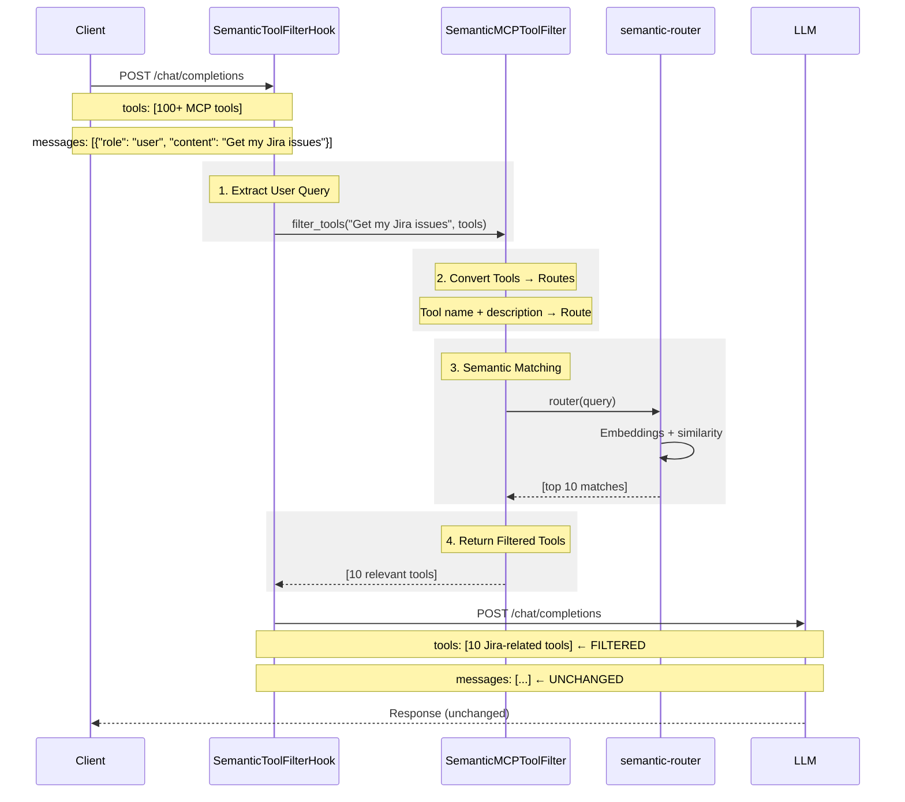

# MCP Semantic Tool Filter Architecture

## Why Filter MCP Tools

When multiple MCP servers are connected, the proxy may expose hundreds of tools. Sending all tools in every request wastes context window tokens and increases cost. The semantic filter keeps only the top-K most relevant tools based on embedding similarity.



## Filter Operations

The hook intercepts requests before they reach the LLM:

| Operation | Description |
|-----------|-------------|
| **Extract query** | Get user message from `messages[-1]` |
| **Convert to Routes** | Transform MCP tools into semantic-router Routes |
| **Semantic match** | Use `semantic-router` to find top-K similar tools |
| **Filter tools** | Replace request `tools` with filtered subset |

## Trigger Conditions

The filter only runs when:
- Call type is `completion` or `acompletion`
- Request contains `tools` field
- Request contains `messages` field
- Filter is enabled in config

## What Does NOT Change

- Request messages
- Response body
- Non-tool parameters

## Integration with semantic-router

Reuses existing LiteLLM infrastructure:
- `semantic-router` - Already an optional dependency
- `LiteLLMRouterEncoder` - Wraps `Router.aembedding()` for embeddings
- `SemanticRouter` - Handles similarity calculation and top-K selection

## Configuration

```yaml
litellm_settings:
  mcp_semantic_tool_filter:
    enabled: true
    embedding_model: "openai/text-embedding-3-small"
    top_k: 10
    similarity_threshold: 0.3
```

## Error Handling

The filter fails gracefully:
- If filtering fails → Return all tools (no impact on functionality)
- If query extraction fails → Skip filtering
- If no matches found → Return all tools
