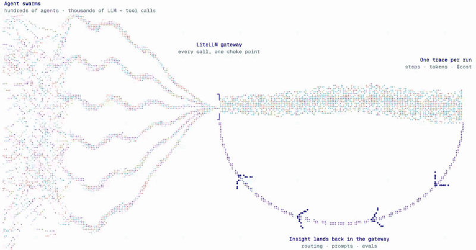
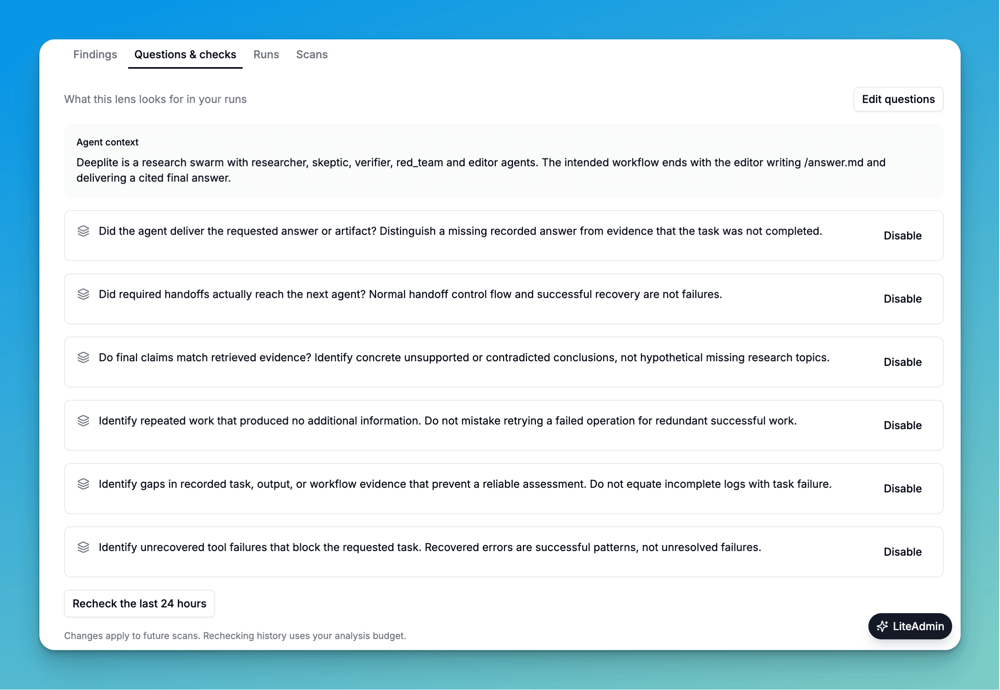
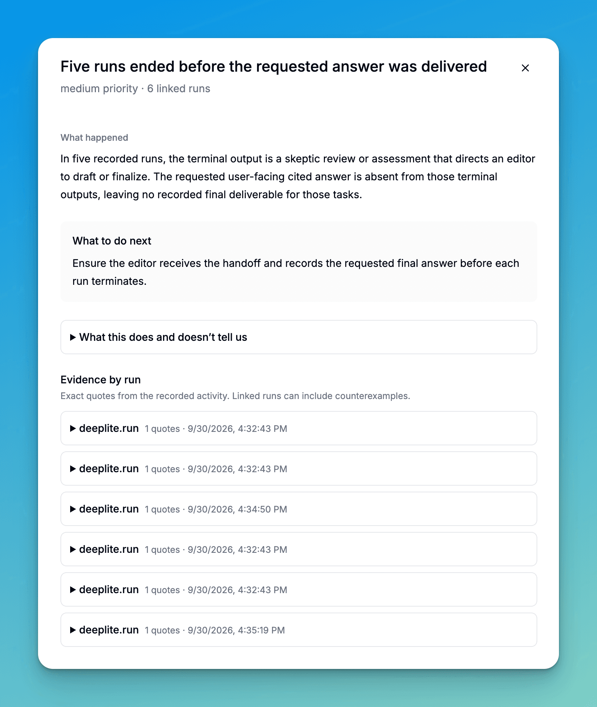
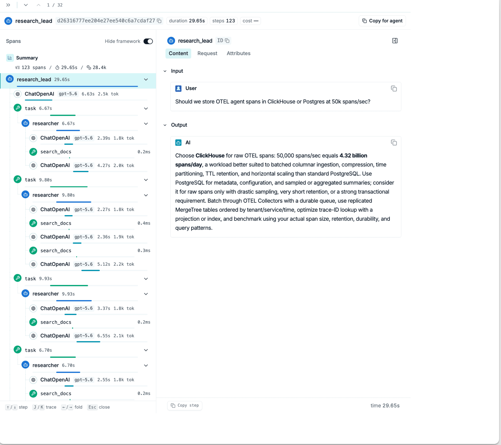

# LiteLLM Lens

**The gateway that helps your agents improve**

Tell Lens what to look for in your agents, let it analyze your traces, then read the findings and go deeper into any trace

## The agentic swarm developer

We're building for a world where one team runs hundreds of agents in parallel. A single swarm can produce 200K+ traces, and every one of those calls already flows through LiteLLM. The gateway is the one chokepoint that sees all of your agent traffic, so it's the natural place to learn from it

## The problem

Nobody can read 200K traces by hand. Tracing platforms make it worse: your data sits in someone else's system behind their rate limits, so tools like Claude Code or Codex can't dig into it the way they dig into your code

## How Lens works

### 1. Tell Lens what to look for

For each agent, describe what a good run and a bad run look like. Add specific questions if you have them, like "Find tool failures the agent does not recover from"

### 2. Lens analyzes your traces

Agents review your traces, group similar problems together, and surface findings. Each finding tells you what happened, what to do next, and which runs back it up

### 3. Read the findings, then go deeper into the trace

Every finding links back to the exact step in the trace that caused it. You get the step tree on one side and the full input and output on the other

### Agent-first tracing APIs

Traces live in ClickHouse that you host next to your LiteLLM gateway. Query them with SQL, or point Claude Code or Codex at the tracing API and let them investigate. No external rate limits, and your data never leaves your infrastructure

## Get started

Lens lives in the LiteLLM dashboard under Observability, Lens (`/ui/lens/`). It needs a Lens worker running next to your gateway. The [worker README](../../../deploy/lens/README.md) covers local installs, existing deployments, Helm, the API, and what a scan actually does

Want help rolling it out? [Sign up for early access](https://forms.gle/3GC1Ner4vjthGWi18), or read the [launch post](https://docs.litellm.ai/blog/litellm-lens-launch) and the [Lens docs](https://docs.litellm.ai/docs/proxy/lens)
