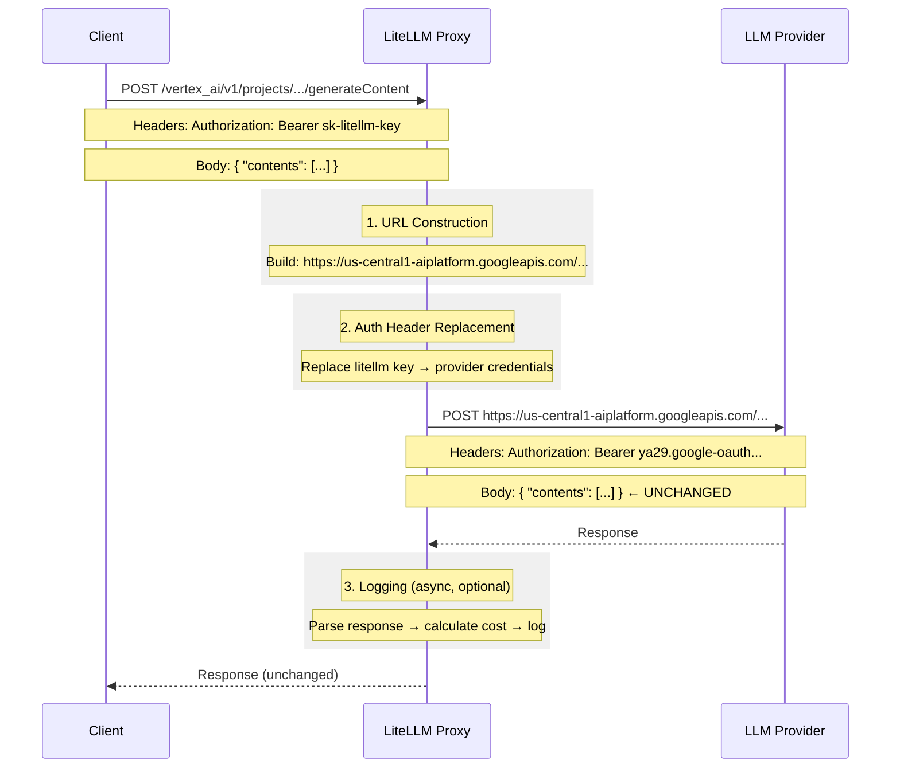

# Pass-Through Endpoints Architecture

## Why Pass-Through Endpoints Transform Requests

Even "pass-through" endpoints must perform essential transformations. The request **body** passes through unchanged, but:

## Essential Transformations

- **URL Construction** - Build correct provider URL (e.g., regional endpoints for Vertex AI, Bedrock)
- **Auth Header Replacement** - Swap LiteLLM virtual key for actual provider credentials
- **Logging** (optional) - Parse response to extract usage and calculate cost

## What Does NOT Change

- Request body
- Response body
- Provider-specific parameters