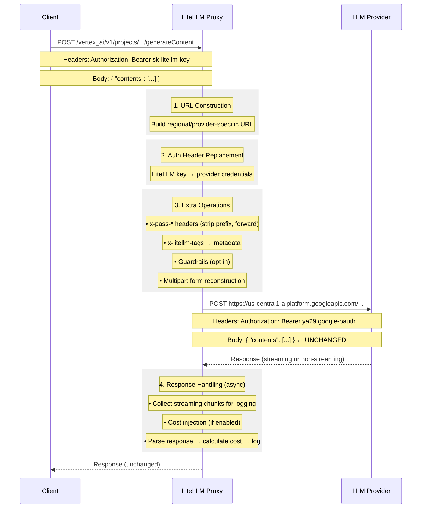

# Pass-Through Endpoints Architecture

## Why Pass-Through Endpoints Transform Requests

Even "pass-through" endpoints must perform essential transformations. The request **body** passes through unchanged, but:

## Essential Transformations

- **URL Construction** - Build correct provider URL (e.g., regional endpoints for Vertex AI, Bedrock)
- **Auth Header Replacement** - Swap LiteLLM virtual key for actual provider credentials

## Extra Operations

| Operation | Description |
|-----------|-------------|
| `x-pass-*` headers | Strip prefix and forward (e.g., `x-pass-anthropic-beta` → `anthropic-beta`) |
| `x-litellm-tags` header | Extract tags and add to request metadata for logging |
| Streaming chunk collection | Collect chunks async for logging after stream completes |
| Multipart form handling | Reconstruct multipart/form-data requests for file uploads |
| Guardrails (opt-in) | Run content filtering when explicitly configured |
| Cost injection | Inject cost into streaming chunks when `include_cost_in_streaming_usage` enabled |

## What Does NOT Change

- Request body
- Response body
- Provider-specific parameters