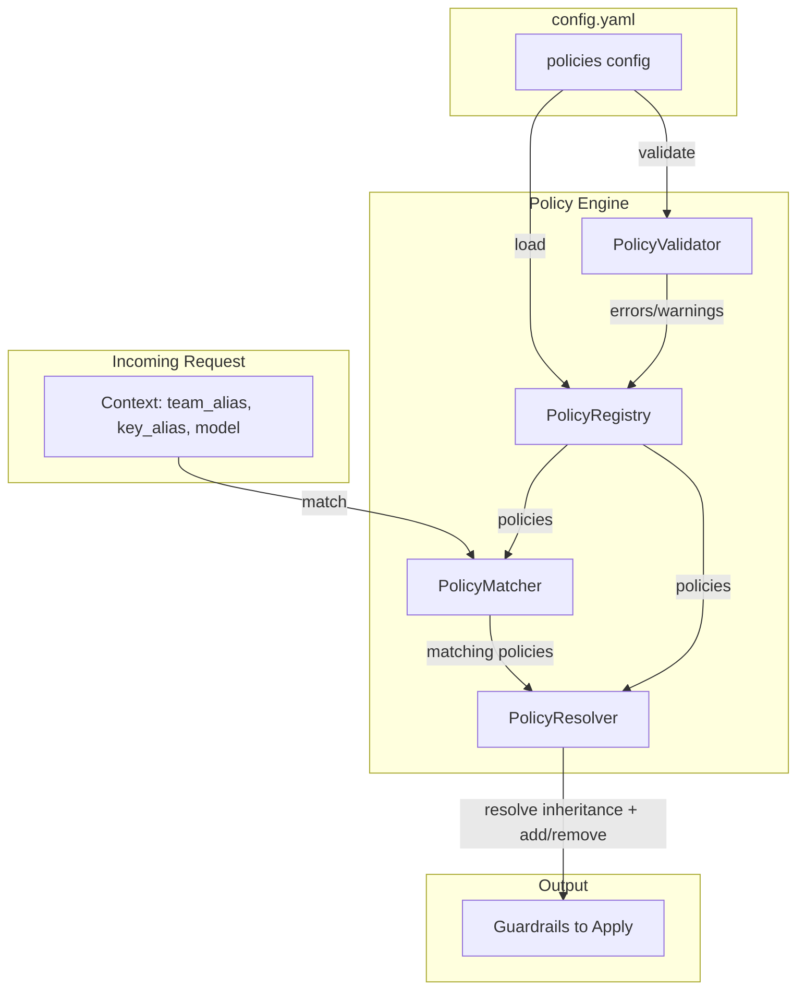

# Policy Engine Architecture

## Overview

The Policy Engine allows administrators to define policies that combine guardrails with scoping rules. Policies can target specific teams, API keys, and models using wildcard patterns, and support inheritance from base policies.

## Architecture Diagram

## Components

| Component | File | Description |
|-----------|------|-------------|
| **PolicyRegistry** | `policy_registry.py` | In-memory singleton store for parsed policies |
| **PolicyValidator** | `policy_validator.py` | Validates configs (guardrails, inheritance, teams/keys/models) |
| **PolicyMatcher** | `policy_matcher.py` | Matches request context against policy scopes |
| **PolicyResolver** | `policy_resolver.py` | Resolves final guardrails via inheritance chain |

## Flow

1. **Startup**: `init_policies()` loads policies from config, validates, and populates `PolicyRegistry`
2. **Request**: `PolicyMatcher` finds policies matching the request's team/key/model
3. **Resolution**: `PolicyResolver` traverses inheritance and applies add/remove to get final guardrails
