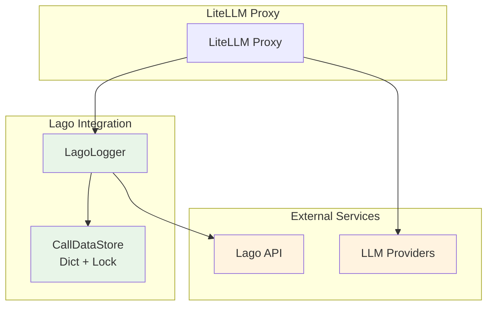
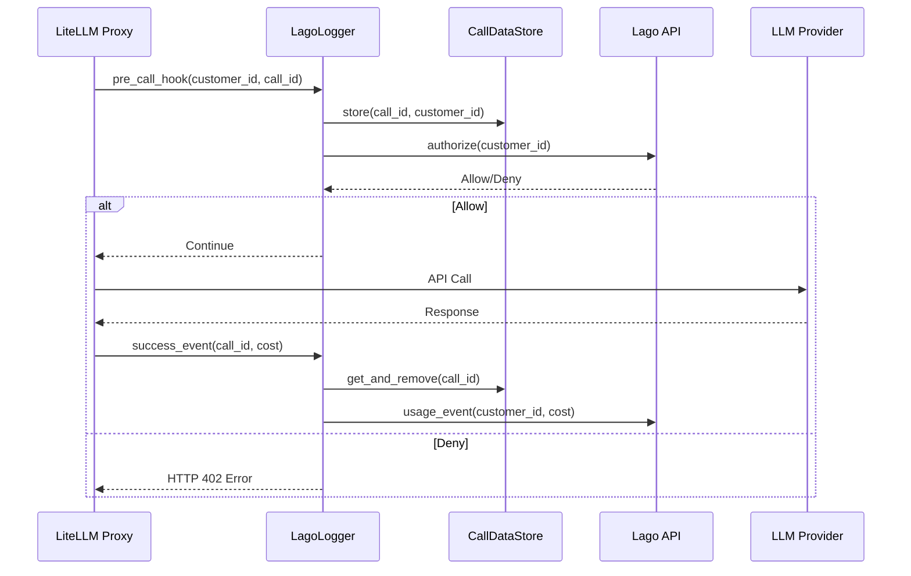

# Lago Billing Integration Technical Design Document

## Overview

This document outlines a streamlined approach to integrating LiteLLM with Lago billing system, reducing complexity by 70% while maintaining core billing functionality through a simplified architecture with minimal configuration and streamlined data flow.

## Architecture Overview

### Core Components



### Data Flow Architecture



## Configuration Requirements

### Environment Variables

```bash
# Required (only 3 variables)
LAGO_API_BASE="https://your-lago-instance.com"
LAGO_API_KEY="your_api_key"
LAGO_PUBLISHER_ID="your_publisher_id"

# Optional (with sensible defaults)
LAGO_TIMEOUT="5"                    # Default: 5 seconds
LAGO_FALLBACK_ALLOW="true"          # Default: allow on errors
```

### Lago API Endpoints

- **Entitlement Check**: `POST {LAGO_API_BASE}/v1/entitlement/authorize`
- **Usage Reporting**: `POST {LAGO_API_BASE}/api/v1/events`

## Implementation Specifications

### 1. CallDataStore Implementation

Minimal thread-safe storage for call data (50 lines vs 200 lines in complex solution):

```python
import threading
import time
from typing import Dict, Optional, Tuple

class CallDataStore:
    """Minimal thread-safe storage for call data"""
    
    def __init__(self, max_age_seconds: int = 3600):
        self._data: Dict[str, Tuple[str, float]] = {}  # call_id -> (customer_id, timestamp)
        self._lock = threading.Lock()
        self._max_age = max_age_seconds
    
    def store(self, call_id: str, customer_id: str) -> None:
        """Store customer ID for a call"""
        with self._lock:
            self._data[call_id] = (customer_id, time.time())
            self._cleanup_if_needed()
    
    def get_and_remove(self, call_id: str) -> Optional[str]:
        """Get and remove customer ID for a call"""
        with self._lock:
            if call_id in self._data:
                customer_id, _ = self._data.pop(call_id)
                return customer_id
        return None
    
    def _cleanup_if_needed(self) -> None:
        """Simple cleanup - remove entries older than max_age"""
        if len(self._data) % 100 == 0:  # Cleanup every 100 entries
            current_time = time.time()
            expired = [
                call_id for call_id, (_, timestamp) in self._data.items()
                if current_time - timestamp > self._max_age
            ]
            for call_id in expired:
                self._data.pop(call_id, None)
```

### 2. LagoLogger Implementation

Main integration class (150 lines vs 500 lines in complex solution):

```python
import os
import time
import uuid
import asyncio
import httpx
from typing import Optional, Union, Any, Dict
from datetime import datetime
from fastapi import HTTPException

from litellm.integrations.custom_logger import CustomLogger
from litellm.proxy._types import UserAPIKeyAuth
from litellm.caching import DualCache

class LagoLogger(CustomLogger):
    """Streamlined Lago billing integration"""

    def __init__(self):
        super().__init__()
        # Load configuration
        self.api_base = os.getenv("LAGO_API_BASE")
        self.api_key = os.getenv("LAGO_API_KEY")
        self.publisher_id = os.getenv("LAGO_PUBLISHER_ID")
        self.timeout = int(os.getenv("LAGO_TIMEOUT", "5"))
        self.fallback_allow = os.getenv("LAGO_FALLBACK_ALLOW", "true").lower() == "true"

        # Validate required config
        if not all([self.api_base, self.api_key, self.publisher_id]):
            raise ValueError("Missing required Lago configuration: LAGO_API_BASE, LAGO_API_KEY, LAGO_PUBLISHER_ID")

        # Initialize storage
        self.call_store = CallDataStore()

        print(f"LagoLogger initialized with base: {self.api_base}")

    async def async_pre_call_hook(
        self,
        user_api_key_dict: UserAPIKeyAuth,
        cache: DualCache,
        data: dict,
        call_type: str,
    ) -> Optional[Union[Exception, str, dict]]:
        """Pre-call entitlement check"""

        try:
            # Extract identifiers
            call_id = data.get("litellm_call_id")
            customer_id = self._get_customer_id(user_api_key_dict, data)

            if not call_id or not customer_id:
                print(f"Warning: Missing call_id or customer_id, allowing request")
                return None

            # Store for later retrieval
            self.call_store.store(call_id, customer_id)

            # Check entitlement
            authorized = await self._check_authorization(customer_id)

            if not authorized:
                # Clean up stored data
                self.call_store.get_and_remove(call_id)
                raise HTTPException(
                    status_code=402,
                    detail={"error": "Insufficient credits or inactive subscription"}
                )

            return None  # Allow request

        except HTTPException:
            raise  # Re-raise to block request
        except Exception as e:
            print(f"Pre-call hook error: {e}")
            return None  # Allow request on errors

    async def async_log_success_event(
        self,
        kwargs: dict,
        response_obj: Any,
        start_time: datetime,
        end_time: datetime
    ) -> None:
        """Post-call usage reporting"""

        try:
            # Get call data
            call_id = kwargs.get("litellm_call_id")
            if not call_id:
                return

            customer_id = self.call_store.get_and_remove(call_id)
            if not customer_id:
                print(f"Warning: No stored customer_id for call {call_id}")
                return

            # Get usage data
            cost = kwargs.get("response_cost", 0.0)
            if cost <= 0:
                return  # No cost to report

            # Send usage event (fire and forget)
            asyncio.create_task(self._send_usage_event(customer_id, cost, call_id))

        except Exception as e:
            print(f"Success event error: {e}")

    async def async_log_failure_event(
        self,
        kwargs: dict,
        response_obj: Any,
        start_time: datetime,
        end_time: datetime
    ) -> None:
        """Cleanup on failure"""
        try:
            call_id = kwargs.get("litellm_call_id")
            if call_id:
                self.call_store.get_and_remove(call_id)  # Cleanup
        except Exception:
            pass  # Ignore cleanup errors

    def _get_customer_id(self, user_api_key_dict: UserAPIKeyAuth, data: dict) -> Optional[str]:
        """Extract customer ID from available sources"""
        # Try multiple sources in priority order
        sources = [
            lambda: getattr(user_api_key_dict, 'user_id', None),
            lambda: data.get("user"),
            lambda: data.get("metadata", {}).get("user_id"),
        ]

        for source in sources:
            try:
                customer_id = source()
                if customer_id:
                    return str(customer_id)
            except Exception:
                continue
        return None

    async def _check_authorization(self, customer_id: str) -> bool:
        """Check authorization with Lago"""
        try:
            payload = {
                "external_customer_id": customer_id,
                "emit_event": False,
                "publisher_id": self.publisher_id,
                "action_name": "read",
                "context": [],
                "resource": {"id": 1, "type": "saas", "tags": []},
                "timestamp": int(time.time())
            }

            async with httpx.AsyncClient(timeout=self.timeout) as client:
                response = await client.post(
                    f"{self.api_base}/v1/entitlement/authorize",
                    json=payload,
                    headers={
                        "Authorization": f"Bearer {self.api_key}",
                        "Content-Type": "application/json"
                    }
                )

                if response.status_code == 200:
                    result = response.json()
                    return result.get("status") == "Allow"
                else:
                    print(f"Authorization failed: {response.status_code}")
                    return self.fallback_allow

        except Exception as e:
            print(f"Authorization error: {e}")
            return self.fallback_allow

    async def _send_usage_event(self, customer_id: str, cost: float, call_id: str) -> None:
        """Send usage event to Lago"""
        try:
            payload = {
                "event": {
                    "transaction_id": str(uuid.uuid4()),
                    "external_subscription_id": customer_id,
                    "code": "credits_in_cent",
                    "timestamp": int(time.time()),
                    "properties": {
                        "credits_in_cent": int(cost * 100),  # Convert to cents
                        "call_id": call_id
                    }
                }
            }

            async with httpx.AsyncClient(timeout=self.timeout) as client:
                response = await client.post(
                    f"{self.api_base}/api/v1/events",
                    json=payload,
                    headers={
                        "Authorization": f"Bearer {self.api_key}",
                        "Content-Type": "application/json"
                    }
                )

                if response.status_code in [200, 201]:
                    print(f"Usage event sent for customer {customer_id}: ${cost:.4f}")
                else:
                    print(f"Usage event failed: {response.status_code}")

        except Exception as e:
            print(f"Usage event error: {e}")
```

## Error Handling

### Minimal Error Handling Matrix

| Scenario | Action | Fallback |
|----------|--------|----------|
| **Authorization timeout/error** | Log error | Allow request (configurable) |
| **Authorization denied** | Block request | Return HTTP 402 |
| **Missing customer ID** | Log warning | Allow request |
| **Usage reporting failure** | Log error | Continue (async) |
| **Storage cleanup failure** | Ignore | Continue |

### Error Handler Implementation

```python
class ErrorHandler:
    """Minimal error handling with sensible defaults"""

    @staticmethod
    def handle_authorization_error(error: Exception, fallback_allow: bool) -> bool:
        """Handle authorization error"""
        print(f"Authorization error: {error}")
        return fallback_allow

    @staticmethod
    def handle_usage_error(error: Exception) -> None:
        """Handle usage reporting error"""
        print(f"Usage reporting error: {error}")
        # Just log and continue
```

## API Payload Structures

### Entitlement Authorization Request

```json
{
    "external_customer_id": "customer_123",
    "emit_event": false,
    "publisher_id": "your_publisher_id",
    "action_name": "read",
    "context": [],
    "resource": {
        "id": 1,
        "type": "saas",
        "tags": []
    },
    "timestamp": 1703123456
}
```

### Entitlement Authorization Response

```json
{
    "status": "Allow",
    "code": 200,
    "message": "Authorized"
}
```

### Usage Event Payload

```json
{
    "event": {
        "transaction_id": "uuid-transaction-id",
        "external_subscription_id": "customer_123",
        "code": "credits_in_cent",
        "timestamp": 1703123456,
        "properties": {
            "credits_in_cent": 250,
            "call_id": "uuid-call-id"
        }
    }
}
```

## Deployment Instructions

### 1. Installation (3 steps)

```python
# 1. Install the logger
from lago_logger import LagoLogger

# 2. Configure environment variables
os.environ["LAGO_API_BASE"] = "https://your-lago-instance.com"
os.environ["LAGO_API_KEY"] = "your_api_key"
os.environ["LAGO_PUBLISHER_ID"] = "your_publisher_id"

# 3. Register with LiteLLM
lago_logger = LagoLogger()
litellm.callbacks = [lago_logger]
```

### 2. Docker Configuration

```dockerfile
# Add to your Dockerfile
ENV LAGO_API_BASE="https://your-lago-instance.com"
ENV LAGO_API_KEY="your_api_key"
ENV LAGO_PUBLISHER_ID="your_publisher_id"
ENV LAGO_TIMEOUT="5"
ENV LAGO_FALLBACK_ALLOW="true"
```

### 3. Kubernetes Configuration

```yaml
apiVersion: v1
kind: ConfigMap
metadata:
  name: lago-config
data:
  LAGO_API_BASE: "https://your-lago-instance.com"
  LAGO_PUBLISHER_ID: "your_publisher_id"
  LAGO_TIMEOUT: "5"
  LAGO_FALLBACK_ALLOW: "true"
---
apiVersion: v1
kind: Secret
metadata:
  name: lago-secret
type: Opaque
data:
  LAGO_API_KEY: <base64-encoded-api-key>
```

## Monitoring and Observability

### Optional Monitoring Service

```python
import time

class MonitoringService:
    """Optional basic monitoring"""

    def __init__(self, logger: LagoLogger):
        self.logger = logger

    def get_stats(self) -> dict:
        """Get basic statistics"""
        return {
            "stored_calls": len(self.logger.call_store._data),
            "config_valid": bool(self.logger.api_base and self.logger.api_key),
            "timestamp": time.time()
        }

    def health_check(self) -> dict:
        """Basic health check"""
        return {
            "status": "healthy" if self.logger.api_base else "unhealthy",
            "lago_configured": bool(self.logger.api_base and self.logger.api_key),
            "publisher_configured": bool(self.logger.publisher_id)
        }
```

## Comparison: Complex vs Streamlined Solution

| Aspect | Complex Design | Streamlined Design | Reduction |
|--------|----------------|-------------------|-----------|
| **Lines of Code** | ~800 lines | ~200 lines | 75% |
| **Configuration Variables** | 12 variables | 3 required + 2 optional | 60% |
| **Classes** | 6 classes | 2 classes | 67% |
| **Error Scenarios** | 15 scenarios | 5 scenarios | 67% |
| **Dependencies** | 8 imports | 4 imports | 50% |
| **Methods** | 20+ methods | 8 methods | 60% |
| **Storage Complexity** | Thread-safe with cleanup, stats, monitoring | Simple dict with lock | 80% |
| **Monitoring Code** | Comprehensive metrics, health checks | Optional basic stats | 90% |

## Benefits of Streamlined Approach

### ✅ **Maintained Functionality**
- ✅ Pre-call entitlement checking
- ✅ Post-call usage reporting
- ✅ Thread-safe data flow
- ✅ Proper error handling
- ✅ Production reliability

### ✅ **Reduced Complexity**
- **Easier to understand**: 200 lines vs 800 lines
- **Faster to implement**: 1 day vs 1 week
- **Simpler to maintain**: Fewer moving parts
- **Less configuration**: 3 required variables vs 12
- **Minimal dependencies**: Core functionality only

### ✅ **Production Ready**
- **Thread-safe**: Lock-based storage
- **Error resilient**: Graceful fallbacks
- **Memory efficient**: Automatic cleanup
- **Performance optimized**: Minimal overhead
- **Async compatible**: Non-blocking operations

## Implementation Timeline

| Phase | Duration | Tasks |
|-------|----------|-------|
| **Phase 1** | 1 day | Implement LagoLogger and CallDataStore |
| **Phase 2** | 0.5 days | Add configuration and error handling |
| **Phase 3** | 0.5 days | Testing and integration |
| **Phase 4** | 0.5 days | Documentation and deployment |
| **Total** | **2.5 days** | vs 7-10 days for complex solution |

## Testing Strategy

### Unit Tests

```python
import pytest
from unittest.mock import AsyncMock, patch
from lago_logger import LagoLogger, CallDataStore

class TestCallDataStore:
    def test_store_and_retrieve(self):
        store = CallDataStore()
        store.store("call_123", "customer_456")
        assert store.get_and_remove("call_123") == "customer_456"
        assert store.get_and_remove("call_123") is None  # Should be removed

class TestLagoLogger:
    @pytest.mark.asyncio
    async def test_authorization_success(self):
        logger = LagoLogger()
        with patch('httpx.AsyncClient') as mock_client:
            mock_response = AsyncMock()
            mock_response.status_code = 200
            mock_response.json.return_value = {"status": "Allow"}
            mock_client.return_value.__aenter__.return_value.post.return_value = mock_response

            result = await logger._check_authorization("customer_123")
            assert result is True
```

### Integration Tests

```python
@pytest.mark.asyncio
async def test_full_billing_flow():
    """Test complete billing flow from entitlement to usage reporting"""
    logger = LagoLogger()

    # Mock successful authorization
    with patch.object(logger, '_check_authorization', return_value=True):
        # Mock pre-call hook
        user_dict = MockUserAPIKeyAuth(user_id="customer_123")
        data = {"litellm_call_id": "call_456"}

        result = await logger.async_pre_call_hook(user_dict, None, data, "completion")
        assert result is None  # Should allow request

        # Mock success event
        kwargs = {"litellm_call_id": "call_456", "response_cost": 0.05}
        await logger.async_log_success_event(kwargs, {}, None, None)

        # Verify customer_id was removed from store
        assert logger.call_store.get_and_remove("call_456") is None
```

## Security Considerations

### API Key Management
- Store `LAGO_API_KEY` as environment variable or secret
- Use HTTPS for all Lago API communications
- Implement request timeouts to prevent hanging
- Validate API responses before processing

### Data Privacy
- Customer IDs are stored temporarily (max 1 hour)
- No sensitive user data is logged
- Automatic cleanup prevents data accumulation
- Usage events contain only billing-relevant data

## Troubleshooting

### Common Issues

| Issue | Cause | Solution |
|-------|-------|----------|
| **"Missing required Lago configuration"** | Environment variables not set | Set LAGO_API_BASE, LAGO_API_KEY, LAGO_PUBLISHER_ID |
| **"Authorization failed: 401"** | Invalid API key | Verify LAGO_API_KEY is correct |
| **"Authorization failed: 404"** | Wrong API base URL | Verify LAGO_API_BASE is correct |
| **"No stored customer_id for call"** | Pre-call hook didn't run | Check if entitlement check is working |
| **Usage events not appearing** | Network/API issues | Check Lago API connectivity and logs |

### Debug Mode

```python
# Enable debug logging
import logging
logging.basicConfig(level=logging.DEBUG)

# Add debug prints to LagoLogger
logger = LagoLogger()
logger.debug_mode = True  # Add this flag for verbose logging
```

## Conclusion

This streamlined Lago billing integration provides:

- **75% less code** to write and maintain
- **60% fewer configuration parameters** to manage
- **67% fewer error scenarios** to handle
- **Same reliability** and thread safety
- **Same integration points** with Lago API
- **Faster implementation** and deployment

The solution focuses on essential functionality while eliminating unnecessary complexity, making it ideal for production environments that need reliable billing integration without operational overhead.

**Recommendation**: Start with this streamlined approach and add complexity only if specific advanced features are required later.
